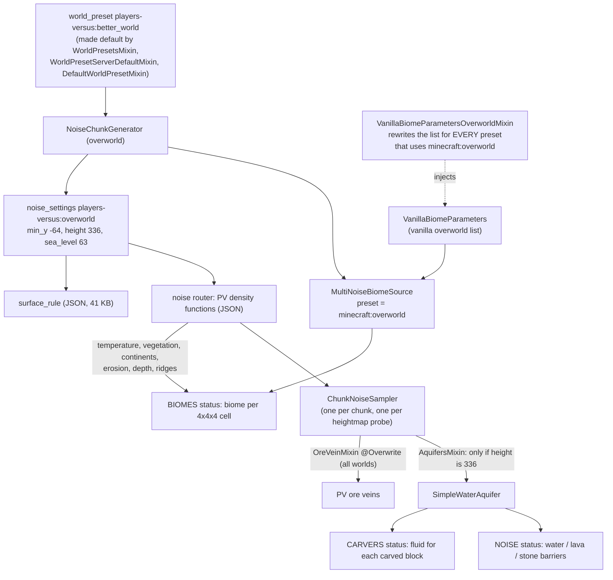
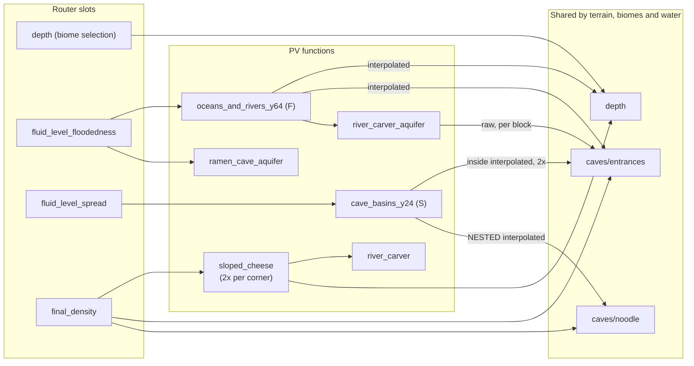
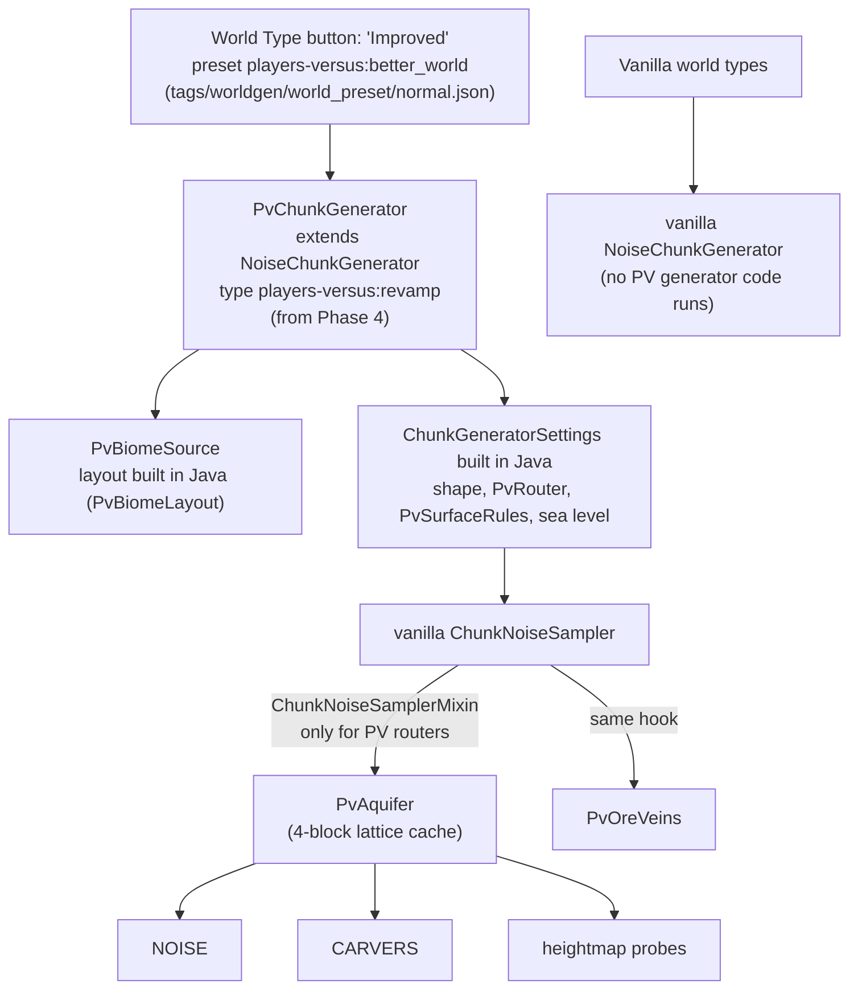

# Players Versus world type: worldgen revamp plan (revision 2)

**Target:** Minecraft 1.21.10, Yarn `1.21.10+build.2`, Fabric Loader 0.17.3, Loom 1.11-SNAPSHOT, Java 21.
**Status:** plan only; no code has changed. Revision 2 replaces the bit-exact refactor of revision 1 (see git history) with a redesign, following these decisions:

1. The output doesn't need to match the current generator, and old worlds may break. New worlds must work well and keep the **spirit** of the current generator.
2. The revamp is **its own world type**. Vanilla world types behave as usual.
3. **Fix the quirks.**

Statements about vanilla internals marked **[verify]** come from knowledge of the 1.21.x sources. They could not be checked against decompiled code in the environment where this was written (Fabric's maven and Mojang's servers were blocked). Confirm them with `genSources` before relying on them.

---

## 0. Summary

**What the revamp is.** A separate world type, today's "Improved" preset (`players-versus:better_world`), backed by code that only runs for that world type:

- **`PvBiomeSource`**, its own biome source type. It builds the biome layout in Java: vanilla's layout plus the PV transitions and cave layers, with the quirks fixed. It replaces the global mixin on `VanillaBiomeParameters`.
- **`PvAquifer`**, rebuilt around a cached 4-block lattice. Its cost per chunk is bounded, and it gives the same answer to the terrain pass, the carvers and heightmap probes.
- **Terrain density functions written in Java**, with duplicate work removed and the hot parts compiled into custom density-function types.
- **`PvChunkGenerator`** (last phase), a subclass of vanilla's `NoiseChunkGenerator` registered as its own generator type. It builds the noise settings (router and surface rules) in Java, so no worldgen logic is left in hand-written JSON.
- **One small mixin**: two `@WrapOperation`s in `ChunkNoiseSampler`'s constructor that swap in the PV aquifer and ore veins, only when the noise router carries PV aquifer inputs. The seven current worldgen mixins are deleted, including the two that change vanilla world types today (biome layout and ore veins).

**Expected effect.** These are static estimates; Phase 0 measures the real numbers.

| Work | Today | After |
|---|---|---|
| Aquifer, terrain pass | ~48 octave samples per open block (y −31…63): 60–400k per chunk | 5–35k per chunk, from lattice points only |
| Aquifer, carvers | ~100–250 per carved block | ~0 extra (same lattice) |
| Terrain corner pass | ~130–180k per chunk | 25–40% less (no duplicate `sloped_cheese`, per-column river/jagged noise) |
| Worldgen mixins | 7 (2 change vanilla world types) | 1, gated to the PV world type |

**Phases.**

| Phase | Deliverable | Size |
|---|---|---|
| 0 | Tooling and baselines: profiling, map export of the current generator (the "spirit" reference), `/pvwg probe` | S–M |
| 1 | Own world type, vanilla untouched: `PvBiomeSource` with the layout fixes, world-type button entry, the single gated hook; delete the global and default-preset mixins | M |
| 2 | Aquifer rebuilt on a lattice (fixes seams, sea level, carver stone) | M |
| 3 | Terrain density functions in Java, deduplicated, hot parts compiled; delete the density-function JSON | L |
| 4 | Surface rules in Java, beach noises trimmed, `PvChunkGenerator` builds all settings in code; delete the noise-settings JSON | M |
| 5 | Measure-driven tuning: stacked cave-biome features, carvers | S–M each |

Each phase ships on its own: the world type keeps working after every phase.

---

## 1. How the current generator works

### 1.1 Pipeline



### 1.2 The pieces

| Piece | File | What it does | Scope today |
|---|---|---|---|
| Default preset | `WorldPresetsMixin`, `WorldPresetServerDefaultMixin`, client `DefaultWorldPresetMixin` | Forces "Improved" as the default (server properties, demo world, Create World screen). It isn't in the `minecraft:normal` world-preset tag, which is what the World Type button lists **[verify]**. | Intended |
| Noise settings | `noise_settings/overworld.json` | Height 336, PV router, surface rule | PV preset only |
| Aquifer | `AquifersMixin` → `SimpleWaterAquifer` | Replaces vanilla's aquifer when `height == 336` | Anything with height 336 |
| Ore veins | `OreVeinMixin` (`@Overwrite OreVeinSampler.create`) | Copper 32–96 over terracotta, iron −8–36 over tuff | **All** noise generators with ore veins, including vanilla presets |
| Biome placement | `VanillaBiomeParametersOverworldMixin`, `CustomOverworldBiomes` | Rewrites the vanilla overworld parameter list | **All** presets using `minecraft:overworld` (Default, Large Biomes, Amplified, PV) |
| Surface rules | JSON in `noise_settings/overworld.json` | Top blocks, beaches (2 custom 29-octave noises) | PV preset only. `SurfaceRulesMixin` is **not registered** and is stale. |

### 1.3 What each router slot means in PV

| Slot | PV value | Read by |
|---|---|---|
| `final_density` | `players-versus:overworld/final_density` (vanilla shape + river carving + ramen caves; `spaghetti_2d` replaced by the constant 1) | terrain (NOISE), heightmap probes |
| `depth` | `players-versus:overworld/depth` = vanilla depth + `river_carver_depth` | **biome selection** (the cave-biome depth bands) and the aquifer (interpolated) |
| `fluid_level_floodedness` | `aquifer_fluid_level_floodedness`: *not* vanilla's meaning; it is the PV sea-level/river "floodedness" F′ | `SimpleWaterAquifer` section 2 |
| `fluid_level_spread` | `aquifer_fluid_level_spread` → `cave_basins_y24` (S) | `SimpleWaterAquifer` section 3 |
| `barrier`, `lava` | vanilla-like | unused while the PV aquifer is active |
| `preliminary_surface_level` | vanilla formula (no rivers) | surface rule `above_preliminary_surface`, vanilla internals |
| `continents`, `erosion`, `ridges`, `temperature`, `vegetation`, `vein_*` | vanilla | biomes, ore veins |

### 1.4 The aquifer

For a block whose final density is ≤ 0, and for **every carved block** (carvers call `apply(pos, 0.0)` **[verify]**). The first matching rule wins:

| # | Condition | Result |
|---|---|---|
| 1 | y < −54 | lava (from the chunk generator's fluid-level sampler) |
| 2 | y ≥ 64 or y ≤ −32 | air |
| 3a | −32 < y < 64 and F′ > 0.34 | water; schedule fluid tick if F′ < 0.54 |
| 3b | −32 < y < 64 and F′ > 0.0001 + max(0, y − 60)·0.015 | **stone** (barrier) |
| 4a | −4 < y < 32 and S > tW(y), where tW = 0.5 for y > 8, else 0.5 − (8 − y)·0.08 | water; tick if S < tW + 0.2 or density < 0.08 |
| 4b | −4 < y < 32, y < 23 and S > tB(y), where tB = 0.0001 for y < 12, else (y − 12)·0.06 | stone |
| 5 | otherwise | air |

F′ = `range_choice(y ∈ [−4, 32): F ∈ [0.0001, 0.34) ? F + ramen_cave_aquifer : F; else F)`, with F = `aquifer_floodedness_oceans_and_rivers_y64`. In words: rivers and oceans are water connected to the sea surface and walled off from caves by stone; caves above y 32 stay dry; low caves get basins with their own water; the bottom is lava. That is the behavior the revamp keeps.

### 1.5 Biome placement

Vanilla's `writeBiomeParameters` emits two entries per surface slice (depth 0.0 and depth 1.0). The mixin cancels every call and emits:

1. **Mountain transition**, for the part of a slice with erosion < −0.475 and continentalness > 0.03. Slices whose weirdness lies entirely inside ±0.3 (river valleys) are skipped. Emitted at depth 0 and 0.1. Examples: forest → mountainside forest (warm variant above T 0.1998), jungle → mountainside jungle, plains → meadow.
2. **Frozen transition**, for temperature slices crossing −0.55 or −0.375. Examples: taiga → cold taiga, snowy plains → cold plains, frozen ocean → cold ocean.
3. **Peak temperature fixes**: grove/snowy slopes above T 0.145 become taiga/windswept hills; stony peaks below T 0.235 become windswept gravelly hills.
4. **Humid transition**, for humidity slices crossing 0.275 or 0.35. Examples: birch → dark birch forest, desert → desert oasis.
5. The **original biome** with the narrowed ranges, at depth 0 only. Vanilla's depth 1.0 copy is dropped, so the underground belongs to PV cave biomes.
6. A **surface-cave biome** at depth 0.1–0.25, offset +0.075: frozen peaks/snowy slopes → frosted caves, desert → desert creeper caves, badlands family → badlands cave.

It also replaces vanilla's lush-caves and dripstone-caves entries with PV variants (adding frosted caves) and appends 13 PV cave entries after deep dark: frosted, badlands, desert-creeper, creeper, lush, dripstone and deep-dark variants, plus regular cave (depth 0.25–0.65) and deep caves (depth 0.9).

Several emitted boxes overlap, and some parts of slices are covered by no box at all. The winner then depends on list order and nearest-box distance **[verify]**, which makes the layout hard to reason about. The revamp makes the boxes disjoint (Section 4.2).

### 1.6 The density-function graph and its evaluation contexts



The same JSON node means different things depending on who evaluates it **[verify]**:

| Context | Who | `interpolated` | `flat_cache` | `cache_once` | `cache_2d` |
|---|---|---|---|---|---|
| Corner pass | `ChunkNoiseSampler` filling cell corners (5×5×43 = 1,075 per chunk) | evaluates the child at the corner. A *nested* interpolator reached through `sample()` returns its **stale** last result. | exact at corners | per corner, shared across interpolators | per column |
| Block loop | aquifer, ore veins, noodle, per block | trilinear value from corners | snapped to the enclosing 4×4 column | per block | last column only |
| Foreign position | carvers, `NoiseConfig`, structure/biome lookups | **raw** child value | snapped inside the chunk, raw outside | **no caching** | per column |

So the aquifer answers the terrain pass with interpolated inputs and the carvers with raw inputs: the two disagree, and the carver path is the expensive one. `caves/entrances` feeds all of these, and `depth` feeds terrain, biomes and water at once. That is why small JSON edits ripple into biomes and water. The revamp gives the aquifer one evaluation path.

### 1.7 Constants that must agree but live in different places

| Constant | Places |
|---|---|
| Sea level | `noise_settings.sea_level = 63` (vanilla meaning: water up to y 62); `SimpleWaterAquifer.SEA_LEVEL = 64` (water up to y **63**); `range_choice` upper bound 64 in F; surface-rule `y_above` 60/63/64/66 |
| Water/barrier thresholds | `0.34` and `0.0001` in `SimpleWaterAquifer` **and** in `aquifer_fluid_level_floodedness.json` |
| Cave-basin band | Java `−4 < y < 32`, `y < 23`, `tW`/`tB` formulas **and** JSON bands `[-2, 48)`, `[24, 48)`, gradients 48→24 |
| Generator identity | `height: 336` in JSON **and** `AquifersMixin` |
| Transition cut points | Java constants that mirror vanilla's slice edges (0.03, −0.475, −0.55, −0.375, 0.275, 0.35) |
| Ore-vein bands | Java `VeinType` (copper 32–96, iron −8–36) **and** the router's `vein_toggle` range `[-60, 51)`, so copper veins actually fade out around y 50 |

---

## 2. Findings

### 2.1 Performance (static estimates, to be measured in Phase 0)

Unit: *octave samples*, meaning one single-octave Perlin sample. A vanilla "double Perlin" noise with n non-zero octaves costs 2n. See Appendix A.

| # | Hotspot | Where | Estimate | Why |
|---|---|---|---|---|
| P1 | Aquifer floodedness per block | NOISE, each non-solid block with −31 ≤ y ≤ 63 | ~48 per block. That is ~60–170k per land chunk and ~200–400k per ocean chunk; the whole terrain corner pass is ~130–180k. | F has `shifted_noise continentalness` (3D) twice and `noise surface` (3D) twice, evaluated per block. River blocks with 48 ≤ y < 64 add about 32. |
| P2 | Aquifer in carvers | CARVERS, each carved block | ~100–250 per block, versus ~0–2 in vanilla | No caching for foreign positions; F is evaluated twice for −4 ≤ y < 32, and `entrances` up to 4 times. |
| P3 | Redundant terrain work | NOISE corner pass | ~30–70k per chunk removable | `sloped_cheese` is evaluated twice per corner (`base_3d_noise` alone is 24–40 samples). `jagged` (32) and `ridge` (6) are 2D but re-sampled per corner. |
| P4 | Extra interpolators | NOISE corner pass | small | 3 aquifer-only interpolators |
| P5 | Stacked biomes at FEATURES | FEATURES | unknown | A chunk typically holds 3–5 biomes stacked vertically, each with 27–56 placed features (the creeper-cave floor alone is count 96 × scan 12), and the union is attempted per chunk. |
| P6 | Biome lookup | BIOMES, structures | small | The list is bigger than vanilla's and has overlapping boxes, but R-tree lookups stay logarithmic. |
| P7 | 29-octave beach noises | SURFACE | small | At most once per column per rule, near sea level only. Octaves past about 12 contribute less than 1e−4. |

C2ME (a suggested dependency) reduces interpreter overhead for JSON density functions, but it can't fix P1/P2, which do the wrong *amount* of work **[verify with C2ME installed]**.

### 2.2 Scope and correctness issues

- **S1:** biome placement is global (1.2).
- **S2:** PV ore veins are global (`@Overwrite`), and incompatible with anything else touching `OreVeinSampler.create`.
- **S3:** the aquifer is switched on by `height == 336` and uses `@Redirect`, which doesn't compose with other mods targeting the same call.
- **S4:** dead code and clutter:
  - `SurfaceRulesMixin` (unregistered, and diverged from the JSON rule);
  - `caves/entrances_old.json` and the `overworld/gravel_beach` density function (unreferenced);
  - `SimpleWaterAquifer.fluidLevelY`, which is never used but costs one full raw F evaluation per `ChunkNoiseSampler`, including every heightmap probe;
  - the empty "waterfalls" section, and unused fields and methods;
  - the empty `landBiomesToPlaceInOverorld` list, `PlacedBiomeType.SKY`, and `freeUpMemory`, which misses one map;
  - the cache in `rangeOf`, which only ever holds one entry;
  - the triple `cache_once` in `entrances.json`;
  - `remappedSrc/`, a stale copy of every worldgen class, which pollutes searches.
- **S5:** there is no single source of truth for coupled constants (1.7).
- **S6:** vanilla-namespace data overrides also change vanilla world types (Section 8, question 1).

### 2.3 Quirks (all fixed in the revamp; Section 6 says how)

| # | Quirk | Effect today |
|---|---|---|
| Q1 | `cave_basins_y24` wraps `caves/noodle` (which has its own `interpolated` nodes) in another `interpolated`. In the corner pass the inner interpolators return stale state **[verify]**. | The noodle term only acts on x-planes 0 and 4 of each chunk, so expect **vertical seams in cave-basin water every 16 blocks along x**. Carvers see different values than the terrain pass. |
| Q2 | The humid transition's lower edge (crossing 0.275) uses the *frozen* map (`VanillaBiomeParametersOverworldMixin.java:198`) | Birch forest next to dark forest gets a birch-taiga strip instead of the intended dark-birch band. |
| Q3 | The dripstone replacement passes `continentalness` as the **depth** argument (`:90–91`) | Dripstone and frosted-cave entries sit at depth 0.8–1.0 instead of the cave layer. |
| Q4 | `newContinentalness` can never be set (`:136`), and the "replace entirely" test ignores continentalness < 0.03 | Parts of mountain slices are covered by no box; whichever box is nearest wins there. |
| Q5 | The aquifer fills water up to y 63, but `sea_level: 63` means water up to y 62 in vanilla | Spawning, structures and icebergs assume a sea level 1 block below the actual water. |
| Q6 | The aquifer returns STONE to carvers in barrier zones | Carvers overwrite dirt, ores and even deepslate with stone inside carved space. |
| Q7 | Transitions are emitted at depth 0 and 0.1, originals at depth 0 only | Transition biomes reach slightly underground where the original biomes don't. |

---

## 3. Goals and acceptance criteria

- **Vanilla world types run no PV generator code.** They get vanilla terrain, aquifers, ore veins and biome layout. Data overrides are a separate question (Section 8).
- **The PV world type is selectable**: from the World Type button in Create World, and via `level-type=players-versus:better_world` on servers.
- **The spirit is kept.** New maps are compared with Phase 0's reference maps, for the same seeds, against this checklist:
  - river valleys carved down to sea level and filled with water;
  - oceans and rivers walled off from caves by stone;
  - dry upper caves, and water basins in caves below about y 32;
  - ramen and noodle caves;
  - mountainside, cold and humid transition biomes;
  - the PV cave-biome layers and the frosted, badlands and desert-creeper surface caves;
  - sand and gravel beach patterns;
  - PV ore veins: copper in terracotta, iron in tuff.
- **Performance:** pregenerating the PV world type is no slower than the vanilla Default preset (stretch goal: faster), and no chunk status costs more than 1.2× vanilla.
- **Correctness:**
  - Q1–Q7 fixed;
  - no chunk-border seams;
  - carvers never place stone;
  - one sea level everywhere.
- **Maintainability:**
  - no hand-written density-function or noise-settings JSON;
  - coupled constants live in one Java class;
  - one mixin;
  - `/pvwg probe` explains the water decision for any block.

---

## 4. Target architecture



```
mod/environment/worldgen/
  PvWorldgen.java                 registers types; isPvRouter(router)
  PvWorldgenConstants.java        sea level, vertical bands, aquifer thresholds, vein bands (one place, documented)
  PvChunkGenerator.java           (Phase 4) builds settings + biome source from registry lookups
  biome/PvBiomeKeys.java          keys (SuspiciousBlockEntityMixin uses REGULAR_CAVE)
  biome/PvBiomeLayout.java        vanilla layout -> PV layout: transitions, surface caves, cave layers (rules as data)
  biome/PvBiomeSource.java        BiomeSource type "players-versus:revamp"
  density/PvRouter.java           builds the NoiseRouter in Java
  density/kernel/...              RiverTerms, RamenCaves, PvEntrances, PvTerrainDensity, AquiferNoises
  aquifer/PvAquifer.java          lattice-cached aquifer
  ore/PvOreVeins.java             today's vein logic
  surface/PvSurfaceRules.java     (Phase 4) MaterialRules built in Java
  debug/WorldgenDebugCommands.java   /pvwg probe | map   (dev only)
mixin/environment/worldgen/
  ChunkNoiseSamplerMixin.java     the only worldgen mixin
```

### 4.1 World type and generator

- The world preset stays `players-versus:better_world` (shown as "Improved"). Add it to `data/minecraft/tags/worldgen/world_preset/normal.json` (`"replace": false`) so it appears in the World Type button.
- Delete the three default-preset mixins, so vanilla stays the default. If you want "Improved" pre-selected in Create World, keep only the client one (Section 8, question 2).
- Phases 1–3 use vanilla's `minecraft:noise` generator type with `PvBiomeSource` and the existing noise-settings key.
- Phase 4 introduces `PvChunkGenerator`, once the router and surface rules are Java. It extends `NoiseChunkGenerator`, so vanilla and mods that check `instanceof NoiseChunkGenerator` still work, and it passes its settings as a direct registry entry built in code (sketch; confirm signatures against `genSources`):
  ```java
  public final class PvChunkGenerator extends NoiseChunkGenerator {
      public static final MapCodec<PvChunkGenerator> CODEC = RecordCodecBuilder.mapCodec(i -> i.group(
              RegistryOps.getEntryLookupCodec(RegistryKeys.BIOME),
              RegistryOps.getEntryLookupCodec(RegistryKeys.DENSITY_FUNCTION),
              RegistryOps.getEntryLookupCodec(RegistryKeys.NOISE_PARAMETERS)
      ).apply(i, i.stable(PvChunkGenerator::create)));

      static PvChunkGenerator create(RegistryEntryLookup<Biome> biomes, RegistryEntryLookup<DensityFunction> dfs,
                                     RegistryEntryLookup<DoublePerlinNoiseSampler.NoiseParameters> noises) {
          return new PvChunkGenerator(new PvBiomeSource(biomes), RegistryEntry.of(PvSettings.create(dfs, noises)));
      }
      private PvChunkGenerator(BiomeSource biomes, RegistryEntry<ChunkGeneratorSettings> settings) { super(biomes, settings); }
      @Override protected MapCodec<? extends ChunkGenerator> getCodec() { return CODEC; }
      // later: appendDebugHudText(...) for PV lines in F3
  }
  ```
  The world preset then becomes `"generator": {"type": "players-versus:revamp"}`, and `level.dat` stores only that. Because settings are rebuilt from code on every load, code changes apply to existing PV worlds (with seams). If that ever matters, add a `version` field to the codec.

### 4.2 Biome layout (`PvBiomeLayout`, `PvBiomeSource`)

- **Input:** vanilla's public `VanillaBiomeParameters#writeOverworldBiomeParameters` output, through a consumer rather than a mixin. Vanilla biome updates in future versions flow in automatically.
- **Rules as data**, each a small record:
  - transition bands: mountain, frozen, humid, and the peak fixes;
  - surface-cave mapping;
  - cave layers: surface cave, cave, generic cave, deep, plus the lush/dripstone/frosted/creeper/badlands/deep-dark entries.
- **Disjoint boxes.** Each vanilla slice is split: *band ∩ slice* gets the transition biome, and *slice − bands* (decomposed into boxes) keeps the original. Where bands overlap, a fixed priority decides (for example mountain > frozen > humid). No point is covered twice or not at all, so results no longer depend on list order. This fixes Q4.
- **One depth band per layer** (fixes Q7). The table says which band each layer uses, as it does today: surface cave 0.1–0.25, cave 0.2–0.4, generic cave 0.25–0.65, deep 0.9. Vanilla's depth-1.0 surface copies stay dropped, so the underground still belongs to PV cave biomes.
- **The biome source** is registered as `players-versus:revamp` in `Registries.BIOME_SOURCE`:
  - lookups go through vanilla's `MultiNoiseUtil.Entries` (R-tree);
  - `biomeStream()` returns the distinct biomes;
  - `addDebugInfo` prints the multinoise point and **which rule produced the biome**.
- **Q2 and Q3** are fixed in the rule tables (Section 6).

### 4.3 Terrain density functions (`PvRouter` + kernels)

- **The router is built in Java.** It references vanilla's registered functions where PV didn't change them: continents, erosion, ridges, offset, factor, jaggedness, `base_3d_noise`, spaghetti roughness. The vanilla look carries over, and vanilla fixes flow in.
- **PV parts become custom density-function types** (`Registries.DENSITY_FUNCTION_TYPE`) with readable math:
  - `RiverTerms`: one ridge sample per 4×4 column (`flat_cache`), from which the river carving, the river depth and the river aquifer terms are derived;
  - `RamenCaves` and `PvEntrances`;
  - `PvTerrainDensity`: the body inside `interpolated`. It computes sloped cheese **once** per corner and shares it between the surface and cave branches.
- **Vanilla markers stay vanilla nodes** where they carry meaning: `interpolated`, `blend_density`, `flat_cache`, `cache_once`. `ChunkNoiseSampler` turns them into per-chunk caches.
- **Kernels are stateless.** Density-function instances are shared across worker threads.
- **Removed:**
  - the nested interpolators (Q1);
  - the aquifer-only interpolators;
  - duplicate river and `jagged` sampling;
  - the triple `cache_once`;
  - unused functions.
- **Phase 3 keeps a thin JSON noise-settings file** whose router slots point at the Java types, and keeps the existing JSON surface rule. Phase 4 moves both into `PvSettings`.

### 4.4 Aquifer (`PvAquifer`)

- **The rules are the same in spirit** as 1.4, with two fixes:
  - a barrier returns `null`, which means "leave it solid" (Q6): in the terrain pass the block becomes stone or an ore vein, and carvers simply don't carve it;
  - one sea-level constant is shared by the settings, the aquifer and the terrain (Q5, Section 6).
- **F and S come from a lattice.** Points sit every 4 blocks in x, y and z, at absolute coordinates, and are filled lazily per chunk and only where the chunk has open space in y −32…63. A block's value is interpolated trilinearly from the lattice.
  - Points are sampled with the seeded functions from `NoiseConfig`, so every caller sees the same value: the terrain pass, carvers, heightmap probes and the neighbouring chunk. That removes seams (Q1) and the terrain/carver disagreement.
  - Cost is at most 625 points per chunk, about 5–35k octave samples, against 60–400k today. A carved block costs one interpolation.
- **Fluid ticks** stay as today: water near the thresholds schedules a tick.
- **Optional:** if barrier edges look too smooth compared with today's per-block noise, refine only the blocks within ε of a threshold by evaluating F or S exactly there.
- **`/pvwg probe`** prints the lattice and refined values, and the rule that fired.

### 4.5 Ore veins

`PvOreVeins` keeps today's logic and is called from the hook only for PV routers. Decide whether copper should really reach y 96. Today the router's `vein_toggle` range cuts it off near y 50 (1.7); align one or the other.

### 4.6 Surface rules and noises (Phase 4)

- **`PvSurfaceRules`** builds the rule with the `MaterialRules` API (the dead `SurfaceRulesMixin` already shows it). The 41 KB JSON is converted with a one-off script, then cleaned up by hand.
- **The beach noises are trimmed** from 29 to about 10 octaves. Their two tiny JSON files stay, because noise parameters are registry data that surface rules reference by key.

### 4.7 The one mixin

The gate is "the router's `fluid_level_floodedness` slot holds a PV aquifer type". There are no magic numbers and no global state (sketch):

```java
@Mixin(ChunkNoiseSampler.class)
abstract class ChunkNoiseSamplerMixin {
    @WrapOperation(method = "<init>", at = @At(value = "INVOKE", target = "Lnet/minecraft/world/gen/chunk/AquiferSampler;aquifer(Lnet/minecraft/world/gen/chunk/ChunkNoiseSampler;Lnet/minecraft/util/math/ChunkPos;Lnet/minecraft/world/gen/noise/NoiseRouter;Lnet/minecraft/util/math/random/RandomSplitter;IILnet/minecraft/world/gen/chunk/AquiferSampler$FluidLevelSampler;)Lnet/minecraft/world/gen/chunk/AquiferSampler;"))
    private AquiferSampler pv$aquifer(ChunkNoiseSampler sampler, ChunkPos pos, NoiseRouter router, RandomSplitter random,
                                      int minY, int height, AquiferSampler.FluidLevelSampler fluids, Operation<AquiferSampler> original,
                                      @Local(argsOnly = true) NoiseConfig noiseConfig) {
        return PvWorldgen.isPvRouter(router)
                ? new PvAquifer(AquiferNoises.of(noiseConfig.getNoiseRouter()), pos, fluids)
                : original.call(sampler, pos, router, random, minY, height, fluids);
    }

    @WrapOperation(method = "<init>", at = @At(value = "INVOKE", target = "Lnet/minecraft/world/gen/OreVeinSampler;create(Lnet/minecraft/world/gen/densityfunction/DensityFunction;Lnet/minecraft/world/gen/densityfunction/DensityFunction;Lnet/minecraft/world/gen/densityfunction/DensityFunction;Lnet/minecraft/util/math/random/RandomSplitter;)Lnet/minecraft/world/gen/chunk/ChunkNoiseSampler$BlockStateSampler;"))
    private ChunkNoiseSampler.BlockStateSampler pv$oreVeins(DensityFunction toggle, DensityFunction ridged, DensityFunction gap, RandomSplitter random,
                                                            Operation<ChunkNoiseSampler.BlockStateSampler> original,
                                                            @Local(argsOnly = true) ChunkGeneratorSettings settings) {
        return PvWorldgen.isPvRouter(settings.noiseRouter())
                ? PvOreVeins.create(toggle, ridged, gap, random)
                : original.call(toggle, ridged, gap, random);
    }
}
```

A mixin-free variant exists: construct the chunk's `ChunkNoiseSampler` yourself in `PvChunkGenerator` overrides, with aquifers disabled and a custom `FluidLevelSampler`. It costs more, though:

- no fluid ticks;
- a `null`-state trick for barriers;
- copies of vanilla's heightmap-probe code;
- a separate ore-vein pass.

The hook above is simpler and safer.

### 4.8 Debug tooling

- **`/pvwg probe`** reports, at your position:
  - biome, the multinoise point, and the layout rule that chose the biome;
  - F, S, the aquifer decision and the rule that fired;
  - depth, entrances and final density.
- **`/pvwg map <radius> <y...>`** exports PNGs: a biome map, surface height, water, and cave slices at the given y levels. It serves the spirit review and the before/after checks.
- **F3 lines** from `PvBiomeSource.addDebugInfo` and (Phase 4) `PvChunkGenerator`.

**Rules for the new code:**

1. Never store mutable state in a density function. Memoize with vanilla markers, or inside per-chunk objects such as the aquifer.
2. Keep `interpolated`, `flat_cache`, `cache_once` and `blend_*` as vanilla nodes. Kernels map their children in `apply(visitor)`.
3. Kernel `minValue`/`maxValue` must be valid bounds, because vanilla's `min`/`max` use them to skip work **[verify]**.
4. Every constant shared by several components lives in `PvWorldgenConstants`, with a comment saying why it has that value.

---

## 5. Phased plan

### Phase 0: Tooling and baselines. Size S–M.

- **Profiling.** Add Spark and Chunky as `modLocalRuntime` from `https://api.modrinth.com/maven`. With the same seed and radius, pregenerate the vanilla Default preset and today's "Improved" preset. Record:
  - chunks/s;
  - Spark flame graphs;
  - time per status (`populateNoise`, `carve`, `buildSurface`, `generateFeatures`).

  This ranks P1–P7 with real numbers.
- **Reference maps.** Build `/pvwg map` and `/pvwg probe` against the **current** generator first. Export maps for about 3 seeds; they are the spirit reference for every later phase. Keep them outside the jar (for example `docs/worldgen-maps/`, or a release asset if they're large).
- **Smoke test.** Add a `runWorldgenSmoke` Loom run config: a headless server that creates a PV world with a fixed seed, generates a few hundred chunks, checks the invariants in Section 7, prints timings and stops. Add it to CI (`.github/workflows/build.yml`).
- **Verify** the [verify] items that the new design relies on:
  - the `ChunkNoiseSampler` constructor parameters (for `@Local`);
  - the `ChunkGeneratorSettings` and `NoiseRouter` constructor argument order in 1.21.10;
  - `BiomeSource` abstract methods;
  - that `Carver.getState` calls the aquifer with density 0;
  - how `min`/`max` use bounds.

*Exit:* baseline numbers and reference maps saved; smoke test running in CI.

### Phase 1: Own world type, vanilla untouched. Size M.

1. **Delete** `VanillaBiomeParametersOverworldMixin`, `OreVeinMixin`, `AquifersMixin`, `SurfaceRulesMixin`, the three default-preset mixins, `remappedSrc/`, and the other dead code listed in S4.
2. **Add** `PvBiomeSource` and `PvBiomeLayout` with disjoint boxes and fixes Q2, Q3, Q4 and Q7. In `better_world.json`, set `"biome_source": {"type": "players-versus:revamp"}` and keep `"settings": "players-versus:overworld"`.
3. **Add the hook** (4.7). Until Phase 2 introduces the real aquifer types, gate it with a thin marker type in the floodedness slot, `{"type": "players-versus:aquifer_floodedness", "argument": "players-versus:overworld/aquifer_fluid_level_floodedness"}`. Behind the gate, `SimpleWaterAquifer` moves unchanged into `PvAquifer`; only the dead constructor sample is removed.
4. **Add** the world-preset tag and move shared constants into `PvWorldgenConstants`.

*Exit:*

- vanilla presets produce the vanilla biome list (hash equals vanilla's) and vanilla ore veins;
- "Improved" can be picked from the World Type button;
- the layout maps show the fixed transitions;
- the smoke test is green.

### Phase 2: Aquifer rebuild. Size M.

- `AquiferNoises` defines F and S as Java density-function types (without the nested interpolation, fixing Q1) and replaces the Phase 1 marker.
- `PvAquifer` uses the lattice (4.4), returns barriers as solid (Q6), and shares the sea-level constant with the settings (Q5).
- `/pvwg probe` shows the lattice values and the decision.

*Exit:*

- NOISE and CARVERS time per chunk reported against Phase 0;
- water maps reviewed against the reference;
- the smoke test's seam and carver-stone checks pass.

### Phase 3: Terrain density functions in Java. Size L.

- Build `PvRouter` and the kernels (4.3). The noise-settings JSON keeps only the shape, flags and spawn target, router slots of the form `{"type": "players-versus:..."}`, and the existing surface rule.
- Delete every file under `density_function/`.

*Exit:* corner-pass time reported against Phase 0; terrain maps reviewed against the reference.

### Phase 4: Surface rules in Java and `PvChunkGenerator`. Size M.

- Add `PvSurfaceRules` (4.6) and trim the beach noises.
- Add `PvSettings` and `PvChunkGenerator` (4.1), and point the preset at `{"type": "players-versus:revamp"}`.
- Delete `noise_settings/overworld.json`, or keep a stub under that key so pre-revamp worlds still open (Section 8, question 3).

*Exit:* no worldgen logic left in hand-written JSON; full pregeneration benchmark against the Phase 0 baseline.

### Phase 5: Measure-driven tuning. Size S–M each.

Driven by the Phase 0 and Phase 4 profiles:

- stacked cave-biome features (P5): shared placed features, fewer redundant layers, or lower counts and scan ranges;
- carver cost and probabilities (and the carver decision in Section 8, question 1).

---

## 6. Quirk fixes

| # | Fix | Phase |
|---|---|---|
| Q1 | The aquifer's S is sampled raw on the lattice; no `interpolated` nests inside it. The seams disappear, and the terrain pass and carvers agree. | 2 |
| Q2 | Use the humid map on both edges of the humid band (0.275 and 0.35), giving a continuous dark-birch band between birch and dark forest. | 1 |
| Q3 | Give the dripstone/frosted replacement a real underground band. Proposal: 0.15–0.5, like the lush replacement; confirm on the cave-layer map. | 1 |
| Q4 | Disjoint box splitting: transition = band ∩ slice, original = slice − band. | 1 |
| Q5 | One sea-level constant. Proposal: settings `sea_level: 64`, which keeps today's water surface at y 63 and makes spawning, structures and icebergs agree. The aquifer, terrain and surface rules derive from the same constant. | 2 |
| Q6 | Barrier → `null` (solid): carvers leave the block alone, and the terrain pass lets ore veins and the surface rules (deepslate) apply. | 2 |
| Q7 | One depth band per layer, from a single table. | 1 |

---

## 7. Validation

- **Spirit review.** After each phase, export maps for the reference seeds and compare them side by side with the Phase 0 maps, using the checklist in Section 3.
- **Smoke-test invariants** (automated, in CI):
  - no exceptions;
  - no stone inside the carving mask (Q6);
  - no abrupt water/air changes aligned to chunk borders, compared with the rate elsewhere (Q1);
  - vanilla presets still produce the vanilla biome list;
  - every PV biome in the layout appears somewhere in a large sample;
  - timings per status.
- **Performance:** the Chunky and Spark protocol after Phases 2, 3 and 4, always against the Default preset on the same machine.
- **Compatibility:** C2ME and Lithium with both a PV world and a vanilla world. Add any other worldgen mods you care about, such as Distant Horizons.
- **Later (optional):** once the revamp settles, add a per-chunk hash snapshot so future refactors can prove they didn't change terrain.

---

## 8. Open questions

1. **Vanilla-namespace data overrides still change vanilla world types.** `data/minecraft/**/worldgen/**` holds 146 files: 6 vanilla biomes, 3 carvers, about 70 features, structure pools and sets, and biome tags. For example, the cave carver's probability is 0.02 here against 0.15 in vanilla **[verify]**, so vanilla worlds get far fewer carver caves. The generator code can be scoped to the PV world type, but these files apply to every world. Options:
   - **(a)** Keep features and structures global, as gameplay tweaks that apply everywhere. **Recommended.**
   - **(b)** Make carvers PV-only. Give PV cave biomes their own carver configs and delete the three `minecraft:` carver overrides. This is cheap: carvers are chosen from the biome at y 0, which in the PV world is almost always a PV cave biome (18 PV biome files reference `minecraft:cave` today). **Recommended.**
   - **(c)** Fully separate all content. That is large and invasive, because PV would need its own copies of vanilla biomes, which affects advancements, tags and other mods.
2. **Pre-selected world type:** should Create World default to "Improved" (keep only the client mixin) or to vanilla (delete all three)?
3. **Pre-revamp worlds:** they reference the `players-versus:overworld` noise settings, so after Phase 4 they won't open unless a stub stays under that key. With the stub they load, with seams at old chunk borders. Keep the stub, or let them fail?

---

## 9. Risks and notes

- **Build environment.** Implementation needs `maven.fabricmc.net` and Mojang's hosts, which the environment this plan was written in couldn't reach. Build and run on a local machine, in CI, or after allowing those hosts.
- **Compatibility.**
  - `@WrapOperation` chains with other mods' injectors, unlike `@Redirect`/`@Overwrite`.
  - `PvChunkGenerator` subclasses `NoiseChunkGenerator`, so `instanceof` checks in vanilla and mods keep working.
  - Other mods' injections into `MultiNoiseBiomeSource` won't reach the PV world, which is intended.
- **Threads.** Worldgen runs on worker threads: kernels hold no mutable state, and each aquifer and its lattice belong to one chunk.
- **Porting to 26.x.** One mixin and a few public-API extension points (biome source, chunk generator, density-function types) is much less to re-target. Appendix B maps the names.

---

## Appendix A: Noise costs used in the estimates

| Noise | Non-zero octaves | Octave samples per evaluation |
|---|---|---|
| `minecraft:surface` | 3 | 6 |
| `minecraft:continentalness` | 9 | 18 |
| `minecraft:ridge` | 3 | 6 |
| `minecraft:jagged` | 16 | 32 |
| `minecraft:cave_cheese` | 7 | 14 |
| `minecraft:noodle`, `noodle_thickness`, `noodle_ridge_a/b`, `spaghetti_3d_*` | 1 | 2 |
| `base_3d_noise` (old blended noise) | 8 main + 16–32 limit | 24–40 |
| `players-versus:sand_beach`, `gravel_beach` | 29 | 58 |

Counts come from vanilla's noise-parameter definitions **[verify]** and the mod's JSON. One octave sample takes roughly 10–20 ns, so 400k samples is about 4–8 ms of one core per chunk.

## Appendix B: Name map for a 26.x port (Yarn → Mojang)

This list is from memory; confirm it against the 26.x sources when porting.

| Yarn (1.21.10) | Mojang (26.x) |
|---|---|
| `ChunkNoiseSampler` | `NoiseChunk` |
| `AquiferSampler` (`aquifer`, `apply`, `needsFluidTick`) | `Aquifer` (`create`, `computeSubstance`, `shouldScheduleFluidUpdate`) |
| `AquiferSampler.FluidLevelSampler` / `FluidLevel` | `Aquifer.FluidPicker` / `Aquifer.FluidStatus` |
| `OreVeinSampler` | `OreVeinifier` |
| `ChunkGeneratorSettings`, `NoiseChunkGenerator`, `NoiseConfig` | `NoiseGeneratorSettings`, `NoiseBasedChunkGenerator`, `RandomState` |
| `DensityFunction.NoisePos` / `EachApplier` / `DensityFunctionVisitor` | `DensityFunction.FunctionContext` / `ContextProvider` / `Visitor` |
| `DensityFunctionTypes` | `DensityFunctions` |
| `MultiNoiseUtil` (`NoiseHypercube`, `ParameterRange`, `Entries`) | `Climate` (`ParameterPoint`, `Parameter`, `ParameterList`) |
| `VanillaBiomeParameters` (`writeOverworldBiomeParameters`) | `OverworldBiomeBuilder` (`addBiomes`) |
| `BiomeSource` (`getBiome`, `biomeStream`, `addDebugInfo`) | `BiomeSource` (`getNoiseBiome`, `collectPossibleBiomes`, `addDebugInfo`) |
| `MaterialRules` / `VanillaSurfaceRules` | `SurfaceRules` / `SurfaceRuleData` |
| `Carver` | `WorldCarver` |
| `DoublePerlinNoiseSampler` / `OctavePerlinNoiseSampler` / `PerlinNoiseSampler` | `NormalNoise` / `PerlinNoise` / `ImprovedNoise` |

## Appendix C: What happens to each current file

| File | Fate |
|---|---|
| `mixin/.../AquifersMixin.java` | deleted; replaced by `ChunkNoiseSamplerMixin` (Phase 1) |
| `mixin/.../OreVeinMixin.java` | deleted; logic moves to `ore/PvOreVeins`, called from the hook (1) |
| `mixin/.../VanillaBiomeParametersOverworldMixin.java` | deleted; rules move to `biome/PvBiomeLayout` with the fixes (1) |
| `mixin/.../SurfaceRulesMixin.java` | deleted (1) |
| `WorldPresetsMixin`, `WorldPresetServerDefaultMixin`, client `DefaultWorldPresetMixin` | deleted (1), unless you want "Improved" pre-selected (Section 8, question 2) |
| `mod/.../SimpleWaterAquifer.java` | moved into `aquifer/PvAquifer` (1), rebuilt on the lattice (2) |
| `mod/.../CustomOverworldBiomes.java` | keys move to `biome/PvBiomeKeys`; tables move to `biome/PvBiomeLayout` (1) |
| `mod/.../CustomWorldgen.java` | becomes `PvWorldgen` (feature registration stays) |
| `density_function/**` | replaced by `PvRouter` and kernels; deleted (3) |
| `noise_settings/overworld.json` | thinned (3); replaced by `PvSettings` (4); optional stub for old worlds |
| `noise/sand_beach.json`, `noise/gravel_beach.json` | kept, trimmed to about 10 octaves (4) |
| `world_preset/better_world.json` | biome source → `players-versus:revamp` (1); generator → `players-versus:revamp` (4) |
| `tags/worldgen/world_preset/normal.json` | new (1) |
| `remappedSrc/` | deleted (1) |
