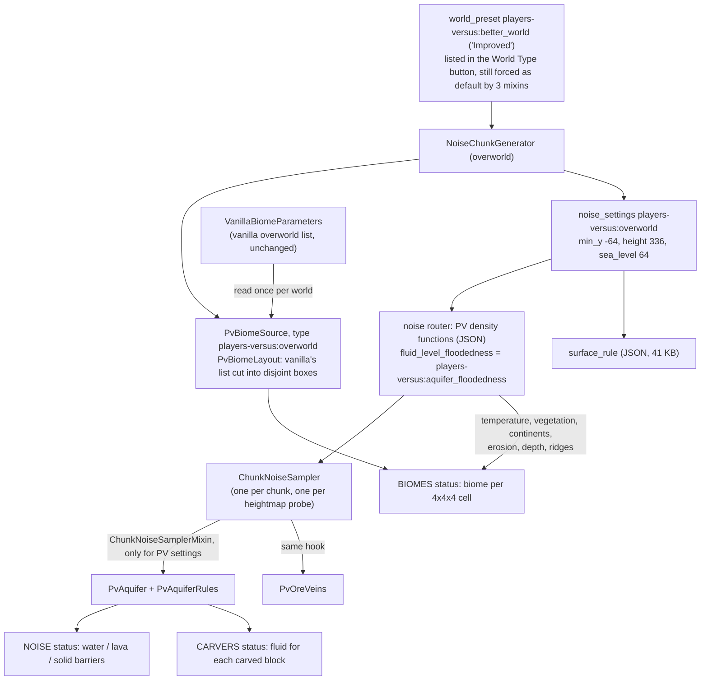
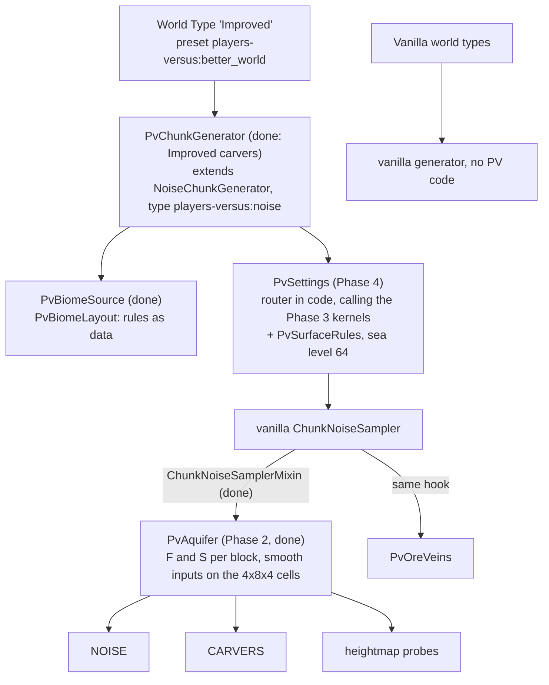

# Players Versus world type: worldgen revamp plan (revision 9)

**Target:** Minecraft 1.21.10, Yarn `1.21.10+build.2`, Fabric Loader 0.17.3, Loom 1.11, Java 21.

**Decisions so far:**

1. The output doesn't need to match the current generator, and old worlds may break. New worlds must work well and keep the **spirit** of the current generator.
2. The revamp is **its own world type**. Vanilla world types behave as usual.
3. **Fix the quirks.**

**Revision 9** (the port, Section 13): all mixins checked against 26.3 and compiling, but the aquifer hook of step 4.

**Status:** the groundwork (Section 4), Phase 1 (the biome source, Section 6.3), Phase 2 (the aquifer, Section 6.2) and Phase 3 (the terrain kernels, Section 6.5) are in, and so are the owner's answers to Section 10, among them Improved-only carvers. They have run on a real server: every commit tagged `[smoke]` generates the same region with a vanilla world and a Players Versus world, alone and next to C2ME and Lithium, reopens a world made by an older build, and compares timings on one runner (Section 8). Phases 4 and 5 are still a plan. Revision 8 adds the owner's river at y 80 (Section 10, question 7; Section 6.2, 2f) and starts the port to Minecraft 26.3 (Section 13): the sources use Mojang's names now, still on 1.21.10. Revision 7 answers the owner's design notes on the aquifer (Section 10, question 7): flooded corridors under the low lakes and nothing wet below y −8 (Section 6.2, 2d and 2e); it also looks at what Minecraft 26.3 breaks (Section 11) and at Distant Horizons (Section 12). Revision 6 answered the notes on cheese caves and water (question 6): the aquifer's walls now stand where water meets open space (Section 6.2, 2c), and the caves are a little less concentrated at y 24..32. Revision 5 adds Phase 3 and what it taught about where the time goes and about C2ME (Section 6.5). Revision 4 replaced predictions with measurements wherever a run or a test could check them (Section 2.4). Revision 3 (git history) added the verified APIs, the pseudocode and the formulas in Appendix A.

**How vanilla facts were checked.** Names and signatures come from the Yarn 1.21.10 mappings (Appendix B). Mappings don't say what code does, and don't reliably say whether a member is public: `VanillaBiomeParameters.writeOverworldBiomeParameters` turned out to be protected, which only the compiler caught. So behavior is checked by running it: unit tests run Minecraft's code under Fabric Loader (`./gradlew test`), and the smoke workflow runs a dedicated server. Claims nothing has measured yet are still marked **[measure]**.

---

## 0. Summary

**What the revamp is.** A separate world type, today's "Improved" preset (`players-versus:better_world`), backed by code that only runs for that world type:

| Component | Replaces | Phase |
|---|---|---|
| `ChunkNoiseSamplerMixin`: one gated `@WrapOperation` hook for aquifer and ore veins | `AquifersMixin` (`height == 336`), `OreVeinMixin` (global `@Overwrite`) | **done** |
| `/pvwg probe`, `/pvwg bench`, `runWorldgenSmoke`, `worldgen-smoke` workflow | (nothing: debugging was guesswork) | **done** |
| `PvBiomeSource` + `PvBiomeLayout`: layout rules as data, disjoint boxes | `VanillaBiomeParametersOverworldMixin` (global) | **done** |
| Aquifer rules: solid barriers, fluid ticks only near edges, sea level 64 | stone barriers placed by carvers, every basin block ticking | **2a, done** |
| `PvAquifer` v2: F and S in Java per block, their smooth inputs on the terrain pass's cells; one answer for every caller | per-block evaluation of the JSON trees, which gave carvers other values than the terrain pass | **2b, done** |
| Terrain kernels (`PvTerrain`, `PvFinalDensity`, `PvDepth`, `PvEntrances`, `PvNoodle`): the terrain density functions in Java, each shared value computed once | 18 hand-written density-function JSON trees | **3, done** |
| `PvChunkGenerator` (`players-versus:noise`): the Improved preset's overworld, carving with the tuned carvers | three `minecraft:` carver overrides, which changed every world type | **done** (Section 10, question 1) |
| Aquifer walls: stone where water could flow into open space, and the barrier bands only within 2 blocks of water or near the sea surface | walls from the barrier bands alone, which missed some edges and filled caves far from any water | **2c, done** (Section 10, question 6) |
| `PvSettings` + `PvSurfaceRules`: all settings in code | `noise_settings/overworld.json` (41 KB of surface rules) | 4 |

**Expected effect.** Static estimates, with measurements where a phase is done (Phase 2a against Phase 2b on one runner, ms per chunk). The measured baseline is in Section 2.4: Players Versus generation took 1.3 to 1.6 times as long as vanilla on the same region; after Phase 2 it takes 1.27 to 1.29 times as long.

| Work | Today | After |
|---|---|---|
| Aquifer, terrain pass | ~48 octave samples per open block (y −31…63): 60–400k per chunk | at most 1,125 lattice points per chunk, plus the surface and ramen noises per block. **Measured:** `noise` 35.5 → 25.9 (vanilla 19.7) |
| Aquifer, carvers | ~100–250 per carved block | the chunk's lattices, already filled. **Measured:** `carvers` 2.34 → 1.07 (vanilla 1.06) |
| Terrain | ~130–180k octave samples per chunk at the corners, plus a JSON tree interpreted at every block | **Measured:** the per-block tree, not the corners, was most of the cost (Section 6.5). `noise` 25.88 → 17.85 (vanilla 19.77), and 0.93 times vanilla in a later run; next to C2ME 1.21–1.24 times vanilla, as before |
| Worldgen mixins | 6, three of which changed vanilla world types | 1 (plus the 3 default-preset mixins, which stay: Section 10, question 2). Today: `ChunkNoiseSamplerMixin` and the default-preset mixins, which now chain with other mods (`@ModifyExpressionValue`, `@ModifyArg`) |

---

## 1. How the current generator works

### 1.1 Pipeline (after the groundwork)



### 1.2 What each router slot means in PV

| Slot | PV value | Read by |
|---|---|---|
| `final_density` | vanilla shape + river carving + ramen caves; `spaghetti_2d` replaced by the constant 1 | terrain (NOISE), heightmap probes |
| `depth` | vanilla depth + `river_carver_depth` | **biome selection** (the cave-biome depth bands) and the aquifer |
| `fluid_level_floodedness` | `players-versus:aquifer_floodedness`: F, computed in Java from the inputs its JSON names (Phase 2b; before, it wrapped the JSON F). **Its presence marks a PV generator.** | `PvAquifer` (its inputs), the hook's gate, `/pvwg probe` |
| `fluid_level_spread` | `players-versus:aquifer_spread`: S, likewise (before: the JSON `cave_basins_y24`) | `PvAquifer` (its inputs), `/pvwg probe` |
| `barrier`, `lava` | vanilla-like | unused while the PV aquifer is active |
| `preliminary_surface_level` | vanilla formula (no rivers) | surface rule `above_preliminary_surface`, vanilla internals |
| `continents`, `erosion`, `ridges`, `temperature`, `vegetation`, `vein_*` | vanilla | biomes, ore veins |

### 1.3 The aquifer rules (`PvAquiferRules`)

**A position's own floodedness** (`atPosition`), below sea level. The first matching rule wins (at or above sea level, only rule g applies):

| # | Condition | Result (`PvAquiferDecision`) |
|---|---|---|
| a | −8 ≤ y and F′ > 0.34 | `SEA_WATER`, or `SEA_WATER_TICKING` if F′ < 0.54 |
| b | −32 < y and F′ > 0.0001 + max(0, y − 60)·0.015 (below y −8, what would be water in rule a too) | the sea's barrier band, `SEA_BARRIER` |
| c | −4 < y < 32 and S > tW(y), where tW = 0.5 for y > 8, else 0.5 − (8 − y)·0.08 | `BASIN_WATER`, or `BASIN_WATER_TICKING` if S < tW + 0.2 |
| d | −4 < y < 24 and the flooded corridors' noodle opens the block (its value ≤ 0: Section 6.2, 2d) | `BASIN_WATER` |
| e | −4 < y < 23 and S > tB(y), where tB = 0.0001 for y < 12, else (y − 12)·0.06 | the basins' barrier band, `BASIN_BARRIER` |
| f | otherwise | `AIR` |
| g | 77 ≤ y ≤ 80 and the high river's valley opens the block, or 94 ≤ y ≤ 96 and its upper layer's does (Section 6.2, 2f) | `HIGH_RIVER_WATER` at y 80 or 96 (ticking), `HIGH_RIVER_BED_WATER` below; else `AIR` |

**What the aquifer places** (`decide`), for a block whose final density is ≤ 0, and for every carved block (carvers pass density 0, and leave the block alone when the answer is solid). The first matching rule wins:

| # | Condition | Result |
|---|---|---|
| 1 | density > 0 | `SOLID` (terrain, ore veins) |
| 2 | y below the lava level (y < −54) | `LAVA` |
| 3 | y ≥ `SEA_LEVEL` (64) | the high river's water where rule g says so; `HIGH_RIVER_BARRIER` (solid) where its bed's water is beside or above, or its surface's water above; else `AIR_ABOVE_SEA` |
| 4 | its own floodedness says water | that water |
| 5 | water (by its neighbours' own floodedness) beside it or above it, where water would flow in | `SEA_BARRIER` if any of it is sea water, else `BASIN_BARRIER` (solid: the terrain pass fills it with ore veins or the default block; carvers skip it) |
| 6 | its own floodedness is a barrier band, and water lies within 2 steps along the axes, or y ≥ 56 | the band's `SEA_BARRIER` or `BASIN_BARRIER` |
| 7 | otherwise | `AIR` |

All thresholds are named in `PvWorldgenConstants`. In words: rivers and oceans are water connected to the sea surface; low caves get basins with their own water up to y 23, and flooded corridors under them; caves above them stay dry, and so does everything below y −8; stone stands wherever water meets open space, and the barrier bands add to it within 2 blocks of the water, and near the sea surface, where the sea's band fills the dry hollows next to coasts; the bottom is lava. Above them, the high river's water sits at y 80 in a bed up to 3 blocks deep, and its upper layer's at y 96 in a bed up to 2 deep, walled like the rest except beside their surfaces, where they spill. Until revision 6 the bands alone were the walls (rules b and e gave stone wherever they held): Section 6.2, 2c.

### 1.4 Biome placement (`PvBiomeLayout`, since Phase 1)

`PvBiomeLayout.build()` reads vanilla's overworld list once per world: 7,593 entries, which are 3,795 surface slices at depth 0, their copies at depth 1, and lush caves, dripstone caves and the deep dark (a unit test checks this shape). Each surface slice goes through these rules in order. A rule cuts the pieces of the slice that still have the original biome into the part inside its region, which gets the transition biome, and the rest:

1. **mountainside**: erosion < −0.475 and continentalness > 0.03, except slices whose weirdness lies within ±0.3 (river valleys);
2. **peak-warm**: grove and snowy slopes above temperature 0.145 become taiga and windswept hills;
3. **peak-cold**: stony peaks below temperature 0.235 become windswept gravelly hills;
4. **frozen**: temperature −0.55..−0.375;
5. **humid**: humidity 0.275..0.35.

The original biome keeps the remaining pieces, all at depth 0. The depth-1 copies are dropped, so the underground belongs to the cave biomes. Each remaining piece also gets its surface-cave biome at depth 0.1–0.25 (frosted, desert-creeper or badlands cave). Vanilla's lush and dripstone entries are replaced as before, and the 13 Players Versus cave entries are appended. The result has 6,293 entries, 5,400 of them at the surface. Unit tests check that the pieces of each slice don't overlap and add up to the slice.

The deleted mixin emitted the same rules, but built each transition from the whole slice and narrowed the original along one axis at most, so its boxes overlapped in places and left holes in others (Q4), and results depended on the search tree's tie-breaking. A test-only copy of it (`OldBiomeLayout`) lets the tests measure what changed: 98.5% of random climate points at the surface keep their biome, and 100% (up to ties) from depth 0.3 down.

### 1.5 Evaluation contexts (why small JSON edits ripple everywhere)

| Context | Who | `interpolated` | `flat_cache` | `cache_once` |
|---|---|---|---|---|
| Corner pass | `ChunkNoiseSampler` filling 5×5×43 cell corners | child at the corner; a *nested* interpolator reached through `sample()` returns the last value it interpolated, 0 before the first block (Q1, measured) | exact at corners | per corner |
| Block loop | aquifer, ore veins, noodle | trilinear from corners | snapped to 4×4 column | per block |
| Foreign position | carvers, `NoiseConfig`, structure/biome lookups | **raw** child | snapped inside the chunk | none |

`caves/entrances` feeds all three contexts, and `depth` feeds terrain, biomes and water. The same aquifer inputs therefore meant one thing in the terrain pass and another for carvers. Since Phase 2b the aquifer reads its smooth inputs from its own lattice, the same for every caller.

---

## 2. Findings

### 2.1 Performance (static estimates; `/pvwg bench` measures them)

Unit: *octave samples*, meaning one single-octave Perlin sample (Appendix C).

| # | Hotspot | Estimate | Why |
|---|---|---|---|
| P1 | Aquifer floodedness per open block, NOISE | ~48 per block: 60–170k per land chunk, 200–400k per ocean chunk | 3D continentalness (18) and `surface` noise (6) sampled twice per block |
| P2 | Aquifer in carvers | 100–250 per carved block | no caches for foreign positions; `entrances` evaluated up to 4 times |
| P3 | Redundant terrain work, corner pass | 30–70k per chunk | `sloped_cheese` twice per corner; 2D `jagged`/`ridge` re-sampled per corner |
| P4 | Aquifer-only interpolators | small | 3 extra interpolators |
| P5 | Stacked cave biomes at FEATURES | unknown | 3–5 stacked biomes per chunk, 27–56 placed features each |
| P6 | Biome lookup | small | bigger list, same R-tree |
| P7 | 29-octave beach noises | small | once per column per rule, near sea level only |

P1, P2 and P4 are gone since Phase 2b (Section 6.2). On one runner, `noise` went from 35.5 to 25.9 ms per chunk and `carvers` from 2.34 to 1.07 (vanilla: 19.7 and 1.06). P3 is gone since Phase 3 (Section 6.5), which found a bigger cost the estimates missed: interpreting the final density's JSON tree at every block.

### 2.2 Scope and correctness

- **S1** (fixed in Phase 1, verified by the smoke runs): biome placement was global. A Default world with the mod had `players-versus:caves/deep_caves` on 73% of y −40 and `regular_cave` on all of y 0, which also brought this mod's cave spawns (wither skeletons, zombified piglins, deeper creepers) to vanilla world types. It now has only vanilla biomes.
- **S2 and S3** (fixed by the groundwork): ore veins were global, and the aquifer was switched by `height == 336` through a `@Redirect`.
- **S5:** there is no single source of truth for density-function thresholds until Phase 2; `PvWorldgenConstants` names where they're duplicated.
- **S6** (carvers fixed): vanilla-namespace data overrides changed vanilla world types. The carvers are Improved-only now (Section 10, question 1); the feature, structure and template overrides stay global by decision, and `VanillaOverridesTest` prints what the six biome overrides still change.

### 2.3 Quirks (Section 7 says how each is fixed)

| # | Quirk | Measured / status |
|---|---|---|
| Q1 | `cave_basins_y24` nests `caves/noodle` (with its own `interpolated` nodes) inside another `interpolated`, behind `min` and `mul` nodes, which evaluate their second argument with `sample()`. In the corner pass, an interpolator's `sample()` returns the last value it interpolated. | **Real; fixed in Phase 2b.** `AquiferTerrainPassTest` runs vanilla's terrain pass with the old JSON: its S differed from S with exact corners at 3,292 of 80,640 blocks in y −3..31 of 9 chunks, all at x 0..7 of their chunk. The pass fills the corner planes x 0 and 4 before it interpolates any block, so the noodle's interpolators still hold 0 there and add a made-up noodle term near y 24. Later planes are filled right after the previous x cell, whose last block is at y −64, where the noodle term is off (in these chunks the exact values had it off there too). It changed 0.47% of the decisions in y 8..31, mostly basin water that shouldn't be there: too few for the seam metrics (water in y 0..31 went from 259.4 to 258.6 blocks per chunk; the x profile didn't move). The aquifer now computes S's inner part from exact values at the corners. |
| Q2 | The humid transition's lower edge uses the *frozen* map | **Fixed in Phase 1.** The effect was wider than a birch-taiga strip: the lower edge applied the frozen map to every slice crossing humidity 0.275, including every ocean slice, so 1.1% of surface climate points were cold ocean where vanilla has frozen ocean (they're frozen ocean again), and snowy taiga, forest and plains had cold-taiga, taiga and meadow strips. |
| Q3 | The dripstone replacement passes continentalness as **depth** | **Kept, written out (Phase 1).** It sits at depth 0.8–1.0 (a test confirms vanilla's dripstone continentalness is 0.8–1.0). Moving it to 0.15–0.5, as revision 3 proposed, would have added dripstone to shallow caves after its rarity was tuned in game (commits of 2025-10-25). |
| Q4 | Mountain transitions use `max(slice.erosionMax, −0.475)` where `min` was meant. They cover whole slices or extend past them, overlapping the originals. `newContinentalness` is unreachable. | **Fixed in Phase 1** (disjoint boxes; a test checks the forest/mountainside edge at erosion −0.475). |
| Q5 | Water reaches y 63, while `sea_level: 63` means water up to y 62 in vanilla | **Fixed in Phase 2a:** `sea_level` is 64, and a test checks it against `PvWorldgenConstants.SEA_LEVEL`. Spawning, icebergs, ocean structures and the snow line now agree with the water. |
| Q6 | Barriers are returned to carvers as STONE | **Fixed in Phase 2a.** Carvers placed stone at 2,027 of 173,811 carved positions in y −8..63, against 0 of 173,701 in vanilla (metric `carver_placed_stone`; revision 3's metric looked below y −8, where there are no barriers). Barriers now return "solid" like vanilla's: 0 of 173,811 on the server. |
| Q7 | Transitions sit at depth 0 and 0.1, originals only at 0 | **Fixed in Phase 1.** At depth 0.12–0.17, 2.5–3% of climate points change, mostly mountainside biomes giving way to cave biomes. |
| Q8 | Basin water's tick test `density < 0.08` is always true, because density is ≤ 0 at that point | **Fixed in Phase 2a.** It queued 243.6 fluid updates per chunk (175.1 in y 0..31, where there are 259.4 water blocks per chunk), against 47.3 in vanilla. Basin water now ticks only within the margin of its threshold: 110.8 per chunk, 44.8 in y 0..31, with the same water. |
| Q9 | Surface biomes only exist at depth 0, so where the ground sits more than about 0.135 of depth (≈17 blocks) below the noise surface, a cave biome is nearer | **New, measured.** 2.19% of surface columns in the benchmark region are `regular_cave`, including patches of ocean floor near the coast, where ocean features (kelp, seagrass) can't generate. Vanilla avoids this with the depth-1 copies, which Players Versus drops so caves stay caves. **Accepted** (Section 10, question 4). |
| Q10 | The terrain's cave branch (vanilla's cheese caves, the cave layer, pillars) almost never runs. It needs the sloped cheese at 1.5625 or more, but the sloped cheese is `min(river_carver, …)`, and the river carver is 1 away from river valleys. Only near a valley's edge, at y 48 to about 70, can the river carver pass 1.5625. | **Measured, kept by design** (Section 10, question 6). 106 of 20,000 random positions take the branch in `TerrainPortTest`. The Players Versus cheese caves are the entrance caves, whose height terms make them most common at y 24..39 (spaghetti and ramen caves, noodles and carvers add the rest). Revision 6 softens that a little (Section 10, question 6). |
| Q11 | The barrier bands were the only walls between water and open space: a dry position was stone when its own floodedness lay between its barrier and water thresholds. Where floodedness jumps over the band, water meets open space: at the bottom of the sea band (y −32), and in the basins, whose band thins out above y 12 and ends at y 22 while their water reaches y 23. Where the band is wide, it fills caves far from any water. | **Fixed in revision 6** (Section 6.2, 2c). In the terrain pass, 0.18 water blocks per chunk had open air beside or below them, and 324 dry blocks per chunk sat next to water that a carver could open: after the carvers, 1.40 water blocks per chunk touched air (vanilla 0.10). The bands put 223 blocks of stone per chunk into open terrain, 87% of it next to no water, and carvers hit that stone at 16.4% of their positions in y −8..63 (vanilla 2.1%). |

---

### 2.4 Measured on a real server (Phase 0 baseline)

Seed 8675309, 625 chunks around chunk (100, 100), generated status by status up to FULL on a 4-core CI runner (commit 748308c). "Vanilla" is the Default world type with this mod installed, so it still carries the `minecraft:` data overrides (Section 10, question 1).

| Status | Vanilla ms/chunk | Players Versus ms/chunk | Ratio |
|---|---|---|---|
| biomes | 6.15 | 6.79 | 1.10 |
| noise | 16.26 | 24.64 | 1.52 |
| surface | 5.73 | 11.26 | 1.97 |
| carvers | 0.78 | 1.97 | 2.53 |
| features | 10.26 | 12.51 | 1.22 |
| full | 8.84 | 11.73 | 1.33 |
| **total** | **48.0** | **68.9** | **1.43** |

The same code measured again varies by about ±10% on these runners (Players Versus total 63.4, vanilla 50.4), so only larger differences mean something. Other baseline metrics: no water at or above y 64 in either world; Q6, Q8 and Q9 as in Section 2.3.

**Compatibility, verified.** C2ME 0.3.6+alpha.0.11 and Lithium 0.20.1 (the newest Modrinth releases for 1.21.10) with both world types: no errors, and the terrain, metrics, biome histograms and maps are identical to the runs without them. Details that matter later:

- C2ME's density-function compiler (`c2me-opts-dfc`) replaces the functions in `NoiseConfig`'s router with compiled ones and treats unknown types such as `players-versus:aquifer_floodedness` as opaque delegates. The gate reads the settings' own router, which C2ME doesn't touch, and `AquiferInputs` (Phase 2b) seeds the settings' functions itself instead of looking for its own types in `NoiseConfig`'s router. With C2ME, Phase 2b's metrics and maps are identical too.
- C2ME's `min`/`max` compilation skips the second argument using `minValue`/`maxValue`, so correct bounds (Section 5, rule 3) matter with C2ME too.
- C2ME changes vanilla's fluid-update queueing (47.3 → 771.3 per chunk in the vanilla world) but not Players Versus's, which uses its own aquifer.
- Lithium `@Overwrite`s `NoiseChunkGenerator.getSeaLevel()` to return the sea level cached when the generator is built. That matters for Phase 4's subclass and for Q5.

The default-preset mixins now chain with other mods (`@ModifyExpressionValue` instead of `@Redirect`, which fails when two mods redirect the same read). A smoke job with no `level-type` in `server.properties` checks that the server still creates an Improved world.

## 3. Goals and acceptance criteria

- **Vanilla world types run no PV generator code.** Done: aquifer and ore veins (groundwork), biome layout (Phase 1). Data overrides are a separate question (Section 10).
- **The PV world type is selectable**: from the World Type button (done) and via `level-type=players-versus:better_world` on servers.
- **The spirit is kept**, checked with `/pvwg bench` maps of the same seeds against this checklist:
  - river valleys carved to sea level and filled with water;
  - oceans and rivers walled off from caves by stone;
  - dry upper caves, and water basins in caves below about y 32;
  - ramen and noodle caves;
  - mountainside, cold and humid transition biomes;
  - the PV cave layers and the frosted, badlands and desert-creeper surface caves;
  - sand and gravel beaches;
  - copper veins in terracotta and iron veins in tuff.
- **Performance:** PV pregeneration is no slower than the vanilla Default preset (stretch goal: faster), and no status costs more than 1.2× vanilla.
- **Correctness:** Q1–Q9 fixed or decided, `carver_placed_stone` 0, one sea level, fluid updates queued only at water edges.
- **Maintainability:**
  - no hand-written density-function or noise-settings JSON;
  - constants live in `PvWorldgenConstants`;
  - one mixin;
  - `/pvwg probe` explains any block.

---

## 4. Groundwork in place (commit `7107dc8`)

| Piece | Where | Notes |
|---|---|---|
| Gated hook | `mixin/environment/worldgen/ChunkNoiseSamplerMixin` | Two `@WrapOperation`s in `ChunkNoiseSampler.<init>`. The gate is `PvWorldgen.isPvGenerator(settings)`: the **settings'** router has an `AquiferFloodedness` in `fluid_level_floodedness`. It reads the settings (via `@Local(argsOnly = true)`), not the per-chunk router copy, so C2ME's density-function compiler can't hide the marker. |
| Marker / F type | `density/AquiferFloodedness` (`players-versus:aquifer_floodedness`) | Wrapped the JSON function at first; since Phase 2b it computes F in Java from named inputs, next to `density/AquiferSpread` for S. |
| Aquifer | `aquifer/PvAquifer`, `PvAquiferRules`, `PvAquiferDecision` | Same behavior as `SimpleWaterAquifer`, minus a dead per-sampler evaluation. The rules are shared with the probe. |
| Ore veins | `ore/PvOreVeins` | Same logic as the old `@Overwrite`, now PV-only. |
| Constants | `PvWorldgenConstants` | Sea level, aquifer thresholds and bands, with notes on where JSON still duplicates them. |
| `/pvwg probe` | `debug/WorldgenProbe` | Prints the biome (source vs stored), the climate point, raw density values, F, S and the aquifer decision at your position. |
| `/pvwg bench <radius>` | `debug/WorldgenBench` | Generates a square of chunks status by status. Writes `report.txt` (time per status, metrics, biome histograms) and PNGs (`surface`, `biomes-*`, `slice-y*`) to `<game dir>/pvwg/`. |
| Headless run | `./gradlew runWorldgenSmoke -Ppv.acceptEula=true [-Ppv.levelType=… -Ppv.seed=… -Ppv.benchRadius=… -Ppv.benchCenter=x,z]` | Fresh world every run in `run/worldgen-smoke/`; stops by itself. |
| CI benchmark | `.github/workflows/worldgen-smoke.yml`: push a commit whose message contains `[smoke]` (the repository owner accepted the Minecraft EULA for these runs), or Actions → worldgen-smoke → Run workflow once the file is on the default branch | Runs vanilla and Players Versus side by side, alone and with C2ME + Lithium, plus a server-default job. The report goes to the job log, with text maps of the surface and its biomes. |
| World-type button | `data/minecraft/tags/worldgen/world_preset/normal.json` | "Improved" can be picked like any other type. |
| Removed | `AquifersMixin`, `OreVeinMixin`, `SurfaceRulesMixin`, `SimpleWaterAquifer`, `entrances_old.json`, `gravel_beach.json` (density function), `remappedSrc/` | Exercised by every smoke run since commit 2d486ef; the report states which aquifer the gate chose. |

---

## 5. Target architecture



```
mod/environment/worldgen/
  PvWorldgen, PvWorldgenConstants               (done)
  aquifer/  PvAquifer, PvAquiferRules, PvAquiferDecision, AquiferFormulas, AquiferInputs, Lattice (done)
  ore/      PvOreVeins                          (done)
  debug/    WorldgenProbe, WorldgenBench, WorldgenDebugCommands (done)
  density/  AquiferFloodedness, AquiferSpread, PvTerrain, PvFinalDensity, PvDepth, PvEntrances, PvNoodle,
            DensityOps, TerrainFormulas, DensityCompilerCompat (done)
  biome/    PvBiomeLayout (with Box), PvBiomeSource (done; the biome keys stay in CustomOverworldBiomes)
  PvChunkGenerator, PvCarvers (done), PvSettings (4)
  surface/  PvSurfaceRules (4)
mixin/environment/worldgen/ChunkNoiseSamplerMixin (done)
```

**Rules for new code:**

1. Density functions are shared across worker threads, so they hold no mutable state. Memoize with vanilla markers (`cache_once`, `cache_2d`, `flat_cache`), which `ChunkNoiseSampler` turns into per-chunk caches, or inside per-chunk objects such as the aquifer's lattice.
2. Keep `interpolated`, `flat_cache`, `cache_once` and `blend_*` as vanilla nodes. Kernels only replace the arithmetic between them, and map their children in `apply(visitor)`.
3. Kernel `minValue`/`maxValue` must be valid bounds, because `min`/`max` nodes use them to skip evaluating a child: C2ME's compiled `min`/`max` do (read in its source), and vanilla's likely do too **[measure]**.
4. Constants shared across components live in `PvWorldgenConstants`, with a *why*.

---

## 6. Component designs (pseudocode)

Signatures that matter are real 1.21.10 Yarn names (Appendix B); the rest is pseudocode.

### 6.1 Hook and gate (done)

```java
// ChunkNoiseSamplerMixin (real code, shortened)
@WrapOperation(method = "<init>", at = @At(value = "INVOKE", target = ".../AquiferSampler;aquifer(...)..."))
AquiferSampler useAquifer(ChunkNoiseSampler s, ChunkPos pos, NoiseRouter router, RandomSplitter r, int minY, int height,
                          FluidLevelSampler fluids, Operation<AquiferSampler> original,
                          @Local(argsOnly = true) ChunkGeneratorSettings settings,
                          @Local(argsOnly = true) NoiseConfig noiseConfig) {
    return PvWorldgen.isPvGenerator(settings)
            ? new PvAquifer(AquiferInputs.of(noiseConfig, settings), router.depth(), pos, fluids)
            : original.call(s, pos, router, r, minY, height, fluids);
}
// router is the chunk's own copy of the router. With C2ME its functions are compiled: sample them, but never check
// their types (Section 2.4).
```

### 6.2 Aquifer v2 (Phase 2)

**2a: rules (done, commit `daf1257`).** Q6: barriers return "solid" (`null`) like vanilla's, so carvers leave them alone and the terrain pass fills them with ore veins or the default block. Q8: basin water ticks only within `FLUID_TICK_MARGIN` of its threshold. Q5: `sea_level` 64. Measured in Section 2.3.

**2b, first attempt (commit `373b78f`, reverted in `3f04892`): F and S interpolated whole.** `PvAquifer` sampled F and S on a 4-block lattice per chunk and interpolated them. `AquiferLatticeTest` (since replaced by `AquiferTerrainPassTest`) and the smoke run ruled it out, because both functions step inside their bands:

- F is 0 from y 64 up, so the top lattice level pulled y 61..63 toward 0 and put barriers on ocean surfaces;
- F adds the ramen term only below y 32, and only where F would otherwise make a barrier;
- S's factor jumps from 1 to -0.2 at y 24.

19% of decisions changed in y 48..63 and 9% in y 8..31, water in y 0..31 fell from 259.4 to 224.3 blocks per chunk, and the surface map lost most of its ocean. It did show what a lattice saves: on one runner, `noise` went from 33.9 to 26.8 ms per chunk and `carvers` from 2.43 to 0.90.

**2b (done, commits `bf27b69` and `ea8dade`): F and S in Java, their smooth inputs on the terrain pass's cells.**

- `aquifer/AquiferFormulas` computes F and S from their leaf values, written to give the JSON's exact doubles: the same operations in the same order, vanilla's `mul` (0 times anything is 0, without looking at the other side) where the JSON multiplies two functions, and band checks against vanilla's `minecraft:y`. That function is a `y_clamped_gradient` from -4064 to 4062 and rounds to 31.9999999999995 at y 32, so today's "below 32" ramen band includes y 32; the port keeps that. F takes the coast's cave entrances and the river's as separate values, because the JSON interpolated only the coast's.
- The router slots hold `players-versus:aquifer_floodedness` (F) and `players-versus:aquifer_spread` (S), whose JSON names their inputs (`depth`, 3D `continentalness`, `ridge`, `entrances`, the `surface` noise at two scales, the `ramen` noise, `noodle`). Their `sample` is exact, so `/pvwg probe` and anything else reading the router get true values. The old aquifer JSON stays in the data, unreferenced, as the reference the tests compare with (`AquiferPortTest`: the Java gives its exact doubles at 20,000 points, half of them on or next to band edges), and the decision thresholds come from `PvWorldgenConstants` only (S5).
- `aquifer/AquiferInputs` seeds those inputs once per world from the settings, not from `NoiseConfig`'s router (C2ME compiles that one), and `WorldgenDataTest` checks the seeding against `NoiseConfig`'s.
- `PvAquifer` evaluates F and S per block. Their smooth inputs come from per-chunk lattices on the terrain pass's cell grid: 4 blocks across and 8 tall (`size_vertical` 2, which `WorldgenDataTest` checks), aligned like vanilla's cells and interpolated in vanilla's order (y, then x, then z). They hold `depth` (sampled through the chunk's own router, whose flat cache answers its 2D spline exactly at lattice points), the cave entrances and S's inner part, which the JSON interpolated on those cells in the terrain pass, and 3D continentalness, which it sampled per block but is smooth. Ridge is kept per column (it doesn't depend on y); the surface and ramen noises are sampled per block, so barrier edges keep their per-block roughness. Lattice points are sampled on first use, at most 1,125 per chunk.
- Every caller that asks about a block gets the same answer: the terrain pass and carvers share the chunk's aquifer, and lattice points sit on absolute multiples of 4 (x, z) and 8 (y), so neighbouring chunks agree along borders. Q1 is gone (Section 2.3): S's inner part is computed from exact values at the corners.
- The first version (`bf27b69`) used 4-block steps in y too. Its test compared the aquifer with exact values and failed (93.2% of decisions in y 8..31), but exact values were the wrong reference: the terrain pass never used them for the interpolated inputs. `AquiferTerrainPassTest` compares with the terrain pass itself instead. Its helper, `TerrainPass`, builds a real `ChunkNoiseSampler` (so the mixin makes the aquifer) and drives vanilla's interpolation loop in `populateNoise`'s order, calling the sampler's constructor and loop methods reflectively, by their Yarn names, so the test doesn't depend on their access modifiers (which the mappings don't record).

Measured:

- **Lattice against vanilla's `interpolated`:** depth and cave entrances are equal to the bit at all 86,016 blocks of each of two chunks (one at negative coordinates).
- **Decisions against the old JSON in the terrain pass** (9 chunks, every block treated as open): 100% the same in y −31..7, 99.53% in y 8..31 (all from S: Q1), 99.997% in y 32..47 and 99.58% in y 48..63 (from F, mostly air becoming barrier). F's changes come from the inputs that moved: continentalness and the river's entrances (per block before, lattice now) and the ridge noise, whose shift the chunk's flat cache rounded to 4 blocks in the terrain pass. Carvers now get the terrain pass's decision at every block; before, they disagreed on 7.7% of y 8..31, 0.8% of y 48..63 and 0.1% of y −3..7.
- **Smoke run:** water in y 0..31 258.6 blocks per chunk (2a: 259.4), 110.7 fluid updates queued per chunk (110.8), seam ratios x 0.88 and z 0.96 (0.86, 0.97), `carver_placed_stone` 0. The surface map differs from 2a's in 2 of 2,500 cells, both at a water's edge; the biome map doesn't differ. With C2ME and Lithium the numbers and maps are the same.
- **Time, one runner:** from 2a to 2b, `noise` went from 35.5 to 25.9 ms per chunk, `carvers` from 2.34 to 1.07 and the total from 92.3 to 74.9 (vanilla: 19.7, 1.06 and 57.9). On another runner, the cell grid (`ea8dade`) timed within 1 to 3% of `bf27b69`.

**2c: walls where water meets open space (done, revision 6, commits `85b94d0` and `91f014e`).** Until then the barrier bands were the only walls (Q11). `AquiferSurveyTest` measured them in vanilla's terrain pass over 40 chunks (20 anywhere, 10 on coasts, 10 along rivers, neighbours looked at inside each chunk), and two smoke metrics after the carvers:

- the walls held in the terrain pass, nearly: 0.18 water blocks per chunk had open air beside or below them. But 324 dry blocks per chunk sat next to water with no band between, which is where floodedness jumps over the band. Carvers open some of them: after the carvers, 1.40 water blocks per chunk touched air (vanilla 0.10), 0.86 of them where a carver made both, and 0.71 at y −31..−1, where the sea band ends;
- the bands put 222.7 blocks of stone per chunk into open terrain (720 per coast chunk), and 87% of it kept no water from flowing anywhere; 10% faced open air in a cave without keeping any water. Carvers skip barrier stone, and did so at 16.4% of their positions in y −8..63 (vanilla 2.1%), which left stone plugs in their tunnels.

Four rules played out on the same decisions (the survey's simulation, in the git history of `AquiferSurveyTest`), per chunk:

| Rule | Stone in open terrain | Floors one block thick between water and open air | Water next to open air | Dry blocks a carver could open next to water |
|---|---|---|---|---|
| the bands (before) | 222.7 | 0.7 | 0.18 | 323.8 |
| exact walls: stone where water could flow in (4 sides, above), nothing else | 30.1 | 24.1 | 0 | 0 |
| exact walls, and the bands within 2 steps of water | **60.6** | **0.7** | **0** | **0** |
| exact walls, and the bands within 3 steps (or 2 blocks in every direction) | 89.2 (86.2) | 0.7 | 0 | 0 |

Exact walls alone leave floors one block thick under water, over air the bands used to fill (sand there would fall once updated). The third rule went in first (`85b94d0`), and the smoke run's surface map showed what the survey hadn't counted: 51 of 2,500 cells changed, most of them sand turning to stone, with the cave biome at the surface, along one coast. Next to coasts, the sea's band filled dry hollows below sea level up to about the sea surface (the sand on top came from the surface rules); without it they opened into pits. Counted against the bands alone, per chunk (the survey's `WallVariants`):

| Rule | Stone in open terrain (in caves / under the sky) | Columns whose highest solid block moves | Water next to open air |
|---|---|---|---|
| the bands (before) | 212.1 / 9.7 | none | 0.18 |
| walls, and the bands within 2 steps of water | 60.5 / 3.3 | 6.40 down, 0.03 up (25.6 blocks in all) | 0 |
| **walls, and the bands within 2 steps of water or from y 56 up** | **77.7 / 9.7** | **0.03 up** (0.6 blocks in all) | **0** |
| the same from y 48 up (from y 40 up) | 78.0 / 9.7 (88.8 / 9.7) | 0.03 up | 0 |

From y 56 up the bands stay where they are (`91f014e`, `BANDS_KEPT_FROM_Y`); keeping them from lower down adds stone in caves and changes nothing at the surface. In the code:

- `PvAquiferRules.atPosition` says what a position's own floodedness says: sea or basin water (ticking near the threshold, as before), a barrier band, or nothing (Section 1.3). Where the water is doesn't change.
- `PvAquiferRules.decide` places that water, else stone where water could flow in, from a side or from above, else a band's stone within 2 steps of water or from y 56 up, else air. Walls don't depend on density, so carvers get the same walls, and no carver can open water to air.
- `PvAquifer` keeps each block's `atPosition` in a memo that reaches 2 blocks past the chunk (one byte per block of y −31..63, a column's array made when first needed), so a block's floodedness is computed once however many neighbours ask. The lattices and the ridge cache reach one lattice cell past the chunk and give there what the neighbouring chunk's own lattice gives, to the bit (`LatticeTest`), so both chunks agree on the walls along their border. `AquiferTerrainPassTest` checks it on 3 × 3 chunks inland and 3 × 3 on a coast (32,351 open water blocks, 9,749 water-neighbour pairs across chunk borders): no open water next to open air, and no water next to a dry block once carved.

Measured after the change (the smoke region: `85b94d0` against `fc5b0fb`, the commit before it, and `91f014e`, which keeps the bands from y 56 up):

- water next to air after the carvers: 1.29 → **0** blocks per chunk (vanilla 0.10), on both commits; carvers skipping barrier stone: 16.3% → 4.2% → **7.3%** of their positions in y −8..63 (vanilla 2.1%), the last from the stone kept from y 56 up; the water itself, fluid updates (109.4 per chunk) and seam ratios (x 0.87, z 0.93) don't change;
- maps: with `91f014e` the surface map is the same as before revision 6 (`92d51d7`) in all 2,500 cells. The biome map differs in 4 cells, all ocean floors switching between an ocean biome and `regular_cave` (Q9). Those come from the cave change: under water the walls change no floor, since they only turn open blocks that aren't water into stone or back, and the first block below the water stays where it was; the cave change moves F through its entrance term;
- in `AquiferSurveyTest` (40 chunks), stone in open terrain went from 222.7 to 89.1 blocks per chunk (79.4 in caves, 9.7 under the sky), and to 229 per coast chunk from 720;
- time: in the terrain pass alone (`AquiferTerrainPassTest.aquiferCost`, 18 chunks), the walls add 0.2 to 0.4 ms per chunk (about 3%), with 511 lattice points per chunk instead of 348 and each block's own floodedness computed for 3,538 blocks instead of 2,959. The `perf` job couldn't resolve that: for `85b94d0`, `noise` read 14.98 → 17.65 ms per chunk alone and 18.10 → 17.71 next to C2ME; for `91f014e`, against `8a5e429` (the same aquifer but for the y 56 rule, which only saves work), 14.54 → 16.29 alone and 16.98 → 23.94 next to C2ME. The same code read 0.87 and 0.76 times vanilla's `noise` depending on its place in the run. Single runs of one build vary by up to 40%, so the job now times each build twice (Section 8).

**2d: flooded corridors (done, revision 7, commit `d79ad84`).** Question 7 asks for the lakes of y 0..24 to get flooded corridors under them that may join them up and are a gamble to swim, with everything around dry. The noodle's height bias (0.08 in y −3..19, 0.047 at y 24) kept noodle caves out of those layers, because the JSON couldn't tell where they would meet the lakes. With the entrance value EN in Java, the bias can follow it:

- in y −3..23, where EN < 0.4 (the entrance caves, which in these layers are all basin lakes, are where EN ≤ 0), the bias moves from its usual value to 0 over 0.05 of EN, and falls on to −0.06 as EN goes from 0.15 to 0, so the corridors widen into the caves they reach (`PvNoodle.corridorBias`, constants `CORRIDOR_*`);
- the final density reads EN interpolated on the terrain pass's cells, only around the layers (a `range_choice` on y −9..24, so the extra corners cost little); the aquifer computes the same noodle from lattices of EN and the noodle's four inputs, to the same doubles (`AquiferTerrainPassTest`), and its new rule (Section 1.3, rule d) makes basin water wherever that noodle opens a block. The walls keep the water from dry air.

`FloodedNoodleSurveyTest` chose the rule in the three lake-richest areas of 5 × 5 chunks it found, per chunk (342.2 water blocks in y −3..23 before):

| Rule | New water | Of it reaching a lake | Opened but left dry |
|---|---|---|---|
| noodles opened only where S floods (bias 0 where S > 0.5, over 0.1) | 1.3 | 1.0 | 0.2 |
| noodles where EN < 0.3 (over 0.05), bias 0, flooded only where S says | 18.2 | | 26.0 |
| the same, flooded by the aquifer | 47.3 | 6.6 (14%) | 0.2 |
| … and the bias falling to −0.06 from EN 0.1 | 54.1 | 24.6 (45%) | 0.7 |
| … to −0.1 from EN 0.1 | 60.2 | 35.4 (59%) | 1.0 |
| … to −0.1 from EN 0.2 | 87.9 | 53.3 (61%) | 2.6 |
| **EN < 0.4, the bias falling to −0.06 from EN 0.15 (the code)** | **74.8** | **48.6 (65%)** | **1.0** |

Measured with the code in generation (the survey now reads the router): 74.0 new water blocks per chunk in those areas, 68% of it in water bodies that reach a lake; 0.03 bodies per chunk join 0.11 of the lakes there before, so corridors that link two big caves are rare (about one chunk in 30); 23.5 blocks per chunk in 0.43 bodies meet no cave (sealed tubes); no water beside or above dry air. In the smoke region: surface and biome maps unchanged (0 of 2,500 cells); water 185.97 → 211.39 blocks per chunk in y 0..23 and 2.60 → 3.86 in y −8..−1 (the corridors reach y −3); fluid updates queued 109.4 → 114.5 per chunk (new water in the basins' ticking band, in the same proportion as before); carvers skip barrier stone at 7.31% of their positions (7.29%); water next to air still 0. Time: the `perf` job read `noise` 16.81 → 17.34 ms per chunk alone (its two runs of this commit 39% apart) and 17.41 → 17.16 next to C2ME, so nothing measurable. Next to C2ME the run stopped matching the plain one; Section 9 says why.

**2d, revised: dry noodles from y 32 down to y −16.** The owner's notes on the port: some noodles where the flooded caves aren't, so dry paths lead down from y 32 to y −16. The noodle's height bias kept them out of about y −12..27 (0.08 in y −8..20). The final density's noodle (`caves/corridor_noodle`) now has a bias of at most 0.02 (`DRY_NOODLE_BIAS`) in y −16..32 away from the entrance caves, at every one of those heights: from an entrance value of 0.4 up, fading in to 0.45, so the tunnels it adds rarely meet an entrance cave (the owner's follow-up: dry tunnels that rarely connect to entrances), and near the caves the bias is as before, the corridors' own inside their zone unchanged to the bit. The interpolated entrance value it reads (`caves/corridor_entrances`) reaches the cell corners at y −16 and 32 for that; the corridors' layers only read the corners from y −8 to 24, so they don't change (checked with the cell interpolation emulated). The aquifer used to flood whatever that noodle opened in y −3..23; it reads `caves/flooded_corridors` now, the same noodle inside the zone (the entrance value below 0.4, `caves/corridor_entrances`) and nothing outside it, so the dry noodles stay dry, walled off where they meet water. S keeps reading the old bias (`caves/noodle`), so the basins' water doesn't move.

**2d, revised again: dry paths through the basins.** The owner: dry caves leading down from y 32 to y −16 didn't exist. The bench agreed (`dry_caves_descents`, open bodies of air that reach from y 32 down to y −16 in the region: none in either smoke region, and no air at all in y −4..1). Two things stopped them. The basins' water threshold is below 0 from y 1 down (0.5 − (8 − y)·0.08), and S is never below 0, so the basins flood every open block of y −3..1 and wall off what's beside it: any tunnel through those layers filled with water or ended at barrier stone. And a bias of 0.02 left the dry noodles thin and rare. Now:

- The aquifer reads `caves/dry_paths` (`AquiferSpread`'s `dry_paths`), the final density's noodle outside the corridors' zone (the entrance value from 0.4 up), and places no basin water within `DRY_PATH_SHELL` (0.1, about a block) of where it opens a block, whatever S says. Past that shell the walls keep the water out as before (2c), so the paths go down through the layers dry, walled off where they pass the basins' water. The sea's water and band come first, as before.
- `DRY_NOODLE_BIAS` is −0.03, a little wider than vanilla's noodles (0). Only in the corridors' layers (y −3..23) does it keep away from the entrance caves; above and below them it holds everywhere in y −16..32, so the paths join the caves they reach.

**2e: dry below y −8 (done, revision 7, commit `1bdc6df`).** Question 7: "Anything under y −8 should be dry." Below `SEA_WATER_MIN_Y` (−8), sea floodedness above the water threshold makes the sea's barrier band instead of water (Section 1.3, rules a and b); basin water already stopped at y −3. It changed nothing measurable: in 4,000 random ocean columns (1,332 of them deep ocean), none of 4,188 open blocks in y −31..−9 had F above the water threshold (`DeepWaterSurveyTest`), and the smoke region had no water there before or after. F's coast term could pass the threshold in entrance caves under ocean (its formula allows it); now it can't make water there.

**2f: the high river (done, revision 8, commits `f33cade` and `ed93272`).** Question 7's ambitious part: a second river on its own noise with its water at y 80, which removes a little terrain, has no barrier at its surface, and so makes waterfalls. The owner's formula (a 2D river map times a height gradient widest at y 80 times max(0, depth·10)², read as a second aquifer) became a valley cut into the final density, because read as an aquifer alone it left ground over the water (the first prototypes in `HighRiverSurveyTest`): the ground stands up to 10 or more blocks above what the depth at y 80 says.

- `players-versus:high_river` (`PvHighRiver`) is a density function the final density takes the minimum with, asked only in y 77..127. With c the river noise (`players-versus:overworld/high_river`, `xz_scale` 0.25, changing by about 0.0028 per block) and d the depth at y 80, the river's half width at height y is w(y) = a(d) · W(y): W is 0.03 at y 80 (about 10 blocks), 0.006 wider per block above (so ground over the water is cut back into banks), and narrows to nothing over the 3 blocks of the bed below; a(d) is 1 up to d 0.06 and falls to 0 at d 0.09, so the river keeps out of ground more than about 8 to 13 blocks above y 80. The valley is |c| − w(y) where that is negative, infinite elsewhere, so nothing changes away from the river. At and under y 80 it opens a block only where the terrain at y 80 was solid, so the river runs on to the ground's real edge and stops there instead of short of it. Constants: `HIGH_RIVER_*` in `PvWorldgenConstants`.
- Its three inputs (c, d at y 80 and the terrain at y 80, the last two through `players-versus:at_height`) are 2D and `interpolated` on the terrain pass's cells. The aquifer reads the same functions on 2D lattices of the same points (`Lattice2D`); for values that don't change with y, both of vanilla's interpolations give the doubles of a plain bilinear one, so the aquifer's water (`PvHighRiver.waterAt`) is exactly where the valley opens a block at or under y 80. Section 1.3, rules g and 3: the water at y 80 ticks and has no wall beside it, so where the ground next to it is open it spills; the bed's water is walled beside and under, and the surface's water under.
- `AquiferInputs` now seeds the 3D base noise (`old_blended_noise`) from `NoiseConfig`'s own splitter, read through an accessor mixin (`NoiseConfigAccessor`), so the aquifer's copy of the terrain at y 80 gives the router's values; `WorldgenDataTest` checks the whole final density that way.

`HighRiverSurveyTest` chose the shape on exact terrain in six hilly areas of 128 × 128 blocks, per chunk:

| Shape | River columns | Water at y 80 / in the bed | Carved above y 80 | Walls | Faces spilling (columns) |
|---|---|---|---|---|---|
| third prototype: river ends where the depth says the ground drops below y 80; ground up to d 0.12 | 9.6 | 9.6 / 14.2 | 290.8 | 2.46 | 0.46 (0.36) |
| to the ground's edge, ground up to d 0.10 | 8.2 | 8.2 / 11.8 | 236.8 | 0.97 | 0.57 (0.42) |
| to the ground's edge, half width 0.02, bed 2 | 4.0 | 4.0 / 4.0 | 76.2 | 0.19 | 0.21 (0.14) |
| **to the ground's edge, half width 0.03, widening 0.006, bed 3, ground up to d 0.06 (the code)** | **6.1** | **6.1 / 9.0** | **113.0** | **0.40** | **0.36 (0.26)** |

Most of the spilled water falls 1 to 3 blocks; none of the shapes leaves ground over open air above the water.

Measured with the code in generation:

- `AquiferTerrainPassTest`: in the terrain pass, the aquifer's river water matches the valley at every block of y 77..80 (725 blocks opened in a river chunk: 291 at the surface, 434 in the bed), and across 3 × 3 chunks the bed's water never touches open dry air, whatever the terrain or a carver opened. `TerrainPortTest`: the final density is the old JSON's cut by the valley, to the bit, in the terrain pass and at random points, both as the Java kernel and in vanilla types.
- The smoke region (radius 12 around chunk 100,100) has no river: its blocks match the commit before, alone, next to C2ME and with the Java kernel. Two runs centred on chunk −129,23, the first river chunk the tests find for the default seed, alone and next to C2ME, match each other block for block: per chunk, 3.24 water blocks at y 80 and 4.88 in the bed, 0.46 faces of surface water with open air beside them (the waterfalls, in 0.32 columns), none with open air under them, and no bed water beside or over open air.

**2f, revised: a river that runs on, cuts in, and steps up to y 96.** The owner's notes on the port: the river didn't cut far enough into the ground and often ended after a few blocks; it should run on where 0 < depth < about 0.05, with a thinner layer at y 96 that falls into it. Two things in the valley caused that. Its water needed the terrain at y 80 to be solid, and near the surface the terrain is `min(sloped cheese, 5·entrances)`, whose entrance term is lowest around y 66..90 (−0.05 at y 80 from its height terms alone), so every cave mouth, tunnel or dip through y 80 ended the river; and a(d) closed it by d 0.09, so on rising ground it pinched out over about 4 blocks of height instead of cutting in. Now (`tools/port-26.3/pv_density.py`, constants `HIGH_RIVER_*`):

- At and under a layer's surface its valley opens a block where the depth at that height is above 0, so the river runs on over caves and dips (walled like before: its bed's water gets stone beside and under it, its surface spills), or else where the terrain there is solid, so it still runs to the ground's real edge and spills off it.
- a(d) is 1 up to d 0.05 (`HIGH_RIVER_FULL_DEPTH`), then narrows to 0.5 (`HIGH_RIVER_GORGE_WIDTH`) at 0.155 (`HIGH_RIVER_CLOSED`) and is 0 from there: into higher ground the river cuts a gorge as wide as the upper layer instead of stopping, and the gorge's head is a wall just past 0.125, the depth at y 80 where y 96 meets the ground's nominal surface. A first try narrowed a(d) to 0 instead: the gorge then ended in a long slot, and the upper layer trickled into a 1-block-wide river.
- The upper layer (`high_river/upper_valley`, `HIGH_RIVER_UPPER_*`) runs on the same path at y 96: half the width and widening, a 2-block bed, the same gate at y 96, a(d) from 1 at 0.05 of its own depth to 0 at 0.1. It opens nothing where the y 80 valley is open at y 96, so going downstream it ends at the top of the gorge's head wall; its surface water runs over the 1-block lip the walls give its bed there and falls about 16 blocks into the river, which is as wide below. The aquifer places its water from that valley like the y 80 layer's (`PvAquifer.highRiverAt`), and walls it the same way (`PvAquiferRules.aboveSea`). The bench reports it as `high_river_upper_per_chunk`.
- Checked offline on the generated JSON (a small evaluator of these files' density-function types, and the aquifer's rules above sea level, on synthetic ground rising 1 block in 8 or 1 in 2 along a straight river, or a hill up to y 92, each with a cave mouth through y 80): the old valley stopped at the cave and at d 0.09 (on the 1-in-2 slope, runs of 4 and 13 blocks); the new one runs from the ground's edge through the cave to the gorge's head (42 blocks, then 18 of the upper layer), cuts through the hill instead of stopping on both sides of it, puts no upper-layer water inside the lower valley, and leaves no bed water beside open air; all the upper layer's spilled water lands in the y 80 river.

Not yet measured in generation: river length, the gorge's depth, and how much more spills along the banks where the ground is lower than its nominal surface.

**2f, revised again: banks, deeper cuts, and walls shaped by depth.** The owner: the rivers at y 80 often float above the terrain when they should cut into it, their walls are too straight and should depend on depth, and they should cut further into higher ground. The bench's cross sections around chunk −129,23 showed why they float: the bed's gate opened wherever the depth at y 80 was above 0, so over dips, cliffs' edges and cave mouths the river ran on, held up by the aquifer's 1-block walls (1.09 river columns per chunk within 6 blocks above open air, 0.42 1-block walls per chunk). Now (`pv_density.py`, constants `HIGH_RIVER_*`):

- Banks (`high_river/bank` and `high_river/upper_bank`): where a layer's water runs, the final density takes the maximum with ground from its surface down to its bank's bottom (sea level for the y 80 layer, y 80 for the upper one), within its half width plus `HIGH_RIVER_BANK_MARGIN` (about 2 blocks) at its surface and wider by `HIGH_RIVER_BANK_SLOPE` per block down (about 1.25 blocks), before the valleys cut the channel. Where the terrain leaves the river open, it runs on a bank that slopes out to the real ground, never on a wall over air.
- The bed's gate: a layer runs where the depth at its surface is at least `HIGH_RIVER_RUN_DEPTH` (0.03, its nominal surface about 4 blocks over the water), whatever the terrain does there, or else where the terrain at its surface is solid, to the ground's real edge, where it spills.
- Deeper cuts: a(d) is 1 up to d 0.1 (`HIGH_RIVER_FULL_DEPTH`, about 13 blocks of ground over the water) and the gorge's head is at 0.205 (about 26 blocks); the upper layer closes at 0.15.
- Walls by depth: the valley widens by 0.004 per block over the water (0.002 for the upper layer), plus a flare from `HIGH_RIVER_FLARE_DEPTH` (0.0625, about 8 blocks) under the ground's nominal surface up: the less ground is left above them, the further the walls lean out (with the square of the height into that depth), up to 0.006 more per block at the nominal surface (0.003 for the upper layer). Where the ground stands high, the valley is steep by its water and opens out at its rim; where it doesn't, the flare is already there at the water.
- Checked offline on the generated JSON (synthetic ground: a 16-block-deep basin with a cave mouth under the river, a hill up to y 106 across it, a 16-block cliff beside it): no river column within 6 blocks above open air, no barriers, no bed water beside open air. Through the hill the gorge's walls rise about 1.5 blocks per block out for the first 10 blocks over the water, then about 1 per block out to the rim.

### 6.3 Biome layout (Phase 1, done): rules as data, disjoint boxes

Implemented as `biome/PvBiomeLayout`; the pseudocode below is the design it follows. Two differences: the dripstone replacement keeps depth 0.8–1.0 (see Q3), and the surface-cave biome goes under each remaining piece of the original rather than under the whole slice, as the old mixin did.

```java
record Box(long[] min, long[] max) {                 // axes T, H, C, E, W in MultiNoiseUtil.toLong units
    Box intersect(Box o) { /* per-axis max of mins, min of maxes; null if any axis is empty */ }
    List<Box> minus(Box o) {                          // disjoint pieces of this − o
        if (intersect(o) == null) return List.of(this);
        List<Box> out = new ArrayList<>(); long[] lo = min.clone(), hi = max.clone();
        for (int a = 0; a < 5; a++) {
            if (lo[a] < o.min[a]) { out.add(withAxis(a, lo[a], o.min[a], lo, hi)); lo[a] = o.min[a]; }
            if (hi[a] > o.max[a]) { out.add(withAxis(a, o.max[a], hi[a], lo, hi)); hi[a] = o.max[a]; }
        }
        return out;                                   // the rest lies inside o and belongs to the rule
    }
}

record TransitionRule(String name, Box region, BiFunction<Slice, RegistryKey<Biome>, RegistryKey<Biome>> target) {}

// Earlier rules win where regions overlap. Targets return null when the rule doesn't apply.
static final List<TransitionRule> RULES = List.of(
    rule("mountainside", box(E(-1, -0.475), C(0.03, 1)), (s, b) -> s.inRiverValley() ? null : mountainTarget(b, s.temperature())), // Q4
    rule("peak-warm",   box(T(0.145, 1)),               (s, b) -> Map.of(GROVE, TAIGA, SNOWY_SLOPES, WINDSWEPT_HILLS).get(b)),
    rule("peak-cold",   box(T(-1, 0.235)),              (s, b) -> b == STONY_PEAKS ? WINDSWEPT_GRAVELLY_HILLS : null),
    rule("frozen",      box(T(-0.55, -0.375)),          (s, b) -> FROZEN.get(b)),
    rule("humid",       box(H(0.275, 0.35)),            (s, b) -> HUMID.get(b)));    // Q2: humid map on both edges

static List<Pair<NoiseHypercube, RegistryKey<Biome>>> build() {
    List<Pair<NoiseHypercube, RegistryKey<Biome>>> out = new ArrayList<>();
    new VanillaBiomeParameters().writeOverworldBiomeParameters(entry -> {
        NoiseHypercube h = entry.getFirst();
        if (isPoint(h.depth(), 0f)) emitSurface(Slice.of(entry), out);   // surface and ocean slices
        else if (isPoint(h.depth(), 1f)) { }                              // dropped: the underground belongs to PV caves
        else if (entry.getSecond() == LUSH_CAVES || entry.getSecond() == DRIPSTONE_CAVES) { } // replaced by CAVES
        else out.add(entry);                                              // deep dark
    });
    CAVES.forEach(c -> out.add(c.toEntry()));
    return out;
}

static void emitSurface(Slice slice, List<...> out) {
    List<Piece> pieces = List.of(new Piece(slice.box(), slice.biome(), false));
    for (TransitionRule rule : RULES) {
        List<Piece> next = new ArrayList<>();
        for (Piece p : pieces) {
            RegistryKey<Biome> target = p.transitioned() ? null : rule.target().apply(slice, p.biome());
            Box inside = target == null ? null : p.box().intersect(rule.region());
            if (inside == null) { next.add(p); continue; }
            next.add(new Piece(inside, target, true));
            for (Box rest : p.box().minus(rule.region())) next.add(new Piece(rest, p.biome(), false));
        }
        pieces = next;
    }
    for (Piece p : pieces) out.add(entry(p.box(), SURFACE_DEPTH, slice.offset(), p.biome()));    // Q7: one depth for all
    RegistryKey<Biome> cave = SURFACE_CAVES.get(slice.biome());
    if (cave != null) out.add(entry(slice.box(), SURFACE_CAVE_DEPTH, slice.offset() + 0.075f, cave));
}
```

**The cave table** (`CAVES`) replaces vanilla's lush and dripstone entries and the 13 appended PV entries. Depth bands:

| Band | Depth | Offset |
|---|---|---|
| `SURFACE_DEPTH` | point 0 | 0 |
| `SURFACE_CAVE` | 0.1–0.25 | 0, or 0.04 when rare |
| `CAVE` | 0.2–0.4 | 0, or 0.04 when rare |
| `GENERIC_CAVE` | 0.25–0.65 | 0.07 |
| `DEEP` | point 0.9 | 0.05 for generic deep caves |
| lush and dripstone replacements | 0.15–0.5 | 0.01 for lush |

Q3: the dripstone and frosted replacements keep depth 0.8–1.0, now written as a named constant instead of reusing the continentalness range (revision 3 proposed 0.15–0.5, which would have added dripstone to shallow caves). Every row keeps its current climate ranges. `SURFACE_CAVES` keeps its current mapping: frozen peaks/snowy slopes → frosted caves, desert → desert creeper caves, badlands family → badlands cave.

**Checks done:** unit tests (Section 1.4 lists them) and the smoke runs. In the benchmark region, which is temperate forest, ocean and plains with no transition rule in play, the Improved world's biome histograms and maps are identical to the baseline; the Default world now has only vanilla biomes.

**Weirdness rules (the owner's notes on the port).** Three rules after the transitions, so they only take what those leave: vanilla's dappled forest (26.3) becomes flower forest everywhere (`flower-forest`); where the weirdness is positive and the temperature negative, birch forest becomes `players-versus:sparse_dappled_forest` (`weird-cool`), or below −0.075, next to the taigas, `players-versus:dappled_taiga` (`weird-cold`), old growth birch forest becomes vanilla's dappled forest, and dark forest becomes `players-versus:dark_taiga_forest`, dark oak among spruce and pine as on mountainsides (`PvBiomeLayout.DAPPLED_*`, `weirdTarget`). In 26.3's layout (printed by the test) birch forest spans temperature −0.15..0.2, at weirdness −1..−0.05 and 0.27..1; old growth birch −0.15..0.2 at −0.05..1; dappled forest −0.45..−0.15, humidity −1..−0.35, at −0.05..1. A first version split the birch at −0.2, below its range, so dappled taiga never generated. Dappled taiga is the birch taiga with dappled trees (26.3's red, orange and yellow poplars with their leaf litter, `players-versus:dappled_trees`) where it has birch; sparse dappled forest is the same biome with mostly dappled trees and a few birch, spruce and pine, placed like the mod's savanna trees (`noise_based_count` 20/8/0.05), so they clump with open ground between. `weirdColdForestsChange` checks the rules inside vanilla's slices and prints where vanilla puts these biomes.

### 6.4 Biome source (Phase 1)

```java
public final class PvBiomeSource extends BiomeSource {               // registered as players-versus:overworld
    public static final MapCodec<PvBiomeSource> CODEC = RecordCodecBuilder.mapCodec(i -> i.group(
            RegistryOps.getEntryLookupCodec(RegistryKeys.BIOME)).apply(i, i.stable(PvBiomeSource::new)));
    private final RegistryEntryLookup<Biome> biomes;
    private final MultiNoiseUtil.Entries<RegistryEntry<Biome>> entries;

    PvBiomeSource(RegistryEntryLookup<Biome> biomes) {
        this.biomes = biomes;
        this.entries = new MultiNoiseUtil.Entries<>(PvBiomeLayout.build().stream().map(p -> p.mapSecond(biomes::getOrThrow)).toList());
    }
    @Override protected MapCodec<? extends BiomeSource> getCodec() { return CODEC; }
    @Override protected Stream<RegistryEntry<Biome>> biomeStream() { return entries.getEntries().stream().map(Pair::getSecond).distinct(); }
    @Override public RegistryEntry<Biome> getBiome(int x, int y, int z, MultiNoiseUtil.MultiNoiseSampler noise) {
        return entries.get(noise.sample(x, y, z));
    }
    @Override public void addDebugInfo(List<String> info, BlockPos pos, MultiNoiseUtil.MultiNoiseSampler noise) {
        // climate point + the layout rule that produced the biome (PvBiomeLayout keeps rule names per entry)
    }
}
```

Phase 1 pointed `better_world.json` at `{"type": "players-versus:overworld"}` and deleted the mixin. The real class stores the rule name next to each biome, for `/pvwg probe` and the F3 screen. It calls `VanillaBiomeParameters.writeOverworldBiomeParameters`, which is protected in 1.21.10, through an access widener (`players-versus.accesswidener`).

### 6.5 Terrain kernels (Phase 3, done)

The router stays in JSON until Phase 4 builds the settings in code, but each terrain function is now one Java density-function type that takes its inputs as fields. Together they give the replaced JSON's doubles (`TerrainPortTest`, below). Appendix A has the formulas.

| Type | Runs | Replaces | Work saved |
|---|---|---|---|
| `players-versus:terrain` (`PvTerrain`) | per cell corner, inside vanilla's `interpolated(blend_density(…))` | the old `final_density` inner tree, `sloped_cheese`, `river_carver`, `depth`, `caves/pillars`, `caves/spaghetti_2d` | The sloped cheese (with the 3D base noise) is computed once per corner; the JSON computed it twice, for the range test and again in the chosen branch. The river ridge noise is read once, from vanilla's `minecraft:overworld/ridges`, which the chunk keeps per column; the JSON sampled it again in the river carver and the depth, twice each in river bands. `jagged` goes through `cache_2d` and is only read where the jaggedness isn't 0. Entrances, spaghetti and pillars are skipped where vanilla's `min` and `max` would skip them. |
| `players-versus:final_density` (`PvFinalDensity`) | per block | the old `final_density` outer part, `min(squeeze(0.64 × terrain), noodle)` | The noodle is skipped where the terrain is already below any noodle at that height. The JSON's `min` could only skip it below −0.55, which a squeezed value never reaches, so it ran at every block. |
| `players-versus:depth` (`PvDepth`) | biome sampling, the aquifer's lattice | `depth` with the river depth | ridge read once |
| `players-versus:entrances` (`PvEntrances`) | per corner, in `cache_once` | `caves/entrances` with the ramen caves | |
| `players-versus:noodle` (`PvNoodle`) | the aquifer's basins | `caves/noodle` | Its four `interpolated` inputs are registered on their own (`caves/noodle_*`) and shared with the final density. |

`DensityOps` holds vanilla's operations as static methods (`mul`'s zero rule, `minecraft:y`'s rounding, `squeeze`); `TerrainFormulas` holds the river terms. The aquifer's formulas use them too. No kernel allocates anything per sample.

**Where the time was.** In vanilla's own terrain pass (`TerrainPortTest.finalDensityCost`: one JVM, the variants taking turns), a chunk took 27.5–32.9 ms with the old JSON and 15.7–18.0 ms with the kernels (three runs on three runners). Most of that was the per-block part. With the Java corner kernel but the per-block part left in vanilla types, a chunk took as long as with the old JSON (28.1–33.3 ms). Vanilla interprets a tree of nodes, one call per node, at each of a chunk's 86,016 blocks; next to that, the work at its 1,075 corners is small. On a server (`perf` job, one runner), `noise` went from 25.88 to 17.85 ms per chunk (vanilla: 19.77). Part of that gap is the job's own bias: without a warm-up, the first run on a runner (here the old code) read 14–22% slow.

**Next to C2ME.** C2ME's density-function compiler turns vanilla's density-function types into bytecode, and runs any other type through vanilla's interface, one position at a time, with a new position object for each call. At every block, that made the Java per-block kernel slower than the compiled JSON: next to C2ME and Lithium, `noise` went from 15.71 to 18.26 ms per chunk (vanilla with C2ME: 12.79). So when the compiler is active, `PvFinalDensity` rebuilds itself from vanilla types as the world's router is built (`asVanillaTypes`: the same `min`, and the same noodle skip as a `range_choice`), and the compiler compiles it. "Active" means its module is loaded and its mixins are applied (`DensityCompilerCompat` looks for its interface on vanilla's `interpolated` marker, which its config can switch off). The terrain kernel stays Java: the compiler calls it once per corner. With this, `noise` next to C2ME went from 18.64 to 16.36 ms per chunk (vanilla with C2ME: 13.22), 1.24 times vanilla, as before Phase 3 (1.23); a later run measured 16.78 against 13.91 (1.21 times). Without C2ME, the Java kernel stays: in vanilla's own code, the vanilla-type form is as slow as the old JSON (above). `TerrainPortTest` checks the vanilla-type form against the old JSON too, the bench report names the form that ran, and the smoke maps with C2ME are identical to those without.

A possible next step for C2ME: give the corner kernels a vanilla-type form as well, with `cache_once` for the sloped cheese, so the compiler compiles the corners too. The corner work is small (above), so the gain would likely be around 1 ms per chunk. Not done.

**Checks.**

- `TerrainPortTest` compares the kernels with the old JSON:
  - at 20,000 random positions, half of them on the heights where a band or gradient starts or ends, and asserts that rivers, jagged peaks, both cave branches, the ramen band and noodles were all reached;
  - at every block of vanilla's terrain pass in three chunks: the smoke region, a river valley and jagged peaks. The doubles must be exact.
- The replaced JSON lives in `src/test/resources/reference` under the namespace `pv_reference`, and only tests load it.
- On the server, the maps and metrics are identical to Phase 2's, with and without C2ME.

### 6.6 Settings and chunk generator (Phase 4)

```java
static ChunkGeneratorSettings create(RegistryEntryLookup<DensityFunction> dfs, RegistryEntryLookup<NoiseParameters> noises) {
    return new ChunkGeneratorSettings(                      // constructor order verified in Yarn (Appendix B)
            GenerationShapeConfig.create(-64, 336, 1, 2),
            Blocks.STONE.getDefaultState(), Blocks.WATER.getDefaultState(),
            PvRouter.create(dfs, noises),
            PvSurfaceRules.create(),
            PV_SPAWN_TARGET,                                // today's two hypercubes from the JSON
            PvWorldgenConstants.SEA_LEVEL,                  // 64 (Q5)
            false, true, true, false);                      // mobGenerationDisabled, aquifers, oreVeins, usesLegacyRandom
}

public final class PvChunkGenerator extends NoiseChunkGenerator {   // players-versus:noise; exists, with the carvers
    public static final MapCodec<PvChunkGenerator> CODEC = RecordCodecBuilder.mapCodec(i -> i.group(
            RegistryOps.getEntryLookupCodec(RegistryKeys.BIOME),
            RegistryOps.getEntryLookupCodec(RegistryKeys.DENSITY_FUNCTION),
            RegistryOps.getEntryLookupCodec(RegistryKeys.NOISE_PARAMETERS)).apply(i, i.stable(PvChunkGenerator::create)));
    static PvChunkGenerator create(RegistryEntryLookup<Biome> b, RegistryEntryLookup<DensityFunction> d, RegistryEntryLookup<NoiseParameters> n) {
        return new PvChunkGenerator(new PvBiomeSource(b), RegistryEntry.of(PvSettings.create(d, n)));
    }
    @Override protected MapCodec<? extends ChunkGenerator> getCodec() { return CODEC; }
    @Override public void appendDebugHudText(List<String> text, NoiseConfig noiseConfig, BlockPos pos) {
        super.appendDebugHudText(text, noiseConfig, pos);
        // + "PV aquifer: <decision> F=… S=…" from PvAquiferRules
    }
}
```

With this, the world preset shrinks to `"generator": {"type": "players-versus:noise"}`. Today the type exists with the fields of vanilla's generator (`biome_source`, `settings`) plus a carver lookup (Section 10, question 1); Phase 4 builds those inside it and keeps the carver swap.

### 6.7 Surface rules (Phase 4)

- **Port the rule to Java.** Write a small script that walks the current JSON rule and prints `MaterialRules` calls: `sequence`, `condition`, `block`, `biome`, `noiseThreshold`, `stoneDepth(offset, addSurfaceDepth, secondaryDepthRange, VerticalSurfaceType.FLOOR/CEILING)`, `aboveY`/`aboveYWithStoneDepth(YOffset.fixed(y), multiplier)`, `water`/`waterWithStoneDepth`, `verticalGradient`, `not`, `steepSlope`, `hole`, `surface` (above preliminary surface), `temperature`, `terracottaBands`. Then hand-split the output into named helpers such as `beaches()`, `badlands()`, `frozenPeaks()`.
- **Check the port.** Encode the Java rule back with `MaterialRules.MaterialRule.CODEC` and compare it structurally with the old JSON before deleting it.
- **Beach noises.** Trim `sand_beach`/`gravel_beach` from 29 to about 10 octaves (P7); they stay as two tiny noise-parameter JSON files.

### 6.8 Old worlds and future breaking changes

- **Old worlds.** A world stores its generator in `level.dat` when it's created, and never reads its preset again (verified: the `upgrade` smoke job, Section 10, question 3). Every Improved world references the `players-versus:overworld` noise settings by key, so Phase 4 keeps that key, and Phase 4's generator must also open worlds whose `level.dat` names `minecraft:noise`.
- **Future breaking changes.** If `PvChunkGenerator` ever needs one, add `"version": 2` to its codec and keep the old behavior behind `version: 1`.

---

## 7. Phased plan and quirk fixes

| Phase | Work | Exit check |
|---|---|---|
| 0 (done) | Tooling (Section 4), baseline run (Section 2.4) | Baseline recorded; the groundwork runs on a server |
| 1 (done) | `PvBiomeLayout` + `PvBiomeSource` (6.3, 6.4); delete the biome mixin | Unit tests pass; the Default world has only vanilla biomes; the Improved world's biomes match the baseline where no rule changed |
| 2a (done) | Aquifer rules: Q5, Q6, Q8 (6.2) | `carver_placed_stone` is 0 (baseline 2,027): **met**; fewer queued fluid updates (baseline 243.6 per chunk): **met**, 110.8 |
| 2b (done) | F and S in Java, `PvAquifer` with lattices on the terrain pass's cells (6.2) | Seam ratios don't get worse (baseline x 0.86, z 0.97): **met**, 0.88 and 0.96; water and barrier maps close to 2a's: **met**, 2 of 2,500 surface cells differ; `noise` and `carvers` ms/chunk below 2a's in the `perf` job: **met**, 0.73 and 0.46 times 2a's |
| 3 (done) | Terrain kernels (6.5); the replaced JSON moves to the test resources | `noise` ms/chunk down: **met**, 25.88 → 17.85 (vanilla 19.77), and next to C2ME 1.24 times vanilla, as before (1.23); maps and metrics: **identical** to Phase 2's, with and without C2ME |
| 2c (done, revision 6) | Walls where water meets open space (6.2) | No water next to open air after the carvers: **met**, 0 (before 1.40 per chunk; vanilla 0.10); fewer carver positions on barrier stone: **met**, 16.3% → 7.3% (vanilla 2.1%); surface map unchanged: **met**, 0 of 2,500 cells |
| 4 | `PvSettings`, `PvSurfaceRules` (6.6, 6.7); `PvChunkGenerator` exists already (Section 10, question 1) | No worldgen logic in hand-written JSON; full bench against Default |
| 5 | Measure-driven tuning: cave-biome features (P5), carvers | Per-status times within 1.2× of vanilla |

| Quirk | Fix | Phase |
|---|---|---|
| Q1 | S's inner part computed from exact values at the lattice points, so no interpolator is read while corners are filled | 2b, done |
| Q2 | Humid map on both humid edges | 1, done |
| Q3 | Keep depth 0.8–1.0, written out as a constant | 1, done |
| Q4 | Transition = slice ∩ region, original = slice − region (disjoint boxes) | 1, done |
| Q5 | `sea_level` 64, one constant everywhere | 2a, done |
| Q6 | Barrier returns "solid" (`null`): carvers skip it, and the terrain pass fills it with ore veins or the default block, as vanilla does | 2a, done |
| Q7 | One surface depth for all surface entries | 1, done |
| Q8 | Queue fluid updates only within the S margin, like sea water | 2a, done |
| Q9 | Accepted as is (Section 10, question 4) | none |
| Q10 | Kept by design: the cheese caves are the entrance caves (Section 10, question 6) | none |
| Q11 | Walls where water could flow into open space, and the barrier bands only where they hold water back (6.2, 2c) | 2c, done |

---

## 8. Validation

- **Every push:** `./gradlew build` runs the unit tests (`src/test`, JUnit with `fabric-loader-junit`, Fabric Loader in server mode, so the mod's mixins apply). `TestGame` starts the game the same way for every test (vanilla's bootstrap, then this mod's worldgen types; the registries refuse to exist before the bootstrap), and `WorldgenTestData` loads vanilla's data pack plus `src/main/resources` with the game's own `RegistryLoader` and decodes the real noise settings (their surface rule swapped for stone, since it names this mod's blocks). The tests cover:
  - the biome layout: vanilla's list is untouched and has the expected shape, pieces partition every slice, Q2/Q4 spot checks, old-vs-new agreement at 11 depths;
  - the data: the gate finds its marker, `sea_level` matches the code, seeding a registry function by hand matches `NoiseConfig` exactly, and a printed baseline of aquifer decisions and raw sample costs;
  - the aquifer: the rules with constant inputs and made-up neighbourhoods; the lattice's interpolation, and past the chunk against the neighbouring chunk's lattice (to the bit); the Java F and S against the old JSON (exact doubles); and, in vanilla's own terrain pass (`TerrainPass`), the lattices against `interpolated` (to the bit), carvers against the terrain pass (the same decision everywhere), each position's own floodedness against the old JSON's, by band, and no water next to open air on 3 x 3 chunks inland and on a coast, across chunk borders and once carved;
  - the water and the caves (`AquiferSurveyTest`, 40 chunks): water by height and kind, walls, no leaks, the share of each height that is cave, and wall rules played out against the bands;
  - the terrain kernels against the old JSON (`TerrainPortTest`, Section 6.5), in both of the final density's forms, and what the terrain pass costs with each;
  - the carvers: no vanilla carver is overridden and the overridden biomes keep vanilla's carver lists (`VanillaOverridesTest`, which also prints what those overrides still change), and Improved worlds carve with the lists they had before (`PvCarversTest`).
- **Commits tagged `[smoke]`** also run two more jobs: `upgrade` reopens a world made by an older build (Section 10, question 3), and `perf` times this commit and the previous one, plus vanilla, on the same runner, alone and next to C2ME and Lithium, because timings between runners differ by more than most changes (the same code measured 63.4 and 68.9 ms per chunk, and one Phase 2a run was about 25% slower in every status, including ones the change didn't touch). "Previous" is the commit before the latest change to the mod, so a push that only touches tests or docs still times the last change. A short warm-up run comes first: without it, the first run on a runner read 14–22% slow with the same mod code on both sides; with it, 7% in the one run measured so far. Single runs still vary: in that run, the first run next to C2ME read every status 10–50% slow, and in `91f014e`'s job two builds with nearly the same code read 12% apart in `noise` alone and 41% apart next to C2ME, while one build read 0.87 and 0.76 times vanilla in two jobs, depending on its place in the run. So since revision 6 each build runs twice, in the order previous, this, vanilla, vanilla, this, previous (alone, then next to C2ME and Lithium), which cancels a drift over the job; the job compares the means and prints how far each build's two runs differ. In its first run (`6e34062` against `91f014e`, the same aquifer), the two runs of one build differed by 4 to 6% in `noise` alone and up to 26% next to C2ME, and the two builds read 17.42 and 16.82 ms per chunk alone. Compare with vanilla on the same runner, and trust changes larger than that spread.
- **Commits tagged `[smoke]`:** the `worldgen-smoke` workflow starts a dedicated server and generates the benchmark region for: Default, Improved, each with C2ME + Lithium, and a server with no `level-type`. A job fails if the bench wrote no report, logged a failure, or the server wrote a crash report. The report is printed to the job log, including text maps of the surface and its biomes (the PNGs are in the uploaded artifact).
- **Metrics** (per world):
  - `water_at_or_above_y64`: must stay 0;
  - `carver_placed_stone_y-8..63`: stone that carvers placed where something else was; vanilla is 0, and Players Versus must reach 0 after Phase 2;
  - `basin_seam_ratio_x`/`z`, and water in y 0..31 by x and z offset inside the chunk: seams show up as a ratio well above 1 or as an x profile unlike z's; run-to-run spatial noise is about ±10%;
  - `fluid_ticks_queued_per_chunk`: after Phase 2, far below the water-block count printed next to it;
  - `carver_skipped_stone_y-8..63`: carved positions that held stone before and after the carvers, where the aquifer answered "barrier" (vanilla about 2%);
  - `water_beside_or_above_air_y-31..63_per_chunk`: water blocks with air beside or below them after the carvers (neighbours inside the chunk), by what made the water and the air, by height, and with a fluid tick queued or not; 0 since revision 6 (vanilla about 0.1).
- **Later (optional):** once the revamp settles, add a per-chunk hash snapshot to the bench so pure refactors can prove they changed nothing.

---

## 9. Risks and notes

- **Runtime coverage.** Mixins, access wideners and codecs only fail when the game loads them, so every worldgen change should go through a `[smoke]` run, not just the build.
- **Build environment.** The agent environment can't reach Fabric's maven or Mojang, and can't download Actions artifacts; everything is compiled and run in CI, and results are read from job logs. The Yarn mapping files used to look up names contain stale entries (`WrapperLookup.getWrapperOrThrow` doesn't exist in 1.21.10) and no access modifiers, so the compiler has the last word.
- **Threads.** Kernels are stateless; each lattice belongs to one chunk's aquifer. The biome layout is built per world and immutable.
- **C2ME and the corridors.** From `d79ad84` (Section 6.2, 2d) to `67b95a2` the Players Versus world next to C2ME didn't match the plain one. The bench's block hashes (`07df535`): 81 of 625 chunks differed right after NOISE, all in y 32..95, with the same structure starts (14 of 2,500 surface cells, mostly coast water turned to grass; water in y 48..63 986.88 against 990.41 blocks per chunk), and the same chunks in all four runs, so it isn't a race. With the Java kernel under C2ME (`-Dpv.worldgen.vanillaTypes=false`) every block matches the plain run; without Lithium it differs the same way; and at 20,000 random positions C2ME's compiled final density gives exactly the doubles of vanilla's own evaluation of the same tree and of the Java kernel (`0f3ec29`). `67b95a2` compiled three other forms of the noodle's height bias: the old bias, the old bias inside the corridors' `range_choice` on y, and the corridors' whole form with a constant entrance value. All three match the plain run in y 32..95. So the difference comes from the interpolated entrance value itself, its `interpolated` and the `cache_once` under it compiled into the final density's code, and it shows at heights where that value isn't even read. Reading C2ME's 1.21.10 sources didn't find the mechanism: its compiled caches are keyed by position and should give the same values. The fix: in the corridors' layers the height bias is a Java type (`players-versus:corridor_bias`, `PvCorridorBias`), which C2ME runs through vanilla's interface, as it does the Java kernel. The rest of the final density stays vanilla types. The cost is one call per block in the corridors' layers (27 of 384). **Verified** (`5f36533` and every smoke run since): next to C2ME, with vanilla types and with the Java kernel, every block matches the plain run. Timed next to C2ME on one runner, each build twice: 49.29 ms per chunk in all with vanilla types (`noise` 14.70) against 49.84 with the Java kernel (`noise` 15.28), so the two forms cost the same within the runs' spread; vanilla took 37.37 (`noise` 10.96) in the same job.
- **C2ME.** Its density-function compiler compiles vanilla's types and calls any other type once per position, with a new position object each time. A custom type is cheap per cell corner and costly per block, so `PvFinalDensity` switches to vanilla types when the compiler is active (Section 6.5). That check relies on the name of one of C2ME's internal interfaces. If C2ME renames it, the Java kernel runs under the compiler again: slower (about 16% on `noise`), but still correct.
- **Access wideners.** `NoiseChunkGenerator` is widened to extendable for `PvChunkGenerator`, and `GenerationSettings`' constructor to accessible. Other mods see the same classes; the only difference is that they are no longer final.
- **Existing worlds after Phase 1** (verified, Section 10, question 3). Chunks generated before keep their biomes. Improved worlds created before Phase 1 keep vanilla's biome source in `level.dat`, so their new chunks get vanilla biomes, not the Players Versus layout. Default worlds created with the mod installed also get vanilla biomes in new chunks, as intended. In both, the Players Versus cave biomes stop at the edge of the old chunks.
- **Existing worlds after Phase 2.** The sea level lives in the noise settings, not in `level.dat`, so existing Improved worlds get sea level 64 too: water mobs' spawn bands, the snow line and similar checks move up one block, to where the water surface already is.
- **Porting to 26.x.** Under way: Section 13.

---

## 10. Questions and decisions

Questions 1 to 6 were answered by the repository owner (decisions of 2026-09-28, below each question); question 7 records the owner's design intent for the aquifer, and the work it asks for.

1. **Vanilla-namespace data overrides change vanilla world types.** Files under `data/minecraft/` replace vanilla's in every world type: 124 under `worldgen/` (6 biomes, 3 carvers, 32 configured and 37 placed features, 10 processor lists, 2 structures, 2 structure sets, 32 template pools), 23 worldgen tags, and 55 structure templates (plains and zombie village pieces, two ancient city pieces). The carvers, compared with vanilla's registry by a unit test (`VanillaOverridesTest`):

   | Carver | Vanilla | This mod |
   |---|---|---|
   | `cave` | probability 0.15, uniform y −56..180 | 0.02 (13% of vanilla), trapezoid y 32..64 |
   | `cave_extra_underground` | 0.07, uniform y −56..47 | 0.03 (43%), uniform y −44..−16 |
   | `canyon` | 0.01, uniform y 10..67 | 0.0125 (125%), y 40..64 (weight 2) or −38..−22 (weight 1) |

   So a vanilla world with this mod installed starts about one cave system in seven, and only at y 32..64 instead of −56..180. Players Versus biomes use the same three carvers (plus their own for `caves/deep_caves` and the deep dark), so the tuning matters to Players Versus too. Options: (a) keep them global; (b) make them Players Versus only: copy them as `players-versus:` carvers and have Phase 4's generator use the copies wherever a biome names the `minecraft:` ones (how it swaps them is to be checked in Phase 4), then delete the three overrides. Recommendation: (b) for carvers, which change the shape of the world; the feature, structure and template changes look like gameplay content that belongs in every world type, so keep them unless you'd rather not.

   **Decided: (b), carvers apply to Improved worlds only.** The feature, structure and template changes stay global.

   **Done.** The three tuned carvers are `players-versus:cave`, `players-versus:cave_extra_underground` and `players-versus:canyon` now, unchanged, and nothing overrides vanilla's. The deep dark's override lists vanilla's carvers again, and keeps its feature changes. The Improved preset's overworld uses a generator type of its own, `players-versus:noise` (`PvChunkGenerator`, the start of Phase 4's generator). It is vanilla's noise generator, except that each biome carves with its Improved carvers (`PvCarvers`): vanilla's three are replaced in place by the copies, and the deep dark gets its old list, `players-versus:cave` and `players-versus:deep_dark_canyon`. A carver's seed comes from its index in the list, so Improved worlds carve exactly as before: 173,811 carved positions in the benchmark region, with identical maps, alone and next to C2ME. The Default world now carves 299,119 positions with vanilla's carvers (173,701 with the old overrides). The mod's own biomes name the copies directly. Improved worlds created before this change keep `minecraft:noise` in `level.dat`: in their new chunks, vanilla's biomes carve with vanilla's carvers, while the mod's own biomes keep the tuned ones (question 3 accepts that).
2. **Pre-selected world type.** Three mixins make Improved the default: pre-selected in Create World, used for demo worlds, and used by a server whose `server.properties` has no `level-type` (checked by the `server-default` smoke job). They chain with other mods now. Keep them, or default to vanilla and delete all three?

   **Decided: keep them.** Improved stays the default.
3. **Worlds created before Phase 1** (verified by the `upgrade` smoke job). A world stores its generator in `level.dat` when it's created. Such an Improved world stores `{"type": "minecraft:noise", "settings": "players-versus:overworld", "biome_source": {"type": "minecraft:multi_noise", "preset": "minecraft:overworld"}}`. It opens without errors and keeps the Players Versus terrain, aquifer and ore veins (the gate reads the settings). But without the old global biome mixin, its new chunks get vanilla's layout: no Players Versus cave biomes (so none of their spawns) and no transition biomes. In the test region, the reopened world's new chunks had forest, plains and ocean from the surface down to y −40, where a fresh world has `caves/deep_caves` (89.5% at y −40) and `caves/regular_cave` (100% at y 0). Options:
   - (a) accept it (decision 1 allows old worlds to break);
   - (b) migrate on load: one more mixin wraps the overworld's `new ServerWorld(...)` in `MinecraftServer.createWorlds` and swaps in `PvBiomeSource` when the settings are `players-versus:overworld` and the biome source is vanilla's overworld preset. `level.dat` stays as it is, so older builds still open the world.

   Recommendation: (b) if people play Improved worlds made by earlier builds, otherwise (a).

   **Decided: (a).** The mod was never released, so no world needs migrating. The goal is to keep the world as similar as possible for gameplay: the terrain and aquifer ports are held to the old output (bit for bit where possible, Sections 6.2 and 6.5).
4. **Q9, cave biomes at the surface.** Surface biomes only sit at depth 0, so where the ground lies deeper than about 0.135 below the noise surface (≈17 blocks), `caves/regular_cave` (depth 0.25–0.65, offset 0.07) is nearer: 2.19% of surface columns in the benchmark region, including ocean floor near coasts, where kelp, seagrass and ocean structures need an ocean biome. Options:
   - (a) accept it;
   - (b) give every surface entry depth 0..0.1: the crossover moves to about 0.19 (≈24 blocks), and the surface-cave biomes (desert creeper, badlands and frosted caves, depth 0.1–0.25) start about 0.075 deeper (≈10 blocks);
   - (c) give only ocean slices a depth range into the ground, such as 0..0.25: ocean floors keep their ocean biome, and caves just under the sea floor get it too, down to about 0.32 (≈41 blocks below the noise surface).

   Recommendation: (c), since ocean floors are where it breaks generation; land columns that dip that deep are ravines and cliffs.

   **Decided: (a), accept it.**
5. **Side effects of the Q2 fix** (measured by `PvBiomeLayoutTest`). Frozen oceans come back where vanilla has them: under the old layout, 1.14% of surface climate points were cold ocean instead. And deserts at humidity 0.275–0.35 become desert oases (0.04% of surface points), which have no creeper caves beneath them (0.08% of points at depth 0.22 go from desert creeper caves to regular caves). Keep the fix as is, or add explicit rules to bring back the old look?

   **Decided: keep the fix as is.**
6. **Cheese caves and water (the owner's notes on revision 5).** "Q10 is due to the gradient we apply to cheese caves, so that they are more common around y=24-32. This could be reduced a little bit though; we can add a bit more cheese above y 32, but just a bit." And: the aquifer was meant to mix ocean, cheese caves and rivers, all interconnected and waterlogged, with a water layer at 24 and another at 64; was that kept? Its walls were very approximate; can the cached values improve them?

   **The water layers are kept.** The rules are the original aquifer's (its thresholds are the constants in `PvWorldgenConstants`; Phase 2a fixed Q5, Q6 and Q8, and Phases 2b and 3 moved the work into Java, to the same doubles): sea water fills oceans, rivers and the caves near them up to y 63, basin water fills low caves up to y 23, and caves in between stay dry. `AquiferSurveyTest` over 40 chunks (20 anywhere, 10 on coasts, 10 along rivers) finds, per chunk, 1,989 blocks of sea water under the sky and 284 in caves (y 8..63, most at y 32..47), and 388 of basin water in caves, all at y 0..23.

   **Q10 and the cheese caves.** The Players Versus cheese caves are the entrance caves: their height terms make them most common at y 24..39 (28.35% of the blocks under the surface at y 32..39, 22.66% at y 24..31, 11.86% at y 40..47). Vanilla's cheese branch, which Q10 is about, stays off: the river carver keeps the sloped cheese at 1 away from river valleys, below the 1.5625 the branch needs. That's kept.

   **Done: the caves are a little less concentrated.** The height term that makes the low, `(48 -> 36, 0 -> -0.165)`, is now `(48 -> 38, 0 -> -0.155)`, and the lift under y 28 `(28 -> 18, 0 -> 0.275)` is `(28 -> 18, 0 -> 0.265)`, so nothing changes under y 18 (commit `fc5b0fb`). Share of the blocks under the surface that is cave: y 16..23 6.93% → 6.63%, y 24..31 22.66% → 21.21%, y 32..39 28.35% → 28.47%, y 40..47 11.86% → 13.55%; the same under y 16 and from y 48 up, and the same volume overall (2,968 → 2,966 blocks per chunk). Candidates that started the low higher (y 50..52) also added caves at y 48..55, where they opened 14 to 23 surface blocks per chunk, mostly sea and river floors; this one opens 2.9.

   **The owner's notes on the port: fewer around y 24, more around y −40, pillars in them.** Two height terms are added, `(30 -> 24, 0 -> 0.03)` and `(24 -> 18, 0 -> -0.03)`, a rise of 0.03 at y 24 gone by y 18 and 30; and the deep pair is `(-16 -> -40, 0 -> -0.23)` and `(-40 -> -60, 0 -> 0.245)`, 0.03 lower at y −40, tapering to nothing at y −16 and −60. The lakes' top layers (y 19..23) lose a little of their entrance caves with it. Pillars stood only below the surface layer (sloped cheese from 1.5625), so entrances near the surface had none; that layer is now `min(SC, 5·max(EN, P))`, P counted from 0.03 as below it: pillars in its entrances, scaled with them, and none above the ground (the min with the sloped cheese). Measured on a noise built like vanilla's `pillar` (scratch simulation, 2048 × 2048 blocks): the pillar term asks for about 7,400 pillars per 1000 × 1000 blocks of cave floor, 2 blocks across, and the terrain's 4-block cells keep 44% of them, 1 to 3 blocks across (thinner in deeper caves); a `pillar` at `xz_scale` 10 instead of 20 would keep 73%, about twice as thick and a quarter as many. Not changed.

   The water follows the caves, since F and S both read the entrance term. In `AquiferSurveyTest`, basin water went from 394 to 388 blocks per chunk, all of it at y 16..23 (143 → 137), and sea water in caves from 273 to 284, at y 40..47 (90 → 102). In the smoke region, water in y 0..31 went from 258.6 to 245.1 blocks per chunk (−5%, carver tunnels included), queued fluid updates from 110.7 to 109.4, and the seam ratios from x 0.88, z 0.96 to 0.87, 0.93. The `perf` job's run of `fc5b0fb` (the cave change alone) already has the later commits' numbers, so this comes from the caves, not the walls.

   **Done: walls where water meets open space** (Section 6.2, 2c; Q11).
7. **The aquifer's design intent (the owner's notes on revision 6).**
   - Under y 64, the river carver and the ocean noise decide what gets water, and the entrance caves around them are waterlogged up to a point (sometimes with a barrier awkwardly in the middle of a cave, which is acceptable): flooded rivers and oceans, some flooded caves connecting to them, dry caves elsewhere. The one real bug: where an ocean cuts into a big entrance cave, the wall is sometimes very thin and leaves gaps.
   - In y 0..24 the entrance caves are big, ramen caves cut under them, and they flood like lakes: lakes in big caves, and flooded corridors under them that may connect big caves and are a gamble to swim, with everything around dry. The JSON couldn't tell where noodle caves would meet those lakes, so noodles were kept out of y 0..24; with the entrance values in Java, noodles could come back there, only around the flooded caves. Anything under y −8 should be dry.
   - If ambitious: a second river-like carver on its own noise around y 80, based on depth, that removes a little terrain and fills it with water without a barrier, for waterfalls. A 2D river map times a height gradient (widest at y 80) times max(0, depth·10)², read as a second aquifer: above 0 and above y 80, air; above 0 but below a threshold, under y 80, stone; at or above the threshold, or at y 80, water, flowing only at y 80.

   **Thin walls with gaps: fixed** in revision 6 (Section 6.2, 2c): no water block touches air after the carvers (1.29 to 1.40 per chunk before).

   **Flooded corridors: done** in revision 7 (Section 6.2, 2d). Noodle caves come back in y −3..23 near the flooded caves, filled with water and widening into the caves they reach; in lake-rich areas 68% of their water reaches a lake, a few link two lakes (about one chunk in 30 there), and all of it is walled off from dry air.

   **Dry below y −8: done** (Section 6.2, 2e). Nothing measurable changed: no sample had enough floodedness for water down there.

   **The river at y 80: done** in revision 8 (Section 6.2, 2f). A river on its own 2D noise, cut into the ground as a valley that widens upwards, so no ground is left over the water; water at y 80 over a bed up to 3 blocks deep, walled where the bed's water could run into dry air, and nothing beside the water at y 80, so where the ground drops away it spills. It runs on to the ground's real edge and keeps out of ground more than about 8 to 13 blocks above y 80, so it cuts 113 blocks per chunk of hilly ground instead of the first prototype's 600. In the world, around chunk −129,23: 3.2 blocks of surface water and 4.9 of bed water per chunk, waterfalls from 0.32 columns per chunk (most fall 1 to 3 blocks), no leaks, and the same blocks next to C2ME.

---

## 11. Minecraft 26.3: what the update breaks

Minecraft 26.3 (the Wilderness Bound drop, released 2026-09-15) rebuilt world generation, which is where its speed-up comes from. What follows comes from Fabric's post for 26.3 (the `FabricMC/fabricmc.net` repository), NeoForged's 26.3 porting primer (`ChampionAsh5357/neoforged-github`, branch `port/26.3`), the 26.3 member lists in RelativityMC's Yarn fork (`RelativityMC/yarn`, branch `ver/26.3`) and C2ME's 26.3 branch. Mojang's servers can't be reached from the agent environment, so none of it has been compiled against the game yet: a 26.3 build has the last word.

**The path.** 1.21.10 → 26.1 is the unobfuscated jump: Mojang's names instead of Yarn, the `net.fabricmc.fabric-loom` plugin without remapping, Java 25, Fabric API renames (Fabric's migration map covers them). 26.2 is small. 26.3 needs Loom 1.17, Gradle 9.6 and Loader 0.19.5. RelativityMC maintains Yarn-style names for 26.x (`org.relativitymc:modern-yarn`, which C2ME builds against), unofficial, if keeping Yarn names matters.

**What changes for the world type**, in the order of the work it means:

| # | 26.3 change | What it means here |
|---|---|---|
| 1 | Density functions are split into a description (`DensityFunction`: codec, value range, axes, `rewriteChildren`, `compile`) and a compiled `DensitySampler` (`sampleValue` at a block and `sampleVolume` over a `DensityVolume`), built by vanilla's own compiler. Values are `float`s. `flat_cache`, `cache_2d`, `cache_once` and `cache_all_in_cell` merge into one `cache`; `interpolated` takes cell sizes | Every Java type here (`PvTerrain`, `PvFinalDensity`, `PvNoodle`, `PvEntrances`, `PvDepth`, `AquiferFloodedness`, `AquiferSpread`) becomes a description plus a sampler. The guarantees "the same doubles as the JSON" become "the same floats as 26.3's evaluation", and the tests that hold them (`TerrainPortTest`, `AquiferPortTest`, `PvNoodleTest`, the lattice tests) are redone against it. `asVanillaTypes` and `DensityCompilerCompat` probably go: a custom type now compiles to its own sampler, which is what C2ME's compiler was needed for |
| 2 | `NoiseChunk` (Yarn `ChunkNoiseSampler`) no longer runs the cell interpolation loop (no `updateForY/X/Z`, `advanceCellX`, `swapSlices`, cell sizes) and is no longer a position; it holds the aquifer, a buffer pool, the samplers and a region | `PvAquifer`'s lattices match vanilla's loop to the bit today; they are rebuilt against 26.3's interpolation. The test helper `TerrainPass`, which drives the loop by reflection, is rewritten |
| 3 | `Aquifer.create` (Yarn `AquiferSampler.aquifer`) is gone. Aquifers come from a codec'd `Aquifer$Config` in the noise settings (`aquifers`, replacing `aquifers_enabled`), which holds the barrier, floodedness, spread and lava noises (moved out of the noise router), a surface level and an `exclusion` density, and builds the sampler with `createSampler(samplers, random, region, fluid levels)`. `apply` takes the block's `x, y, z` | `ChunkNoiseSamplerMixin`'s aquifer hook moves to that call (a `@WrapOperation` around `createSampler` where `NoiseChunk` makes its aquifer); `PvAquifer` implements the new `apply`. F and S move from the router slots into the aquifer config |
| 4 | Ore veins are an `OreVeinRule` inside the material rules (`ore_veins_enabled` merged into them) | `PvOreVeins` becomes a material rule; the mixin's ore-vein hook goes |
| 5 | Surface rules are now material rules and conditions, which can be registered (`worldgen/material_rule`, `worldgen/material_condition`); `surface_rule` → `material_rule` | The 41 KB of surface rules move; Phase 4's `PvSurfaceRules` targets material rules |
| 6 | Chunk statuses `NOISE`, `SURFACE` and `CARVERS` merge into `TERRAIN` (`buildTerrain`); a chunk no longer keeps its `NoiseChunk`, nor a proto chunk its carving mask | The bench's per-status times and its snapshot before the carvers are reworked |
| 7 | `ConfiguredWorldCarver` is gone (carvers are records with their settings inline); carving no longer takes the aquifer: `NoiseBasedChunkGenerator.generateCarvers` (now private) applies it to the carved blocks | The three `players-versus:` carvers are rewritten. `PvChunkGenerator` overrides `ChunkGenerator.getGenerationSettings(biome)`, which 26.3 still has next to a new `getGenerationSettings(BiomeSupplier, ChunkPos)`; to check that carving still reads it |
| 8 | `ConfiguredFeature` is gone (a feature is its type and settings, in `worldgen/feature`); placement modifiers are renamed; number providers split into float and int providers | All 69 feature overrides and the mod's own features are rewritten; data generation is the way to keep them in step |
| 9 | Noise parameters: `firstOctave` → `base_octave`, `amplitudes` → `amplitude_modifiers`, plus `octave_count`, `base_amplitude`, `normalize`; noises return `float`s | Every noise file, `players-versus:high_river` included |
| 10 | `BiomeSource` no longer resolves biomes itself (`BiomeResolver`); `Climate.Sampler` takes density samplers; `OverworldBiomeBuilder#addBiomes` (Yarn `writeOverworldBiomeParameters`) is package-private since 26.2 | `PvBiomeSource` changes; the access widener becomes a class tweaker that widens `addBiomes` |
| 11 | `WorldPresets.DEFAULT`, `createDemoOptions`, `getDefaultOverworldOptions` and `StructurePiece.addBlockWithRandomThreshold` are still there; `Feature.generate` becomes `place(WorldGenLevel, ChunkGenerator, RandomSource, BlockPos)` | `WorldPresetsMixin`, `WorldPresetServerDefaultMixin` and `StructurePieceMixin` port with renames; `DungeonsMixin` retargets to `place` |

**Order.** Finish what's in flight on 1.21.10. Port to 26.1 with the world generation unchanged (names, Loom, Java 25), then 26.2. Then 26.3's rewrite: time vanilla 26.3 first, since its compiler may make some of this mod's JSON fast enough to stay data (Phase 3 moved it to Java for speed); then samplers for the rest, the aquifer on `createSampler`, ore veins as a material rule, and the data files; then the tests against 26.3's evaluation. Items 1 to 3 are most of the work.

## 12. Distant Horizons

Distant Horizons (3.3.4, for 1.21.10 and for 26.3; read from its source, `distant-horizons-team/distant-horizons` on GitLab) draws distant terrain two ways.

- **Near its range (detail level 0) it generates real chunks** with its own pipeline, calling the chunk generator: structure starts and references, biomes, `fillFromNoise` (26.3: `buildTerrain`), `buildSurface`, features; no carvers, for any world type. It treats any `NoiseBasedChunkGenerator` as vanilla's, and `PvChunkGenerator` is one, so the aquifer (through the mixin), `PvBiomeSource`, the surface rules and the features all apply. Everything they share between chunks is immutable, so its worker threads are safe. These chunks match the world, but for the carvers' caves and the C2ME caveat of Section 9.
- **Further out it estimates.** Its rough generator marches the router's final density down each column at single points (exact values: no cell interpolation), takes the biome from the biome source and each biome's top block from a few real chunks, and puts water "up to sea level wherever the ground is lower". It never asks the aquifer. Players Versus places water where the floodedness says, so ground below y 64 that is dry in the world is drawn under water in the distance, and turns dry as real chunks load; the high river at y 80 wouldn't show at all. The bench counts that ground (`ground_below_sea_surface_columns_per_chunk`, dry against under water): in the smoke region (`67b95a2`), Players Versus has 94.4 columns per chunk whose ground lies below the sea surface, 3.1 of them dry (3.3%); vanilla has 78.9, 5.9 dry (7.5%). So the estimate misdraws less of Players Versus than of vanilla, whose dry low ground Distant Horizons already floods the same way.

Distant Horizons lets a mod register its own generator for a level (`DhApi` world generator overrides, returning data sources). An optional compatibility module could draw far terrain with Players Versus water: sea floodedness at the surface, from the same inputs the aquifer uses. With 3.3% of the low ground misdrawn, it isn't needed for the sea; it would be for the high river (Section 6.2, 2f). The estimate marches the final density, so it draws the river's valley, but never its water, which the aquifer places: in the distance the river shows as a dry cut in the hills, 3 to 4 blocks deep at y 77..80, until real chunks load.

## 13. The port to Minecraft 26.3

**Target.** Minecraft 26.3 with Fabric Loader 0.19.5, Fabric API 0.161.0+26.3 (the newest 26.3 build when this was written; 0.158.2, which C2ME's 26.3 branch pins, predates fixes to the game-jar mixins), Loom 1.17 (`net.fabricmc.fabric-loom`, which doesn't remap), Gradle 9.7.1 (Fabric asks for 9.6 or later) and Java 25. The game ships unobfuscated since 26.1, so mods use Mojang's names; Yarn and intermediary end at 1.21.11.

**How.** No game jar reaches the agent environment (Section 9), so the port is compiled in CI and written against three references: NeoForged's porting primers for 1.21.11, 26.1, 26.2 and 26.3, which list the renames and API changes in Mojang's names (`ChampionAsh5357/neoforged-github`, branch `port/26.3`); vanilla's data for 1.21.10 and for 26.3 (`misode/mcmeta`, tags `1.21.10-data` and `26.3-data`), for the data files; and `api-probe` (commits tagged `[api]`), which prints the 26.3 client jar's class list and `javap` member signatures (names and types, no code) for the classes listed in `.github/api-probe.txt`.

**Steps.**

1. **Mojang's names, still on 1.21.10 (done: `6e2d0fa`, `5ea5381`).** The rename on its own, on a version that builds and runs, so its mistakes can't hide among API changes. `migrate-mappings` (commits tagged `[migrate]`) ran Loom 1.17's `migrateMappings` to `net.minecraft:mappings:1.21.10` on the three source sets together (so references between them resolve), mixins included, and `migrateClassTweakerMappings` on the access widener; it rewrote 275 of the 283 source files. By hand: the wildcard imports of Yarn packages, `FluidPicker.computeFluid`, a `@Shadow` field the tool renamed to an unrelated field (`sleepManager` became `DEEPSLATE_BRICKS`; it is `sleepStatus`), an overloaded injector target it left alone (`canSpawn`, which is `checkDrownedSpawnRules`), and the names `TerrainPass` calls by reflection. The Mixin annotation processor warns about targets it can't find, which is how the last two showed. The smoke run holds the step to the Yarn build's blocks.
   Its smoke run found one thing the Yarn build hid: `BlockMixin` added a `protected` `getSoundType` override to `Block`, and `BlockStateBase` (package `block.state`) names `Block` when it calls it. Yarn's and intermediary's packages put both classes in one package; Mojang's don't, so feature generation hit an `IllegalAccessError` at the first sculk patch and the run hung. 26.x ships Mojang's packages, so the same crash waited there. The override, and every `protected` override a mixin adds to a class in another package than the method's declaring class, is `public` now (`966a3df`).
2. **The build on 26.3 (done: `cda2838`):** the Loom plugin, Java 25, the versions above, `implementation` instead of `modImplementation`, `jar` instead of `remapJar`, and the access widener checked against 26.3's names (`OverworldBiomeBuilder#addBiomes` is package-private since 26.2).
3. **Everything but world generation**, from the primers and the compiler's errors: blocks lose their codecs, items become templates until a world loads, brewing and villager trades are data now, rendering and GUI code moved in every version since 1.21.11, and so on.

   **The mixins first (done: `ce4ada8`, `fa296bd`, `966a3df`).** `api-probe` also prints, with `[api-calls]`, what each method of the mixin targets (`.github/api-calls.txt`) calls, reads and writes, and which constants it loads, with counts but not in order, so no code. Every mixin is checked against that and against the signatures: its target classes, `method` selectors and descriptors (a bare name takes the first overload, so overloads are named), handler parameters and staticness, `@Shadow` members, and `@At` INVOKE/FIELD targets, ordinals and `@ModifyConstant` constants. All but the aquifer hook (`ChunkNoiseSamplerMixin`, step 4) pass, and none of the mixins has a compile error left on 26.3. What moved, besides renames: `travelInFluid` split into `travelInWater`/`travelInLava`; `knockback` has two overloads, and the one without the boolean calls the other; `GameRenderer#pick` is `LocalPlayer`'s now; the HUD moved from `Gui` to `Hud` (26.2); the weather's precipitation check and rain particles moved into `ClientLevel`; slimes and magma cubes are both `AbstractCubeMob`s (a magma cube is no longer a slime); `MonsterRoomFeature` is a record implementing the `Feature` interface; villagers level up at once (no 40-tick timer); the weather is the server's `WeatherData`; time is world clocks, and `ultraWarm`, `hasRaids` and the moon phase are environment attributes (`WorldTime` gives the old values). Four comparisons of a `Holder` with a `ResourceKey` were always false (mending and protection anvil costs, the regular-cave loot biome, the soul sand valley wildfire rate); 26.3's final `ResourceKey` rejects them, and they compare by key now, as meant.

   The old `PotionBrewing` mixin was removed because brewing is recipes and a `BREWING_FUEL` component since 26.3; the 26.3 brewing-stand fuel and reagent handling remain in code, while the mod's brewing graph remains code-only pending a compact replacement strategy. The 1.21.10 sky tweaks (rain darkening, rain sky colour), lightmap tweaks (night vision, ambient light, moon-phase darkness), and Nether fog tweak remain unported; 26.x computes those through environment attributes and GPU state. The villager and wandering trader offers keep their Java factories through `updateTrades(ServerLevel)`.

   The compiler's count went from 994 errors to 644: about 430 in world generation (step 4), about 60 in the trades, the rest in items (tools are item tags and templates), blocks, entities and the client, which compiles once the common code does.
4. **World generation**, Section 11's list: the density-function types as descriptions compiled to float samplers, the aquifer through `Aquifer$Config`, ore veins as a material rule, the surface rules as material rules, the carvers and features as records, the chunk status `TERRAIN`, the noise files' new fields. The goal stays the one question 3 set: the world as close to today's as the new floats allow.
5. **The data files**, converted with vanilla's 26.3 files as the reference.
6. **The tests**, redone against 26.3's own evaluation.

**Where the port stands (revision 10).**

- **World generation (step 4), written, compiled in CI up to the last two batches.** The terrain is data: `tools/port-26.3/pv_density.py` writes every `players-versus` density function, the noise settings, the material rule (surface rules plus the copper and iron ore veins) and the carvers from Python mirrors of the old Java kernels (`--check` compares them with the 1.21.10 files), reading its constants from `PvWorldgenConstants`. The two custom density-function types left are `AquiferFloodedness` and `AquiferSpread`, which describe the aquifer's inputs to `PvAquifer`; `PvAquifer` is built through `Aquifer$Config.create`, which `ChunkNoiseSamplerMixin` wraps, and samples its inputs as volumes on the terrain pass's own code path so that water and terrain agree. `PvBiomeSource` delegates to vanilla's `MultiNoiseBiomeSource` (batched climate volumes); the three carvers are records; the two custom features are records; `/pvwg probe` and `/pvwg bench` run against `TERRAIN`.
- **Everything else in Java (step 3), fixed in two CI rounds.** Tools (`Item.Properties.axe/hoe/shovel/pickaxe/sword`; sword blocking is a delayed component that resolves the shield-bypass damage types through the registries), the creative-tab, payload and effect APIs, the mob and block API renames, and the trade factories, which stay Java: the constants vanilla dropped are replaced by `TradeKeys` (the mod's own enchantment providers and special-enchantment tags, still shipped as data under `data/minecraft`) and by the renamed structure map tags. `BrewingSystem` retains the recipe graph through `describeRecipes`; the oversized generated 26.3 recipe set was removed, and no mixin suppresses vanilla recipes until a compact code-only replacement is implemented.
- **Compiles (revision 11).** Main and client compile in CI (build of `4caa4bf`); `LatticeTest` passes. The two tests that boot the game (`PvAquiferRulesTest`, `PvBiomeLayoutTest`) failed to start it with Fabric API 0.158.2+26.3: `fabric-item-api-v1`'s `AbstractFurnaceBlockEntityMixin` (`copyStack`) expected a descriptor with `ServerLevel, BlockPos` in front of the furnace's stacks. That build is old: Maven lists 26.3 builds up to 0.161.0 (0.159.2 to 0.160.7 in between), and `gradle.properties` now names 0.161.0+26.3; `build.yml` lists the builds before building and uploads the jar even when a test fails (the build stays red).
- **Data conversion (in progress; live registry codecs still fail).** The checkout has 1,749 datapack JSON files. `tools/port-26.3/convert_data.js` converts advancements, loot tables, biomes, enchantments, features and their block-state providers, placed features, processor lists, and trim materials; configured features move into the `worldgen/feature` registry. It was checked against Misode's 1.21.11, 26.1, 26.2 and 26.3 references; all datapack JSON parses and `node tools/port-26.3/convert_data.js --check` reports no remaining automatic conversions. Five legacy cave biomes offered weighted multi-track music; since 26.3's background-music attribute accepts one track per situation, those biomes retain the highest-weight track. A live Vulkan client run has exposed remaining worldgen feature and placed-feature codec errors; the registry migration is not yet complete. OpenGL still exits with native Windows access violation `0xC0000005` on this machine. A dedicated-server world-generation run remains unverified. The format changes encountered include:
  - **Block states** everywhere (processor lists, placed features' block predicates, enchantment effects, features): `{"Name", "Properties"}` is `{"id", "properties"}`.
  - **Conditions and predicates** (advancements, enchantment requirements, loot): `"condition"` and `"function"` keys are `"type"`; a list of conditions is one condition (`"conditions"` → `"condition"`); loot entries' `"functions"` are `"modifier"`; entity predicates are keyed by namespaced names (`"type": "minecraft:blaze"` → `"minecraft:entity_type": "minecraft:blaze"`, `flags` → `minecraft:flags`, `vehicle` → `minecraft:vehicle`, `location` → `minecraft:location`); `block_state_property` takes `blocks` and `state`; defaults are omitted (`bonus_rolls` 0, `count` 1, `category` misc), which the old spelling still parses.
  - **Recipes** only lose defaults (`category`, `result.count`): the 1.21.10 files should load as they are. Brewing is a new recipe type; the mod's brewing graph remains code-only while a compact replacement is designed.
  - **Features**: `worldgen/configured_feature` is `worldgen/feature` (different settings layout, 240 files in vanilla), with a new registry `worldgen/block_state_provider`; **placed features'** modifiers changed (`xz_spread`/`y_spread` are `x`/`y`/`z`, block predicates carry `type`); **biomes** move `effects` and `spawners`/`spawn_costs` into `attributes` (`minecraft:visual/…`, `minecraft:gameplay/natural_mob_spawns`); **trim materials** have `palette_id` instead of `asset_name` and `override_armor_assets`.
  - Unchanged: template pools, structure sets, most structures (26 of 34), most tags (renamed structure map tags: `on_swamp_explorer_maps` → `on_swamp_hut_maps`, `on_jungle_explorer_maps` → `on_jungle_pyramid_maps`, `on_ocean_explorer_maps` → `on_ocean_monument_maps`, `on_woodland_explorer_maps` → `on_woodland_mansion_maps`, `on_trial_chambers_maps` → `on_buried_trial_chambers_maps`).
  - **Method.** Run the converter with `--check` to detect unapplied changes or `--apply` to write them. Keep correcting codecs reported by the forced-Vulkan client registry load until registries and resource reload succeed; a dedicated-server/world-generation smoke run is still needed.
- **Still outstanding.** The lightmap and fog tweaks (client mixins keep 1.21.10's logic where 26.x computes the lightmap on the GPU), the tests that need the game (`TestGame`), the behaviours that changed around the mod's overrides (a spear's piercing attack goes through vanilla because `MinecraftClientMixin` only knows the melee attack), and a real world on 26.3.

## Appendix A: The current density functions as formulas

Notation:

- `G(a, b, u, v)` is `y_clamped_gradient` from y a to y b, value u to v (`MathHelper.clampedMap(y, a, b, u, v)`).
- `noise(xs, ys)` samples a noise at `(xs·x, ys·y, xs·z)`.
- `R` is the shifted ridge noise (xz 0.25, y 0).
- `qn`/`hn` are `quarter_negative`/`half_negative`: identity for positive values, times 0.25 or 0.5 for negative ones.

### A.1 Rivers and depth

```
RC  (river_carver)       = y∈[48,256) ∧ R∈[-0.22,0.22) ? G(50,74,0.8,-1.2) + G(68,90,0,0.3) + G(68,128,0,0.89) + (7R)² : 1
RCD (river_carver_depth) = y∈[54,128) ∧ R∈[-0.2,0.2)   ? min(0, G(54,74,0,-1) + G(56,120,0,1) + (6.75R)²)        : 0
RCA (river_carver_aquifer) = y∈[48,64) ∧ R∈[-0.3,0.3)  ? -2·min(0, G(48,54,-0.2,3)·min(0, EN-0.2) + G(48,64,0.25,-1) + (6.25R)²) : 0
D   (depth)              = G(-64,320,1.5,-1.5) + offset + RCD
```

### A.2 Terrain and caves

```
SC (sloped_cheese) = min(RC, 4·qn((D + jaggedness·hn(jagged(1500, 0)))·factor) + base_3d_noise)
RMC (ramen_cave_carver) = y∈[0,44) ? min(0, 2·(0.1 + G(-4,8,0,1)·G(8,16,1.4,1)·G(16,44,1.2,0)·(-0.2 + 0.08·noodle_ridge_a(4,2) + |noodle(3,3)|))) : 0
EN (entrances) = RMC
               + (-0.1·min(continents, 0.1) + G(96,72,0.15,0) + G(66,56,-0.1,0.025) + G(48,38,0,-0.155) + G(28,18,0,0.265) + G(30,24,0,0.03) + G(24,18,0,-0.03) + G(-16,-40,0,-0.23) + G(-40,-60,0,0.245))
               + min(0.37 + cave_entrance(0.8, 0.75) + G(-10,30,0.3,0),
                     roughness + clamp(max(spaghetti_3d_1, spaghetti_3d_2) - 0.0765 - 0.0115·spaghetti_3d_thickness, -1, 1))
P  (pillars)   = min(0.3, max(-0.02, -0.2 + 0.7·max(0, pillar(20, 0.5) - 0.15)))
N  (noodle)    = G(96,56,-0.05,0.08) + G(56,40,0,-0.1) + G(32,20,0,0.1) + G(-8,-32,0,-0.3) + G(-52,-64,0,0.35)
               + (n < -0.2 ? 64 : t + 1.5·max(|a|, |b|))        n, t, a, b = interpolated noodle, thickness, ridge_a, ridge_b (y∈[-60,321))
T  (inside final_density) = SC < 1.5625
               ? min(SC, 5·max(EN, P < 0.03 ? -1e6 : P))
               : max(min(min(4·cave_layer(1, 8)² + clamp(0.27 + cave_cheese(1, 0.667), -1, 1) + clamp(1.5 - 0.64·SC, 0, 0.5), EN), 1 + roughness),
                     P < 0.03 ? -1e6 : P)
final_density = min(squeeze(0.64·interpolated(blend_density(0.1171875 + G(-64,-40,0,1)·(-0.1171875 + (-0.078125 + G(240,256,1,0)·(0.078125 + T)))))), N)
```

### A.3 Aquifer inputs

```
S2 = surface(2, 1)   C3 = continentalness shifted (0.25, 0.1)   iD, iEN = interpolated D, EN
F0 = y∈[-32,64) ? max(max(8·max(0, 0.06 + 0.02|S2| - iD), RCA),
                      (G(16,48,0,-0.34) + C3)·(-64·min(0, min(-0.08, C3-0.1) - 0.08|S2| + iD))·min(0, G(-32,8,0.32,-0.18) + iEN)) : 0
RMA (ramen_cave_aquifer) = y∈[0,40) ? max(0, -6·(0.1 + G(-4,8,0,1)·G(8,16,1.4,1)·G(16,40,1.2,0)·(|noodle(3,3)| - 0.24))) : 0
F′ = y∈[-4,32) ∧ F0∈[0.0001,0.34) ? F0 + RMA : F0
S  = y∈[-2,48) ? (y≥24 ? G(24,48,-0.2,0) : 1)·max(0, G(48,24,-3,-0.1)
               + interpolated(min(1, G(0,16,0,-16)·min(0, -0.12 - 0.06|surface(4,2)| + EN + min(0, (EN-0.24)·(-4·min(0, N-0.08))))))) : 0
```

(The `interpolated(...)` wrapping `N` inside `S` is Q1. Since Phase 2b the aquifer computes that inner part from exact values at its lattice points, which sit where the terrain pass's cell corners are. `EN`'s two height terms `G(48,38,0,-0.155) + G(28,18,0,0.265)` were `G(48,36,0,-0.165) + G(28,18,0,0.275)` until revision 6: Section 10, question 6.)

---

## Appendix B: Vanilla APIs used, verified in Yarn 1.21.10

| API | Signature (Yarn names) |
|---|---|
| `ChunkNoiseSampler.<init>` | `(int horizontalCellCount, NoiseConfig, int startBlockX, int startBlockZ, GenerationShapeConfig, DensityFunctionTypes.Beardifying, ChunkGeneratorSettings, AquiferSampler.FluidLevelSampler, Blender)` |
| `ChunkNoiseSampler` (terrain pass, called reflectively by the test helper `TerrainPass`) | `getActualDensityFunction(DensityFunction)`, `getAquiferSampler()`, `sampleStartDensity()`, `sampleEndDensity(int cellX)`, `onSampledCellCorners(int cellY, int cellZ)`, `interpolateY(int blockY, double deltaY)`, `interpolateX(int blockX, double deltaX)`, `interpolateZ(int blockZ, double deltaZ)`, `swapBuffers()`, `stopInterpolation()`; confirmed at run time |
| `AquiferSampler` | `static aquifer(ChunkNoiseSampler, ChunkPos, NoiseRouter, RandomSplitter, int minimumY, int height, FluidLevelSampler)`, `static seaLevel(FluidLevelSampler)`, `apply(NoisePos, double density)`, `needsFluidTick()` |
| `AquiferSampler.FluidLevel` | record `(int y, BlockState state)`, `getBlockState(int y)` |
| `OreVeinSampler.create` | `(DensityFunction veinToggle, DensityFunction veinRidged, DensityFunction veinGap, RandomSplitter)` → `ChunkNoiseSampler.BlockStateSampler` |
| `ChunkGeneratorSettings` | record `(GenerationShapeConfig, BlockState defaultBlock, BlockState defaultFluid, NoiseRouter, MaterialRule surfaceRule, List spawnTarget, int seaLevel, boolean mobGenerationDisabled, boolean aquifers, boolean oreVeins, boolean usesLegacyRandom)` |
| `GenerationShapeConfig.create` | `(int minimumY, int height, int horizontalSize, int verticalSize)` |
| `NoiseRouter` | record; component names are unobfuscated and used by the current code (`fluidLevelFloodednessNoise()`, `depth()`, …); **constructor order not in Yarn, so self-check it** |
| `DensityFunction` | `sample(NoisePos)`, `fill(double[], EachApplier)`, `apply(DensityFunctionVisitor)`, `minValue()`, `maxValue()`, `getCodecHolder()`; codecs `CODEC`, `REGISTRY_ENTRY_CODEC`, `FUNCTION_CODEC` |
| `DensityFunctionTypes` factories | `zero, constant, yClampedGradient(int fromY, int toY, double fromValue, double toValue), interpolated, flatCache, cache2d, cacheOnce, cacheAllInCell, rangeChoice(input, min, max, inRange, outRange), add, mul, min, max, noise(entry[, scaleY \| scaleXz, scaleY]), shiftedNoise(shiftX, shiftZ, xzScale, entry), shift, shiftA, shiftB, blendDensity, spline, lerp, weirdScaledSampler, findTopSurface(density, upperBound, int lowerBound, int cellHeight)` |
| `DensityFunctionTypes.RegistryEntryHolder` | record, accessor `function()` |
| `NoiseConfig` | `getNoiseRouter()`, `getMultiNoiseSampler()`, `getOrCreateSampler(RegistryKey)`, `getAquiferRandomDeriver()`, `getOreRandomDeriver()` |
| `BiomeSource` | `getCodec()`, `biomeStream()`, `getBiome(int, int, int, MultiNoiseSampler)` (from `BiomeSupplier`), `addDebugInfo(List<String>, BlockPos, MultiNoiseSampler)` |
| `MultiNoiseUtil` | `Entries<T>(List<Pair<NoiseHypercube, T>>)`, `Entries.get(NoiseValuePoint)`, `NoiseHypercube(T, H, C, E, depth, W, long offset)`, `ParameterRange.of(float[, float])`, `toLong`, `toFloat`, `createNoiseHypercube(...)` |
| `VanillaBiomeParameters` | `writeOverworldBiomeParameters(Consumer<Pair<NoiseHypercube, RegistryKey<Biome>>>)`, `getSpawnSuitabilityNoises()` |
| `MultiNoiseBiomeSourceParameterList.Preset` | record `(Identifier id, BiomeSourceFunction)`, static `BY_IDENTIFIER` (not needed any more: `PvBiomeSource` is its own type) |
| `NoiseChunkGenerator` | `<init>(BiomeSource, RegistryEntry<ChunkGeneratorSettings>)`, `getSettings()` |
| `ChunkGenerator` | `getCodec()`, `appendDebugHudText(List<String>, NoiseConfig, BlockPos)`, `carve(ChunkRegion, long, NoiseConfig, BiomeAccess, StructureAccessor, Chunk)`, `getHeight(int, int, Heightmap.Type, HeightLimitView, NoiseConfig)`, `getColumnSample(int, int, HeightLimitView, NoiseConfig)` |
| `RegistryOps` | `getEntryLookupCodec(RegistryKey)` and `getEntryCodec(RegistryKey)` → `RecordCodecBuilder` |
| `MaterialRules` | `sequence, condition, block, biome, noiseThreshold, stoneDepth, aboveY, aboveYWithStoneDepth, water, waterWithStoneDepth, verticalGradient, not, steepSlope, hole, surface, temperature, terracottaBands`; `MaterialRule.CODEC` |
| `MathHelper` | `lerp(delta, start, end)` (the lattice's interpolation, in the order vanilla's `interpolated` uses: y, then x, then z), `lerp3(dx, dy, dz, x0y0z0, x1y0z0, x0y1z0, x1y1z0, x0y0z1, x1y0z1, x0y1z1, x1y1z1)`, `clampedMap(value, oldStart, oldEnd, newStart, newEnd)` |
| Commands (1.21.10) | `CommandManager.literal/argument`; `ServerCommandSource` implements `PermissionLevelSource.hasPermissionLevel(int)`; `CommandManager.requirePermissionLevel(int)` → `PermissionLevelPredicate` |

## Appendix C: Noise costs used in the estimates

| Noise | Non-zero octaves | Octave samples per evaluation |
|---|---|---|
| `minecraft:surface` | 3 | 6 |
| `minecraft:continentalness` | 9 | 18 |
| `minecraft:ridge` | 3 | 6 |
| `minecraft:jagged` | 16 | 32 |
| `minecraft:cave_cheese` | 7 | 14 |
| `noodle`, `noodle_thickness`, `noodle_ridge_a/b`, `spaghetti_3d_*` | 1 | 2 |
| `base_3d_noise` (old blended noise) | 8 main + 16–32 limit | 24–40 |
| `players-versus:sand_beach`, `gravel_beach` | 29 | 58 |

Octave counts are from vanilla's noise definitions (from memory) and the mod's JSON.

## Appendix D: Name map for a 26.x port (Yarn → Mojang, from memory)

| Yarn (1.21.10) | Mojang (26.x) |
|---|---|
| `ChunkNoiseSampler` | `NoiseChunk` |
| `AquiferSampler` (`aquifer`, `apply`, `needsFluidTick`) | `Aquifer` (`create`, `computeSubstance`, `shouldScheduleFluidUpdate`) |
| `OreVeinSampler` | `OreVeinifier` |
| `ChunkGeneratorSettings`, `NoiseChunkGenerator`, `NoiseConfig` | `NoiseGeneratorSettings`, `NoiseBasedChunkGenerator`, `RandomState` |
| `DensityFunction.NoisePos` / `EachApplier` / `DensityFunctionVisitor` | `DensityFunction.FunctionContext` / `ContextProvider` / `Visitor` |
| `DensityFunctionTypes` | `DensityFunctions` |
| `MultiNoiseUtil` (`NoiseHypercube`, `ParameterRange`, `Entries`) | `Climate` (`ParameterPoint`, `Parameter`, `ParameterList`) |
| `VanillaBiomeParameters.writeOverworldBiomeParameters` | `OverworldBiomeBuilder.addBiomes` |
| `BiomeSource` (`getBiome`, `biomeStream`) | `BiomeSource` (`getNoiseBiome`, `collectPossibleBiomes`) |
| `MaterialRules` | `SurfaceRules` |
