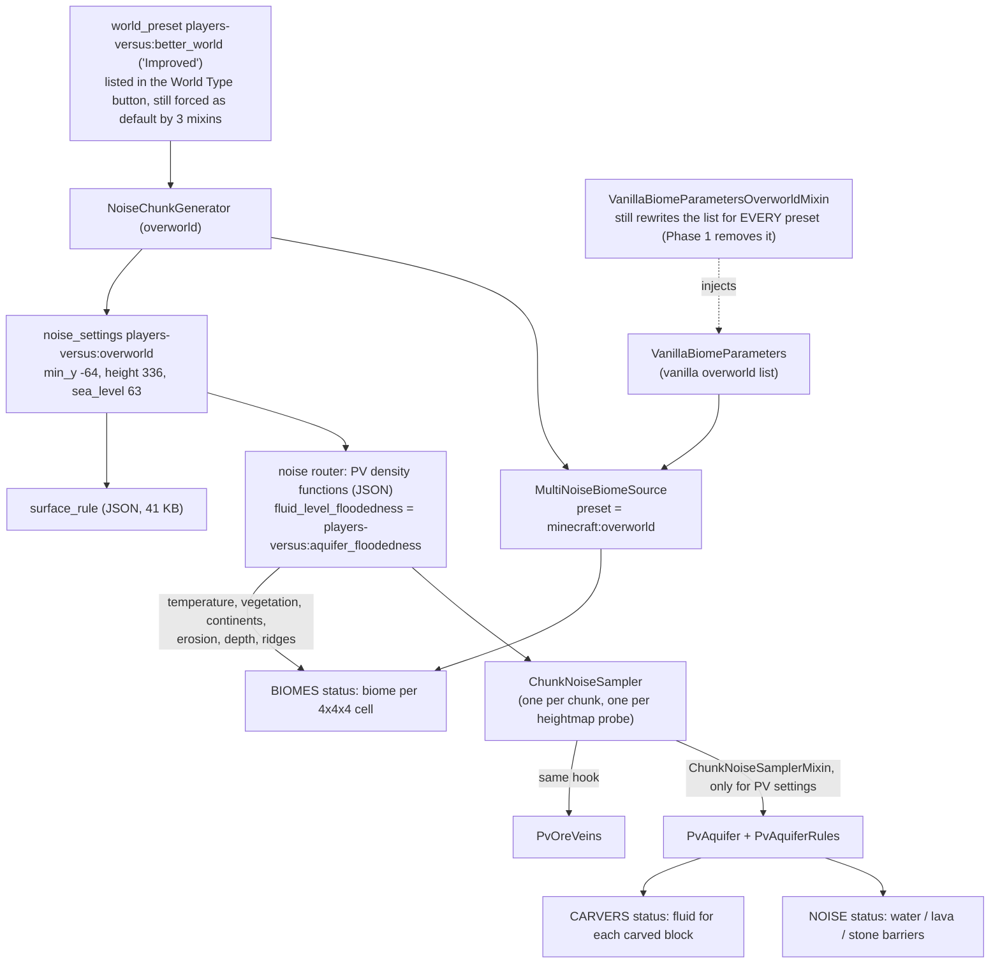
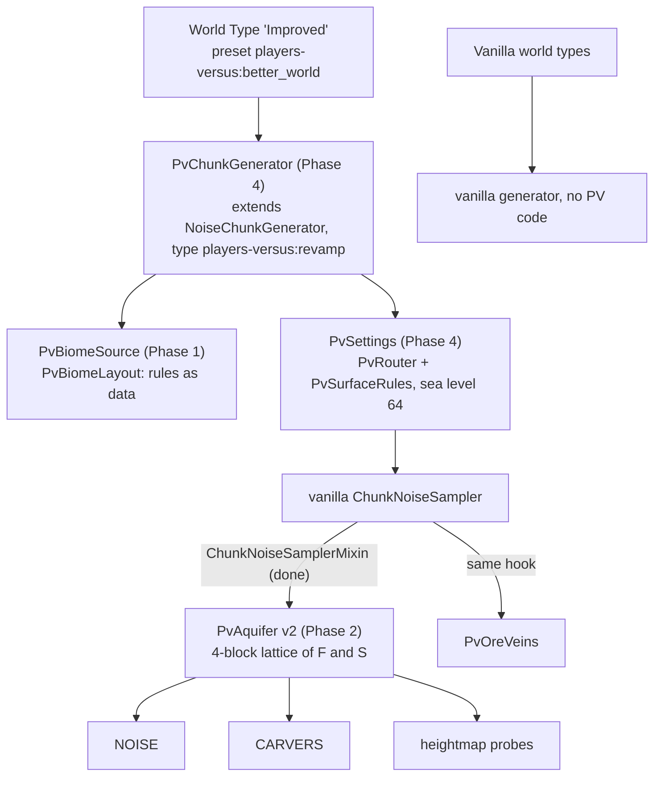

# Players Versus world type: worldgen revamp plan (revision 3)

**Target:** Minecraft 1.21.10, Yarn `1.21.10+build.2`, Fabric Loader 0.17.3, Loom 1.11, Java 21.

**Decisions so far:**

1. The output doesn't need to match the current generator, and old worlds may break. New worlds must work well and keep the **spirit** of the current generator.
2. The revamp is **its own world type**. Vanilla world types behave as usual.
3. **Fix the quirks.**

**Status:** the groundwork is in (Section 4); everything else is still a plan. Revision 2 (git history) described the goals. This revision adds verified vanilla APIs, pseudocode for every component, and the current density functions written out as formulas (Appendix A).

**How vanilla facts were checked.** Class, method and constructor signatures were checked against the Yarn 1.21.10 mappings (`FabricMC/yarn`, branch `1.21.10`). Appendix B lists them. Mappings don't contain method bodies, so behavior claims (for example the stale nested interpolator behind Q1) are still marked **[measure]**. The `/pvwg bench` metrics measure them directly.

---

## 0. Summary

**What the revamp is.** A separate world type, today's "Improved" preset (`players-versus:better_world`), backed by code that only runs for that world type:

| Component | Replaces | Phase |
|---|---|---|
| `ChunkNoiseSamplerMixin`: one gated `@WrapOperation` hook for aquifer and ore veins | `AquifersMixin` (`height == 336`), `OreVeinMixin` (global `@Overwrite`) | **done** |
| `/pvwg probe`, `/pvwg bench`, `runWorldgenSmoke`, `worldgen-smoke` workflow | (nothing: debugging was guesswork) | **done** |
| `PvBiomeSource` + `PvBiomeLayout`: layout rules as data, disjoint boxes | `VanillaBiomeParametersOverworldMixin` (global) | 1 |
| `PvAquifer` v2: lattice-cached F and S, one answer for every caller | per-block evaluation of the JSON trees | 2 |
| `PvRouter` + kernels: terrain density functions in Java | 18 hand-written density-function JSON files | 3 |
| `PvChunkGenerator` + `PvSettings` + `PvSurfaceRules`: all settings in code | `noise_settings/overworld.json` (41 KB of surface rules) | 4 |

**Expected effect.** These are static estimates; `/pvwg bench` measures the real numbers.

| Work | Today | After |
|---|---|---|
| Aquifer, terrain pass | ~48 octave samples per open block (y −31…63): 60–400k per chunk | 5–35k per chunk, from lattice points only |
| Aquifer, carvers | ~100–250 per carved block | ~0 extra (same lattice) |
| Terrain corner pass | ~130–180k per chunk | 25–40% less (no duplicate `sloped_cheese`, per-column river/jagged noise) |
| Worldgen mixins | 6, two of which changed vanilla world types | 1 (plus the 3 default-preset mixins, depending on Section 10, question 2) |

---

## 1. How the current generator works

### 1.1 Pipeline (after the groundwork)



### 1.2 What each router slot means in PV

| Slot | PV value | Read by |
|---|---|---|
| `final_density` | vanilla shape + river carving + ramen caves; `spaghetti_2d` replaced by the constant 1 | terrain (NOISE), heightmap probes |
| `depth` | vanilla depth + `river_carver_depth` | **biome selection** (the cave-biome depth bands) and the aquifer |
| `fluid_level_floodedness` | `players-versus:aquifer_floodedness` wrapping the PV sea/river floodedness F′. **Its presence marks a PV generator.** | `PvAquifer`, the hook's gate |
| `fluid_level_spread` | `cave_basins_y24` (S) | `PvAquifer` |
| `barrier`, `lava` | vanilla-like | unused while the PV aquifer is active |
| `preliminary_surface_level` | vanilla formula (no rivers) | surface rule `above_preliminary_surface`, vanilla internals |
| `continents`, `erosion`, `ridges`, `temperature`, `vegetation`, `vein_*` | vanilla | biomes, ore veins |

### 1.3 The aquifer rules (`PvAquiferRules.decide`)

For a block whose final density is ≤ 0, and for every carved block (carvers pass density 0 **[measure]**). The first matching rule wins:

| # | Condition | Result (`PvAquiferDecision`) |
|---|---|---|
| 1 | density > 0 | `SOLID` (terrain, ore veins) |
| 2 | y below the lava level (y < −54) | `LAVA` |
| 3 | y ≥ `SEA_LEVEL` (64) | `AIR_ABOVE_SEA` |
| 4a | −32 < y and F′ > 0.34 | `SEA_WATER`, or `SEA_WATER_TICKING` if F′ < 0.54 |
| 4b | −32 < y and F′ > 0.0001 + max(0, y − 60)·0.015 | `SEA_BARRIER` (stone) |
| 5a | −4 < y < 32 and S > tW(y), where tW = 0.5 for y > 8, else 0.5 − (8 − y)·0.08 | `BASIN_WATER`, or `BASIN_WATER_TICKING` if S < tW + 0.2 or density < 0.08 (always true: Q8) |
| 5b | −4 < y < 23 and S > tB(y), where tB = 0.0001 for y < 12, else (y − 12)·0.06 | `BASIN_BARRIER` (stone) |
| 6 | otherwise | `AIR` |

All thresholds are named in `PvWorldgenConstants`. In words: rivers and oceans are water connected to the sea surface and walled off from caves by stone; caves above y 32 stay dry; low caves get basins with their own water; the bottom is lava. That is what the revamp keeps.

### 1.4 Biome placement (still the mixin until Phase 1)

Vanilla's `writeBiomeParameters` emits two entries per surface slice (depth 0.0 and 1.0). The mixin cancels every call and emits, in order:

1. a **mountain transition** where erosion < −0.475 and continentalness > 0.03 (skipping river-valley slices), at depth 0 and 0.1;
2. a **frozen transition** for slices crossing temperature −0.55 or −0.375;
3. **peak fixes**: grove/snowy slopes above T 0.145, stony peaks below T 0.235;
4. a **humid transition** for slices crossing humidity 0.275 or 0.35;
5. the **original biome** with narrowed ranges, at depth 0 only (vanilla's depth-1.0 copy is dropped, so the underground belongs to PV cave biomes);
6. a **surface-cave biome** at depth 0.1–0.25 (frosted, desert-creeper or badlands cave).

It also replaces vanilla's lush and dripstone entries and appends 13 PV cave entries (Section 6.3 turns all of these into one table). Boxes overlap in several places and leave holes in others (Q4), so today the result depends on R-tree tie-breaking.

### 1.5 Evaluation contexts (why small JSON edits ripple everywhere)

| Context | Who | `interpolated` | `flat_cache` | `cache_once` |
|---|---|---|---|---|
| Corner pass | `ChunkNoiseSampler` filling 5×5×43 cell corners | child at the corner; a *nested* interpolator reached through `sample()` returns stale state **[measure]** | exact at corners | per corner |
| Block loop | aquifer, ore veins, noodle | trilinear from corners | snapped to 4×4 column | per block |
| Foreign position | carvers, `NoiseConfig`, structure/biome lookups | **raw** child | snapped inside the chunk | none |

`caves/entrances` feeds all three contexts, and `depth` feeds terrain, biomes and water. The same aquifer inputs therefore mean one thing in the terrain pass and another for carvers. Phase 2 removes that split.

---

## 2. Findings

### 2.1 Performance (static estimates; `/pvwg bench` measures them)

Unit: *octave samples*, meaning one single-octave Perlin sample (Appendix C).

| # | Hotspot | Estimate | Why |
|---|---|---|---|
| P1 | Aquifer floodedness per open block, NOISE | ~48 per block: 60–170k per land chunk, 200–400k per ocean chunk | 3D continentalness (18) and `surface` noise (6) sampled twice per block |
| P2 | Aquifer in carvers | 100–250 per carved block | no caches for foreign positions; `entrances` evaluated up to 4 times |
| P3 | Redundant terrain work, corner pass | 30–70k per chunk | `sloped_cheese` twice per corner; 2D `jagged`/`ridge` re-sampled per corner |
| P4 | Aquifer-only interpolators | small | 3 extra interpolators |
| P5 | Stacked cave biomes at FEATURES | unknown | 3–5 stacked biomes per chunk, 27–56 placed features each |
| P6 | Biome lookup | small | bigger list, same R-tree |
| P7 | 29-octave beach noises | small | once per column per rule, near sea level only |

### 2.2 Scope and correctness

- **S1:** biome placement is still global until Phase 1.
- **S2 and S3** (fixed by the groundwork): ore veins were global, and the aquifer was switched by `height == 336` through a `@Redirect`.
- **S5:** there is no single source of truth for density-function thresholds until Phase 2; `PvWorldgenConstants` names where they're duplicated.
- **S6:** vanilla-namespace data overrides still change vanilla world types (Section 10, question 1).

### 2.3 Quirks (all fixed in the revamp; Section 7 says how)

| # | Quirk | Effect today |
|---|---|---|
| Q1 | `cave_basins_y24` nests `caves/noodle` (with its own `interpolated` nodes) inside another `interpolated`, behind `min` and `mul` nodes, which evaluate their second argument with `sample()`. In the corner pass, an interpolator's `sample()` returns the last value it interpolated **[measure]**. For x-planes 0 and 1 that is nothing yet (0). For x-planes 2–4 it is the bottom block of the previous cell column (y −64, where the noodle is off). | The real noodle term never reaches the terrain pass. x-planes 0–1 get a made-up term instead, which matters at y 17–23, so basin water should jump at every chunk border along x. Carvers get the real term. `/pvwg bench` reports `basin_seam_ratio_x`. |
| Q2 | The humid transition's lower edge uses the *frozen* map | A birch-taiga strip appears where a dark-birch band was intended. |
| Q3 | The dripstone replacement passes continentalness as **depth** | Dripstone and frosted entries sit at depth 0.8–1.0. |
| Q4 | Mountain transitions use `max(slice.erosionMax, −0.475)` where `min` was meant. They cover whole slices or extend past them, overlapping the originals. `newContinentalness` is unreachable. Slices with continentalness < 0.03 are dropped entirely. | Mountain edges depend on R-tree tie-breaking, with holes in places. |
| Q5 | Water reaches y 63, while `sea_level: 63` means water up to y 62 in vanilla | Spawning, structures and icebergs assume a sea level 1 block too low. |
| Q6 | Barriers are returned to carvers as STONE | Carvers overwrite deepslate, dirt and ores with stone. `/pvwg bench` reports `stone_in_carved_space_below_y-8`. |
| Q7 | Transitions sit at depth 0 and 0.1, originals only at 0 | Transitions reach further underground than the biomes they sit next to. |
| Q8 | Basin water's tick test `density < 0.08` is always true, because density is ≤ 0 at that point | Every basin-water block is queued for a fluid update, which runs when its chunk becomes a full chunk **[measure]**. `/pvwg bench` reports `fluid_ticks_queued_per_chunk`. |

---

## 3. Goals and acceptance criteria

- **Vanilla world types run no PV generator code.** Done for aquifer and ore veins; biome layout follows in Phase 1. Data overrides are a separate question (Section 10).
- **The PV world type is selectable**: from the World Type button (done) and via `level-type=players-versus:better_world` on servers.
- **The spirit is kept**, checked with `/pvwg bench` maps of the same seeds against this checklist:
  - river valleys carved to sea level and filled with water;
  - oceans and rivers walled off from caves by stone;
  - dry upper caves, and water basins in caves below about y 32;
  - ramen and noodle caves;
  - mountainside, cold and humid transition biomes;
  - the PV cave layers and the frosted, badlands and desert-creeper surface caves;
  - sand and gravel beaches;
  - copper veins in terracotta and iron veins in tuff.
- **Performance:** PV pregeneration is no slower than the vanilla Default preset (stretch goal: faster), and no status costs more than 1.2× vanilla.
- **Correctness:** Q1–Q8 fixed, `basin_seam_ratio_x` ≈ 1, zero stone in carved deepslate, one sea level, fluid updates queued only at water edges.
- **Maintainability:**
  - no hand-written density-function or noise-settings JSON;
  - constants live in `PvWorldgenConstants`;
  - one mixin;
  - `/pvwg probe` explains any block.

---

## 4. Groundwork in place (commit `7107dc8`)

| Piece | Where | Notes |
|---|---|---|
| Gated hook | `mixin/environment/worldgen/ChunkNoiseSamplerMixin` | Two `@WrapOperation`s in `ChunkNoiseSampler.<init>`. The gate is `PvWorldgen.isPvGenerator(settings)`: the **settings'** router has an `AquiferFloodedness` in `fluid_level_floodedness`. It reads the settings (via `@Local(argsOnly = true)`), not the per-chunk router copy, so C2ME's density-function compiler can't hide the marker. |
| Marker / future F type | `density/AquiferFloodedness` (`players-versus:aquifer_floodedness`) | Wraps the JSON function unchanged for now; Phase 2 turns it into the Java F under the same id. |
| Aquifer | `aquifer/PvAquifer`, `PvAquiferRules`, `PvAquiferDecision` | Same behavior as `SimpleWaterAquifer`, minus a dead per-sampler evaluation. The rules are shared with the probe. |
| Ore veins | `ore/PvOreVeins` | Same logic as the old `@Overwrite`, now PV-only. |
| Constants | `PvWorldgenConstants` | Sea level, aquifer thresholds and bands, with notes on where JSON still duplicates them. |
| `/pvwg probe` | `debug/WorldgenProbe` | Prints the biome (source vs stored), the climate point, raw density values, F, S and the aquifer decision at your position. |
| `/pvwg bench <radius>` | `debug/WorldgenBench` | Generates a square of chunks status by status. Writes `report.txt` (time per status, metrics, biome histograms) and PNGs (`surface`, `biomes-*`, `slice-y*`) to `<game dir>/pvwg/`. |
| Headless run | `./gradlew runWorldgenSmoke -Ppv.acceptEula=true [-Ppv.levelType=… -Ppv.seed=… -Ppv.benchRadius=… -Ppv.benchCenter=x,z]` | Fresh world every run in `run/worldgen-smoke/`; stops by itself. |
| CI benchmark | `.github/workflows/worldgen-smoke.yml` (Actions → worldgen-smoke → Run workflow) | Runs vanilla and PV side by side and uploads both result folders. It only starts if you tick the EULA box. |
| World-type button | `data/minecraft/tags/worldgen/world_preset/normal.json` | "Improved" can be picked like any other type. |
| Removed | `AquifersMixin`, `OreVeinMixin`, `SurfaceRulesMixin`, `SimpleWaterAquifer`, `entrances_old.json`, `gravel_beach.json` (density function), `remappedSrc/` | The CI build (`./gradlew build`) passes. The mixin still needs a first in-game or smoke run to be exercised. |

---

## 5. Target architecture



```
mod/environment/worldgen/
  PvWorldgen, PvWorldgenConstants               (done)
  aquifer/  PvAquifer, PvAquiferRules, PvAquiferDecision (done), Lattice (2)
  ore/      PvOreVeins                          (done)
  debug/    WorldgenProbe, WorldgenBench, WorldgenDebugCommands (done)
  density/  AquiferFloodedness (done), AquiferNoises (2), PvRouter + kernel/* (3)
  biome/    PvBiomeKeys, PvBiomeLayout, PvBiomeSource, Box (1)
  PvSettings, PvChunkGenerator (4)
  surface/  PvSurfaceRules (4)
mixin/environment/worldgen/ChunkNoiseSamplerMixin (done)
```

**Rules for new code:**

1. Density functions are shared across worker threads, so they hold no mutable state. Memoize with vanilla markers (`cache_once`, `cache_2d`, `flat_cache`), which `ChunkNoiseSampler` turns into per-chunk caches, or inside per-chunk objects such as the aquifer's lattice.
2. Keep `interpolated`, `flat_cache`, `cache_once` and `blend_*` as vanilla nodes. Kernels only replace the arithmetic between them, and map their children in `apply(visitor)`.
3. Kernel `minValue`/`maxValue` must be valid bounds, because vanilla's `min`/`max` nodes use them to skip evaluating a child **[measure]**.
4. Constants shared across components live in `PvWorldgenConstants`, with a *why*.

---

## 6. Component designs (pseudocode)

Signatures that matter are real 1.21.10 Yarn names (Appendix B); the rest is pseudocode.

### 6.1 Hook and gate (done)

```java
// ChunkNoiseSamplerMixin (real code)
@WrapOperation(method = "<init>", at = @At(value = "INVOKE", target = ".../AquiferSampler;aquifer(...)..."))
AquiferSampler useAquifer(ChunkNoiseSampler s, ChunkPos pos, NoiseRouter router, RandomSplitter r, int minY, int height,
                          FluidLevelSampler fluids, Operation<AquiferSampler> original,
                          @Local(argsOnly = true) ChunkGeneratorSettings settings) {
    return PvWorldgen.isPvGenerator(settings) ? new PvAquifer(router, fluids) : original.call(s, pos, router, r, minY, height, fluids);
}
// Phase 2 changes the PV branch to: new PvAquifer(AquiferNoises.of(noiseConfig.getNoiseRouter()), pos, fluids)
// with @Local(argsOnly = true) NoiseConfig noiseConfig, so the lattice samples raw, seeded functions.
```

### 6.2 Aquifer v2 (Phase 2): lattice + Java F and S

**Idea.** F and S vary smoothly, so sample them on a 4-block lattice per chunk and interpolate. Every caller (terrain pass, carvers, heightmap probes, the neighbouring chunk) then sees the same values: no seams, no terrain/carver disagreement, bounded cost.

```java
public final class PvAquifer implements AquiferSampler {
    private final Lattice floodedness, spread;          // per chunk, lazily filled
    private final FluidLevelSampler fluids;
    private boolean needsFluidTick;

    PvAquifer(AquiferNoises noises, ChunkPos chunk, FluidLevelSampler fluids) {
        this.floodedness = new Lattice(noises.floodedness(), chunk);   // raw F from NoiseConfig's router
        this.spread = new Lattice(noises.spread(), chunk);             // raw S
        this.fluids = fluids;
    }

    public BlockState apply(NoisePos pos, double density) {
        if (density > 0) { needsFluidTick = false; return null; }
        int y = pos.blockY();
        boolean lava = fluids.getFluidLevel(pos.blockX(), y, pos.blockZ()).getBlockState(y).isOf(Blocks.LAVA);
        PvAquiferDecision d = PvAquiferRules.decide(pos, density, lava, floodedness, spread); // takes PositionalValue in v2
        needsFluidTick = d.needsFluidTick;
        return d.isBarrier() ? null : d.state;           // Q6: barriers stay solid, so carvers leave them alone;
                                                         // in the terrain pass, ore veins, then the default block, fill them
    }
}

/** Values of one function on a 4-block lattice covering one chunk and y -32..64. */
final class Lattice implements PositionalValue {
    static final int STEP = 4, MIN_Y = SEA_BAND_MIN_Y, LEVELS = (SEA_LEVEL - MIN_Y) / STEP + 1, SIDE = 16 / STEP + 1;
    private final DensityFunction source;                // raw, seeded; no interpolated wrappers inside
    private final int originX, originZ;                  // chunk start / STEP
    private final float[] values = filledWithNaN(SIDE * SIDE * LEVELS);

    public double at(NoisePos pos) {
        int x = pos.blockX(), y = pos.blockY(), z = pos.blockZ();
        int ix = (x >> 2) - originX, iy = (y - MIN_Y) >> 2, iz = (z >> 2) - originZ;
        if (outside(ix, iy, iz)) return source.sample(new UnblendedNoisePos(x, y, z));  // safety net, never expected
        return MathHelper.lerp3((x & 3) / 4.0, ((y - MIN_Y) & 3) / 4.0, (z & 3) / 4.0,
                corner(ix, iy, iz),     corner(ix + 1, iy, iz),     corner(ix, iy + 1, iz),     corner(ix + 1, iy + 1, iz),
                corner(ix, iy, iz + 1), corner(ix + 1, iy, iz + 1), corner(ix, iy + 1, iz + 1), corner(ix + 1, iy + 1, iz + 1));
    }

    private double corner(int ix, int iy, int iz) {
        int i = (ix * SIDE + iz) * LEVELS + iy;
        if (Float.isNaN(values[i])) {
            values[i] = (float) source.sample(new UnblendedNoisePos((originX + ix) * STEP, MIN_Y + iy * STEP, (originZ + iz) * STEP));
        }
        return values[i];
    }
}
```

- **Cost:** at most 5 × 5 × 25 = 625 points per function per chunk, and only where open space needs them.
- **Optional refinement:** if barrier edges look too smooth compared with today's per-block noise, evaluate F exactly for blocks within ε of a threshold.

**F and S in Java (`AquiferNoises`).** These are today's JSON formulas (Appendix A.3), with two changes:

- `depth`, `entrances` and `noodle` are sampled raw at the lattice point instead of through `interpolated`. That fixes Q1: no nested interpolators.
- Each leaf is computed once per point.

```java
double seaFloodedness(x, y, z) {                                  // F′, y in (-32, 64)
    double depth = terrain.depth(x, y, z), entr = terrain.entrances(x, y, z);
    double s2 = abs(surfaceNoise.sample(2 * x, y, 2 * z));
    double ocean = 8 * max(0, 0.06 + 0.02 * s2 - depth);           // below the sea surface of oceans and lakes
    double river = rivers.aquifer(x, y, z, entr);                   // river channels, y 48..63 (A.1)
    double coast = 0, entrance = min(0, G(-32, 8, 0.32, -0.18, y) + entr);
    if (entrance < 0) {                                             // cave entrances opening near the coast
        double c3 = continentalness3d(x, y, z);                     // shifted continentalness, xz 0.25, y 0.1
        coast = (G(16, 48, 0, -0.34, y) + c3) * (-64 * min(0, min(-0.08, c3 - 0.1) - 0.08 * s2 + depth)) * entrance;
    }
    double f = max(max(ocean, river), coast);
    if (y >= -4 && y < 32 && f >= SEA_BARRIER_THRESHOLD && f < SEA_WATER_THRESHOLD) f += ramenAquifer(x, y, z);
    return f;
}

double basinFloodedness(x, y, z) {                                // S, y in [-2, 48)
    double entr = terrain.entrances(x, y, z), noodle = terrain.noodleRaw(x, y, z);   // raw noodle: Q1 fixed
    double walls = -0.12 - 0.06 * abs(surfaceNoise.sample(4 * x, 2 * y, 4 * z))
                 + entr + min(0, (entr - 0.24) * (-4 * min(0, noodle - 0.08)));
    double inner = min(1, G(0, 16, 0, -16, y) * min(0, walls));
    double s = max(0, G(48, 24, -3, -0.1, y) + inner);
    return y >= 24 ? s * G(24, 48, -0.2, 0, y) : s;
}
// G(fromY, toY, fromValue, toValue, y) = MathHelper.clampedMap(y, fromY, toY, fromValue, toValue)
```

Since F and S are now Java, their thresholds come from `PvWorldgenConstants`, and the JSON copies (`0.0001`, `0.34`) disappear (S5).

**Q5, sea level.** Set the settings' `sea_level` to 64. That keeps today's water surface at y 63 and makes vanilla systems agree with it. `SEA_LEVEL` then feeds the settings, the aquifer, F's `y < 64` band and the surface rules.

### 6.3 Biome layout (Phase 1): rules as data, disjoint boxes

```java
record Box(long[] min, long[] max) {                 // axes T, H, C, E, W in MultiNoiseUtil.toLong units
    Box intersect(Box o) { /* per-axis max of mins, min of maxes; null if any axis is empty */ }
    List<Box> minus(Box o) {                          // disjoint pieces of this − o
        if (intersect(o) == null) return List.of(this);
        List<Box> out = new ArrayList<>(); long[] lo = min.clone(), hi = max.clone();
        for (int a = 0; a < 5; a++) {
            if (lo[a] < o.min[a]) { out.add(withAxis(a, lo[a], o.min[a], lo, hi)); lo[a] = o.min[a]; }
            if (hi[a] > o.max[a]) { out.add(withAxis(a, o.max[a], hi[a], lo, hi)); hi[a] = o.max[a]; }
        }
        return out;                                   // the rest lies inside o and belongs to the rule
    }
}

record TransitionRule(String name, Box region, BiFunction<Slice, RegistryKey<Biome>, RegistryKey<Biome>> target) {}

// Earlier rules win where regions overlap. Targets return null when the rule doesn't apply.
static final List<TransitionRule> RULES = List.of(
    rule("mountainside", box(E(-1, -0.475), C(0.03, 1)), (s, b) -> s.inRiverValley() ? null : mountainTarget(b, s.temperature())), // Q4
    rule("peak-warm",   box(T(0.145, 1)),               (s, b) -> Map.of(GROVE, TAIGA, SNOWY_SLOPES, WINDSWEPT_HILLS).get(b)),
    rule("peak-cold",   box(T(-1, 0.235)),              (s, b) -> b == STONY_PEAKS ? WINDSWEPT_GRAVELLY_HILLS : null),
    rule("frozen",      box(T(-0.55, -0.375)),          (s, b) -> FROZEN.get(b)),
    rule("humid",       box(H(0.275, 0.35)),            (s, b) -> HUMID.get(b)));    // Q2: humid map on both edges

static List<Pair<NoiseHypercube, RegistryKey<Biome>>> build() {
    List<Pair<NoiseHypercube, RegistryKey<Biome>>> out = new ArrayList<>();
    new VanillaBiomeParameters().writeOverworldBiomeParameters(entry -> {
        NoiseHypercube h = entry.getFirst();
        if (isPoint(h.depth(), 0f)) emitSurface(Slice.of(entry), out);   // surface and ocean slices
        else if (isPoint(h.depth(), 1f)) { }                              // dropped: the underground belongs to PV caves
        else if (entry.getSecond() == LUSH_CAVES || entry.getSecond() == DRIPSTONE_CAVES) { } // replaced by CAVES
        else out.add(entry);                                              // deep dark
    });
    CAVES.forEach(c -> out.add(c.toEntry()));
    return out;
}

static void emitSurface(Slice slice, List<...> out) {
    List<Piece> pieces = List.of(new Piece(slice.box(), slice.biome(), false));
    for (TransitionRule rule : RULES) {
        List<Piece> next = new ArrayList<>();
        for (Piece p : pieces) {
            RegistryKey<Biome> target = p.transitioned() ? null : rule.target().apply(slice, p.biome());
            Box inside = target == null ? null : p.box().intersect(rule.region());
            if (inside == null) { next.add(p); continue; }
            next.add(new Piece(inside, target, true));
            for (Box rest : p.box().minus(rule.region())) next.add(new Piece(rest, p.biome(), false));
        }
        pieces = next;
    }
    for (Piece p : pieces) out.add(entry(p.box(), SURFACE_DEPTH, slice.offset(), p.biome()));    // Q7: one depth for all
    RegistryKey<Biome> cave = SURFACE_CAVES.get(slice.biome());
    if (cave != null) out.add(entry(slice.box(), SURFACE_CAVE_DEPTH, slice.offset() + 0.075f, cave));
}
```

**The cave table** (`CAVES`) replaces vanilla's lush and dripstone entries and the 13 appended PV entries. Depth bands:

| Band | Depth | Offset |
|---|---|---|
| `SURFACE_DEPTH` | point 0 (proposal) | 0 |
| `SURFACE_CAVE` | 0.1–0.25 | 0, or 0.04 when rare |
| `CAVE` | 0.2–0.4 | 0, or 0.04 when rare |
| `GENERIC_CAVE` | 0.25–0.65 | 0.07 |
| `DEEP` | point 0.9 | 0.05 for generic deep caves |
| lush and dripstone replacements | 0.15–0.5 | 0.01 for lush |

Q3 is fixed here: dripstone and frosted replacements get 0.15–0.5, the same band as the lush replacement, instead of continentalness. Every row keeps its current climate ranges. `SURFACE_CAVES` keeps its current mapping: frozen peaks/snowy slopes → frosted caves, desert → desert creeper caves, badlands family → badlands cave.

**Check:** the bench's biome maps and histograms at the surface, y 0 and y −40, against the reference run.

### 6.4 Biome source (Phase 1)

```java
public final class PvBiomeSource extends BiomeSource {               // registered as players-versus:revamp
    public static final MapCodec<PvBiomeSource> CODEC = RecordCodecBuilder.mapCodec(i -> i.group(
            RegistryOps.getEntryLookupCodec(RegistryKeys.BIOME)).apply(i, i.stable(PvBiomeSource::new)));
    private final RegistryEntryLookup<Biome> biomes;
    private final MultiNoiseUtil.Entries<RegistryEntry<Biome>> entries;

    PvBiomeSource(RegistryEntryLookup<Biome> biomes) {
        this.biomes = biomes;
        this.entries = new MultiNoiseUtil.Entries<>(PvBiomeLayout.build().stream().map(p -> p.mapSecond(biomes::getOrThrow)).toList());
    }
    @Override protected MapCodec<? extends BiomeSource> getCodec() { return CODEC; }
    @Override protected Stream<RegistryEntry<Biome>> biomeStream() { return entries.getEntries().stream().map(Pair::getSecond).distinct(); }
    @Override public RegistryEntry<Biome> getBiome(int x, int y, int z, MultiNoiseUtil.MultiNoiseSampler noise) {
        return entries.get(noise.sample(x, y, z));
    }
    @Override public void addDebugInfo(List<String> info, BlockPos pos, MultiNoiseUtil.MultiNoiseSampler noise) {
        // climate point + the layout rule that produced the biome (PvBiomeLayout keeps rule names per entry)
    }
}
```

Phase 1 points `better_world.json` at `{"type": "players-versus:revamp"}` and deletes the mixin.

### 6.5 Terrain router and kernels (Phase 3)

Build the router in Java from vanilla's registered functions plus PV kernels. Appendix A has each formula.

```java
static NoiseRouter create(RegistryEntryLookup<DensityFunction> dfs, RegistryEntryLookup<NoiseParameters> noises) {
    DensityFunction continents = ref(dfs, "overworld/continents"), erosion = ref(dfs, "overworld/erosion"),
            ridges = ref(dfs, "overworld/ridges"), offset = ref(dfs, "overworld/offset"), factor = ref(dfs, "overworld/factor"),
            jaggedness = ref(dfs, "overworld/jaggedness"), base3d = ref(dfs, "overworld/base_3d_noise"),
            roughness = ref(dfs, "overworld/caves/spaghetti_roughness_function"),
            shiftX = ref(dfs, "shift_x"), shiftZ = ref(dfs, "shift_z");          // ref = RegistryEntryHolder(lookup.getOrThrow(key))

    DensityFunction ridge = flatCache(shiftedNoise(shiftX, shiftZ, 0.25, noises.getOrThrow(RIDGE))); // once per 4×4 column
    DensityFunction depth = cacheOnce(add(add(yClampedGradient(-64, 320, 1.5, -1.5), offset), new RiverDepth(ridge)));
    DensityFunction jagged = flatCache(new HalfNegativeNoise(noises.getOrThrow(JAGGED), 1500.0));   // 2D, once per column
    DensityFunction slopedCheese = cacheOnce(min(new RiverCarver(ridge),
            add(mul(constant(4), quarterNegative(mul(add(depth, mul(jaggedness, jagged)), factor))), base3d)));
    DensityFunction entrances = cacheOnce(new PvEntrances(continents, roughness, noises /* ramen, cave_entrance, spaghetti_3d */));
    DensityFunction noodle = vanillaStyleNoodle(noises);                 // keeps its 4 interpolated inputs
    DensityFunction terrain = new PvTerrainDensity(slopedCheese, entrances, roughness,
            new PvPillars(noises), noises /* cave_layer, cave_cheese */);  // T in A.2: sloped cheese read once
    DensityFunction finalDensity = min(squeeze(mul(constant(0.64), interpolated(blendDensity(
            add(constant(0.1171875), mul(yClampedGradient(-64, -40, 0, 1),
            add(constant(-0.1171875), add(constant(-0.078125), mul(yClampedGradient(240, 256, 1, 0),
            add(constant(0.078125), terrain)))))))))), noodle);

    NoiseRouter router = new NoiseRouter(barrier, new AquiferFloodedness(new SeaFloodedness(...)), new BasinFloodedness(...),
            lava, temperature, vegetation, continents, erosion, depth, ridges, preliminarySurface, finalDensity,
            veinToggle, veinRidged, veinGap);
    checkSlots(router);   // NoiseRouter's component order isn't in Yarn: assert each accessor returns what we passed
    return router;
}
```

Every factory above exists under that name in `DensityFunctionTypes` (Appendix B); `squeeze`, `quarterNegative` and friends are default methods on `DensityFunction`.

**Kernel template.**

```java
public record RiverCarver(DensityFunction ridge) implements DensityFunction {        // A.1: RC
    public double sample(NoisePos pos) {
        int y = pos.blockY();
        if (y < 48 || y >= 256) return 1;
        double r = ridge.sample(pos);
        if (r < -0.22 || r >= 0.22) return 1;
        return G(50, 74, 0.8, -1.2, y) + G(68, 90, 0, 0.3, y) + G(68, 128, 0, 0.89, y) + square(7 * r);
    }
    public void fill(double[] out, EachApplier applier) { applier.fill(out, this); }
    public DensityFunction apply(DensityFunctionVisitor v) { return v.apply(new RiverCarver(ridge.apply(v))); }
    public double minValue() { return -1.2; }  public double maxValue() { return 1 + square(7 * 0.22) + 1.19; }  // loose but valid
    public CodecHolder<? extends DensityFunction> getCodecHolder() { return CODEC_HOLDER; }
}
```

Also in Phase 3:

- **Speed-up checks:** `/pvwg bench` `noise` time per chunk before and after.
- **Spirit checks:** the `surface.png` and `slice-y*.png` maps against the reference run.
- **Cleanup:** delete `density_function/**`.

### 6.6 Settings and chunk generator (Phase 4)

```java
static ChunkGeneratorSettings create(RegistryEntryLookup<DensityFunction> dfs, RegistryEntryLookup<NoiseParameters> noises) {
    return new ChunkGeneratorSettings(                      // constructor order verified in Yarn (Appendix B)
            GenerationShapeConfig.create(-64, 336, 1, 2),
            Blocks.STONE.getDefaultState(), Blocks.WATER.getDefaultState(),
            PvRouter.create(dfs, noises),
            PvSurfaceRules.create(),
            PV_SPAWN_TARGET,                                // today's two hypercubes from the JSON
            PvWorldgenConstants.SEA_LEVEL,                  // 64 (Q5)
            false, true, true, false);                      // mobGenerationDisabled, aquifers, oreVeins, usesLegacyRandom
}

public final class PvChunkGenerator extends NoiseChunkGenerator {                   // players-versus:revamp
    public static final MapCodec<PvChunkGenerator> CODEC = RecordCodecBuilder.mapCodec(i -> i.group(
            RegistryOps.getEntryLookupCodec(RegistryKeys.BIOME),
            RegistryOps.getEntryLookupCodec(RegistryKeys.DENSITY_FUNCTION),
            RegistryOps.getEntryLookupCodec(RegistryKeys.NOISE_PARAMETERS)).apply(i, i.stable(PvChunkGenerator::create)));
    static PvChunkGenerator create(RegistryEntryLookup<Biome> b, RegistryEntryLookup<DensityFunction> d, RegistryEntryLookup<NoiseParameters> n) {
        return new PvChunkGenerator(new PvBiomeSource(b), RegistryEntry.of(PvSettings.create(d, n)));
    }
    @Override protected MapCodec<? extends ChunkGenerator> getCodec() { return CODEC; }
    @Override public void appendDebugHudText(List<String> text, NoiseConfig noiseConfig, BlockPos pos) {
        super.appendDebugHudText(text, noiseConfig, pos);
        // + "PV aquifer: <decision> F=… S=…" from PvAquiferRules
    }
}
```

With this, the world preset shrinks to `"generator": {"type": "players-versus:revamp"}`.

### 6.7 Surface rules (Phase 4)

- **Port the rule to Java.** Write a small script that walks the current JSON rule and prints `MaterialRules` calls: `sequence`, `condition`, `block`, `biome`, `noiseThreshold`, `stoneDepth(offset, addSurfaceDepth, secondaryDepthRange, VerticalSurfaceType.FLOOR/CEILING)`, `aboveY`/`aboveYWithStoneDepth(YOffset.fixed(y), multiplier)`, `water`/`waterWithStoneDepth`, `verticalGradient`, `not`, `steepSlope`, `hole`, `surface` (above preliminary surface), `temperature`, `terracottaBands`. Then hand-split the output into named helpers such as `beaches()`, `badlands()`, `frozenPeaks()`.
- **Check the port.** Encode the Java rule back with `MaterialRules.MaterialRule.CODEC` and compare it structurally with the old JSON before deleting it.
- **Beach noises.** Trim `sand_beach`/`gravel_beach` from 29 to about 10 octaves (P7); they stay as two tiny noise-parameter JSON files.

### 6.8 Old worlds and future breaking changes

- **Old worlds.** They reference `players-versus:overworld` noise settings. If Section 10, question 3 is "keep them loadable", Phase 4 keeps a stub under that key.
- **Future breaking changes.** If `PvChunkGenerator` ever needs one, add `"version": 2` to its codec and keep the old behavior behind `version: 1`.

---

## 7. Phased plan and quirk fixes

| Phase | Work | Exit check |
|---|---|---|
| 0 (mostly done) | Tooling (Section 4). **Remaining:** run the `worldgen-smoke` workflow once on the current generator; its artifacts are the reference maps and baseline numbers. | Report shows Q1 (`basin_seam_ratio_x`), Q6 (`stone_in_carved_space…`) and Q8 (`fluid_ticks_queued…`) on PV; vanilla vs PV timings recorded |
| 1 | `PvBiomeLayout` + `PvBiomeSource` (6.3, 6.4); delete the biome mixin | Biome maps reviewed; the vanilla preset's biomes equal plain vanilla |
| 2 | `AquiferNoises` + lattice `PvAquifer` (6.2); sea level 64 | `basin_seam_ratio_x` ≈ 1; carved deepslate has no stone; fewer queued fluid ticks; `noise` and `carvers` ms/chunk well below baseline |
| 3 | `PvRouter` + kernels (6.5); delete density-function JSON | `noise` ms/chunk down; terrain maps reviewed |
| 4 | `PvSettings`, `PvChunkGenerator`, `PvSurfaceRules` (6.6, 6.7) | No worldgen logic in hand-written JSON; full bench against Default |
| 5 | Measure-driven tuning: cave-biome features (P5), carvers | Per-status times within 1.2× of vanilla |

| Quirk | Fix | Phase |
|---|---|---|
| Q1 | S sampled raw on the lattice; no nested interpolators | 2 |
| Q2 | Humid map on both humid edges | 1 |
| Q3 | Real depth band (0.15–0.5) for the dripstone/frosted replacement | 1 |
| Q4 | Transition = slice ∩ region, original = slice − region (disjoint boxes) | 1 |
| Q5 | `sea_level` 64, one constant everywhere | 2 |
| Q6 | Barrier returns "solid" (`null`): carvers skip it, and the terrain pass fills it with ore veins or the default block, as vanilla does | 2 |
| Q7 | One surface depth for all surface entries | 1 |
| Q8 | Queue fluid updates only within the S margin, like sea water | 2 |

---

## 8. Validation

- **Every phase:** run the `worldgen-smoke` workflow (or `runWorldgenSmoke` locally) with the same seed and center. Compare these against the Phase 0 reference:
  - `report.txt`: times per status, the metrics, and the biome histograms;
  - the PNGs.
- **Metrics** (already implemented):
  - `water_at_or_above_y64` must stay 0 for PV;
  - `stone_in_carved_space_below_y-8` must reach 0 after Phase 2;
  - `basin_seam_ratio_x`/`z` must both be ≈ 1 after Phase 2;
  - `fluid_ticks_queued_per_chunk` for y 0..31 must fall well below the water-block count printed next to it, after Phase 2.
- **Compatibility:** C2ME and Lithium with a PV world and a vanilla world. The gate reads the settings' router precisely so C2ME can't break it.
- **Later (optional):** once the revamp settles, add a per-chunk hash snapshot to the bench so pure refactors can prove they changed nothing.

---

## 9. Risks and notes

- **Runtime coverage.** Mixins and density-function codecs are only exercised when the game loads them. The first smoke run is also the first runtime test of the groundwork.
- **Build environment.** Fabric's maven and Mojang's servers aren't reachable from the environment this was written in. CI builds every push, and the smoke workflow runs the server there.
- **Threads.** Kernels are stateless; each lattice belongs to one chunk's aquifer.
- **Porting to 26.x.** One mixin, plus public extension points (biome source, chunk generator, density-function types). Appendix D maps names.

---

## 10. Open questions

1. **Vanilla-namespace data overrides still change vanilla world types.** There are 146 files: 124 under `data/minecraft/worldgen/` and 22 tags under `data/minecraft/tags/worldgen/`. For example, carver probabilities are `cave` 0.02, `cave_extra_underground` 0.03 and `canyon` 0.0125 here, against vanilla's 0.15, 0.07 and 0.01 (vanilla values from memory). So vanilla worlds get far fewer carver caves. Recommendation:
   - make carvers PV-only: PV cave biomes get their own carver configs, and the three `minecraft:` carver overrides go away;
   - keep feature and structure tweaks global.
2. **Pre-selected world type:** keep "Improved" pre-selected in Create World (keep the client mixin), or default to vanilla (delete all three default-preset mixins)?
3. **Pre-revamp worlds:** keep a stub so they still open (with seams), or let them fail?

---

## Appendix A: The current density functions as formulas

Notation:

- `G(a, b, u, v)` is `y_clamped_gradient` from y a to y b, value u to v (`MathHelper.clampedMap(y, a, b, u, v)`).
- `noise(xs, ys)` samples a noise at `(xs·x, ys·y, xs·z)`.
- `R` is the shifted ridge noise (xz 0.25, y 0).
- `qn`/`hn` are `quarter_negative`/`half_negative`: identity for positive values, times 0.25 or 0.5 for negative ones.

### A.1 Rivers and depth

```
RC  (river_carver)       = y∈[48,256) ∧ R∈[-0.22,0.22) ? G(50,74,0.8,-1.2) + G(68,90,0,0.3) + G(68,128,0,0.89) + (7R)² : 1
RCD (river_carver_depth) = y∈[54,128) ∧ R∈[-0.2,0.2)   ? min(0, G(54,74,0,-1) + G(56,120,0,1) + (6.75R)²)        : 0
RCA (river_carver_aquifer) = y∈[48,64) ∧ R∈[-0.3,0.3)  ? -2·min(0, G(48,54,-0.2,3)·min(0, EN-0.2) + G(48,64,0.25,-1) + (6.25R)²) : 0
D   (depth)              = G(-64,320,1.5,-1.5) + offset + RCD
```

### A.2 Terrain and caves

```
SC (sloped_cheese) = min(RC, 4·qn((D + jaggedness·hn(jagged(1500, 0)))·factor) + base_3d_noise)
RMC (ramen_cave_carver) = y∈[0,44) ? min(0, 2·(0.1 + G(-4,8,0,1)·G(8,16,1.4,1)·G(16,44,1.2,0)·(-0.2 + 0.08·noodle_ridge_a(4,2) + |noodle(3,3)|))) : 0
EN (entrances) = RMC
               + (-0.1·min(continents, 0.1) + G(96,72,0.15,0) + G(66,56,-0.1,0.025) + G(48,36,0,-0.165) + G(28,18,0,0.275) + G(-16,-40,0,-0.2) + G(-40,-60,0,0.215))
               + min(0.37 + cave_entrance(0.8, 0.75) + G(-10,30,0.3,0),
                     roughness + clamp(max(spaghetti_3d_1, spaghetti_3d_2) - 0.0765 - 0.0115·spaghetti_3d_thickness, -1, 1))
P  (pillars)   = min(0.3, max(-0.02, -0.2 + 0.7·max(0, pillar(20, 0.5) - 0.15)))
N  (noodle)    = G(96,56,-0.05,0.08) + G(56,40,0,-0.1) + G(32,20,0,0.1) + G(-8,-32,0,-0.3) + G(-52,-64,0,0.35)
               + (n < -0.2 ? 64 : t + 1.5·max(|a|, |b|))        n, t, a, b = interpolated noodle, thickness, ridge_a, ridge_b (y∈[-60,321))
T  (inside final_density) = SC < 1.5625
               ? min(SC, 5·EN)
               : max(min(min(4·cave_layer(1, 8)² + clamp(0.27 + cave_cheese(1, 0.667), -1, 1) + clamp(1.5 - 0.64·SC, 0, 0.5), EN), 1 + roughness),
                     P < 0.03 ? -1e6 : P)
final_density = min(squeeze(0.64·interpolated(blend_density(0.1171875 + G(-64,-40,0,1)·(-0.1171875 + (-0.078125 + G(240,256,1,0)·(0.078125 + T)))))), N)
```

### A.3 Aquifer inputs

```
S2 = surface(2, 1)   C3 = continentalness shifted (0.25, 0.1)   iD, iEN = interpolated D, EN
F0 = y∈[-32,64) ? max(max(8·max(0, 0.06 + 0.02|S2| - iD), RCA),
                      (G(16,48,0,-0.34) + C3)·(-64·min(0, min(-0.08, C3-0.1) - 0.08|S2| + iD))·min(0, G(-32,8,0.32,-0.18) + iEN)) : 0
RMA (ramen_cave_aquifer) = y∈[0,40) ? max(0, -6·(0.1 + G(-4,8,0,1)·G(8,16,1.4,1)·G(16,40,1.2,0)·(|noodle(3,3)| - 0.24))) : 0
F′ = y∈[-4,32) ∧ F0∈[0.0001,0.34) ? F0 + RMA : F0
S  = y∈[-2,48) ? (y≥24 ? G(24,48,-0.2,0) : 1)·max(0, G(48,24,-3,-0.1)
               + interpolated(min(1, G(0,16,0,-16)·min(0, -0.12 - 0.06|surface(4,2)| + EN + min(0, (EN-0.24)·(-4·min(0, N-0.08))))))) : 0
```

(The `interpolated(...)` wrapping `N` inside `S` is Q1.)

---

## Appendix B: Vanilla APIs used, verified in Yarn 1.21.10

| API | Signature (Yarn names) |
|---|---|
| `ChunkNoiseSampler.<init>` | `(int horizontalCellCount, NoiseConfig, int startBlockX, int startBlockZ, GenerationShapeConfig, DensityFunctionTypes.Beardifying, ChunkGeneratorSettings, AquiferSampler.FluidLevelSampler, Blender)` |
| `AquiferSampler` | `static aquifer(ChunkNoiseSampler, ChunkPos, NoiseRouter, RandomSplitter, int minimumY, int height, FluidLevelSampler)`, `static seaLevel(FluidLevelSampler)`, `apply(NoisePos, double density)`, `needsFluidTick()` |
| `AquiferSampler.FluidLevel` | record `(int y, BlockState state)`, `getBlockState(int y)` |
| `OreVeinSampler.create` | `(DensityFunction veinToggle, DensityFunction veinRidged, DensityFunction veinGap, RandomSplitter)` → `ChunkNoiseSampler.BlockStateSampler` |
| `ChunkGeneratorSettings` | record `(GenerationShapeConfig, BlockState defaultBlock, BlockState defaultFluid, NoiseRouter, MaterialRule surfaceRule, List spawnTarget, int seaLevel, boolean mobGenerationDisabled, boolean aquifers, boolean oreVeins, boolean usesLegacyRandom)` |
| `GenerationShapeConfig.create` | `(int minimumY, int height, int horizontalSize, int verticalSize)` |
| `NoiseRouter` | record; component names are unobfuscated and used by the current code (`fluidLevelFloodednessNoise()`, `depth()`, …); **constructor order not in Yarn, so self-check it** |
| `DensityFunction` | `sample(NoisePos)`, `fill(double[], EachApplier)`, `apply(DensityFunctionVisitor)`, `minValue()`, `maxValue()`, `getCodecHolder()`; codecs `CODEC`, `REGISTRY_ENTRY_CODEC`, `FUNCTION_CODEC` |
| `DensityFunctionTypes` factories | `zero, constant, yClampedGradient(int fromY, int toY, double fromValue, double toValue), interpolated, flatCache, cache2d, cacheOnce, cacheAllInCell, rangeChoice(input, min, max, inRange, outRange), add, mul, min, max, noise(entry[, scaleY \| scaleXz, scaleY]), shiftedNoise(shiftX, shiftZ, xzScale, entry), shift, shiftA, shiftB, blendDensity, spline, lerp, weirdScaledSampler, findTopSurface(density, upperBound, int lowerBound, int cellHeight)` |
| `DensityFunctionTypes.RegistryEntryHolder` | record, accessor `function()` |
| `NoiseConfig` | `getNoiseRouter()`, `getMultiNoiseSampler()`, `getOrCreateSampler(RegistryKey)`, `getAquiferRandomDeriver()`, `getOreRandomDeriver()` |
| `BiomeSource` | `getCodec()`, `biomeStream()`, `getBiome(int, int, int, MultiNoiseSampler)` (from `BiomeSupplier`), `addDebugInfo(List<String>, BlockPos, MultiNoiseSampler)` |
| `MultiNoiseUtil` | `Entries<T>(List<Pair<NoiseHypercube, T>>)`, `Entries.get(NoiseValuePoint)`, `NoiseHypercube(T, H, C, E, depth, W, long offset)`, `ParameterRange.of(float[, float])`, `toLong`, `toFloat`, `createNoiseHypercube(...)` |
| `VanillaBiomeParameters` | `writeOverworldBiomeParameters(Consumer<Pair<NoiseHypercube, RegistryKey<Biome>>>)`, `getSpawnSuitabilityNoises()` |
| `MultiNoiseBiomeSourceParameterList.Preset` | record `(Identifier id, BiomeSourceFunction)`, static `BY_IDENTIFIER` (not needed any more: `PvBiomeSource` is its own type) |
| `NoiseChunkGenerator` | `<init>(BiomeSource, RegistryEntry<ChunkGeneratorSettings>)`, `getSettings()` |
| `ChunkGenerator` | `getCodec()`, `appendDebugHudText(List<String>, NoiseConfig, BlockPos)`, `carve(ChunkRegion, long, NoiseConfig, BiomeAccess, StructureAccessor, Chunk)`, `getHeight(int, int, Heightmap.Type, HeightLimitView, NoiseConfig)`, `getColumnSample(int, int, HeightLimitView, NoiseConfig)` |
| `RegistryOps` | `getEntryLookupCodec(RegistryKey)` and `getEntryCodec(RegistryKey)` → `RecordCodecBuilder` |
| `MaterialRules` | `sequence, condition, block, biome, noiseThreshold, stoneDepth, aboveY, aboveYWithStoneDepth, water, waterWithStoneDepth, verticalGradient, not, steepSlope, hole, surface, temperature, terracottaBands`; `MaterialRule.CODEC` |
| `MathHelper` | `lerp3(dx, dy, dz, x0y0z0, x1y0z0, x0y1z0, x1y1z0, x0y0z1, x1y0z1, x0y1z1, x1y1z1)`, `clampedMap(value, oldStart, oldEnd, newStart, newEnd)` |
| Commands (1.21.10) | `CommandManager.literal/argument`; `ServerCommandSource` implements `PermissionLevelSource.hasPermissionLevel(int)`; `CommandManager.requirePermissionLevel(int)` → `PermissionLevelPredicate` |

## Appendix C: Noise costs used in the estimates

| Noise | Non-zero octaves | Octave samples per evaluation |
|---|---|---|
| `minecraft:surface` | 3 | 6 |
| `minecraft:continentalness` | 9 | 18 |
| `minecraft:ridge` | 3 | 6 |
| `minecraft:jagged` | 16 | 32 |
| `minecraft:cave_cheese` | 7 | 14 |
| `noodle`, `noodle_thickness`, `noodle_ridge_a/b`, `spaghetti_3d_*` | 1 | 2 |
| `base_3d_noise` (old blended noise) | 8 main + 16–32 limit | 24–40 |
| `players-versus:sand_beach`, `gravel_beach` | 29 | 58 |

Octave counts are from vanilla's noise definitions (from memory) and the mod's JSON.

## Appendix D: Name map for a 26.x port (Yarn → Mojang, from memory)

| Yarn (1.21.10) | Mojang (26.x) |
|---|---|
| `ChunkNoiseSampler` | `NoiseChunk` |
| `AquiferSampler` (`aquifer`, `apply`, `needsFluidTick`) | `Aquifer` (`create`, `computeSubstance`, `shouldScheduleFluidUpdate`) |
| `OreVeinSampler` | `OreVeinifier` |
| `ChunkGeneratorSettings`, `NoiseChunkGenerator`, `NoiseConfig` | `NoiseGeneratorSettings`, `NoiseBasedChunkGenerator`, `RandomState` |
| `DensityFunction.NoisePos` / `EachApplier` / `DensityFunctionVisitor` | `DensityFunction.FunctionContext` / `ContextProvider` / `Visitor` |
| `DensityFunctionTypes` | `DensityFunctions` |
| `MultiNoiseUtil` (`NoiseHypercube`, `ParameterRange`, `Entries`) | `Climate` (`ParameterPoint`, `Parameter`, `ParameterList`) |
| `VanillaBiomeParameters.writeOverworldBiomeParameters` | `OverworldBiomeBuilder.addBiomes` |
| `BiomeSource` (`getBiome`, `biomeStream`) | `BiomeSource` (`getNoiseBiome`, `collectPossibleBiomes`) |
| `MaterialRules` | `SurfaceRules` |
