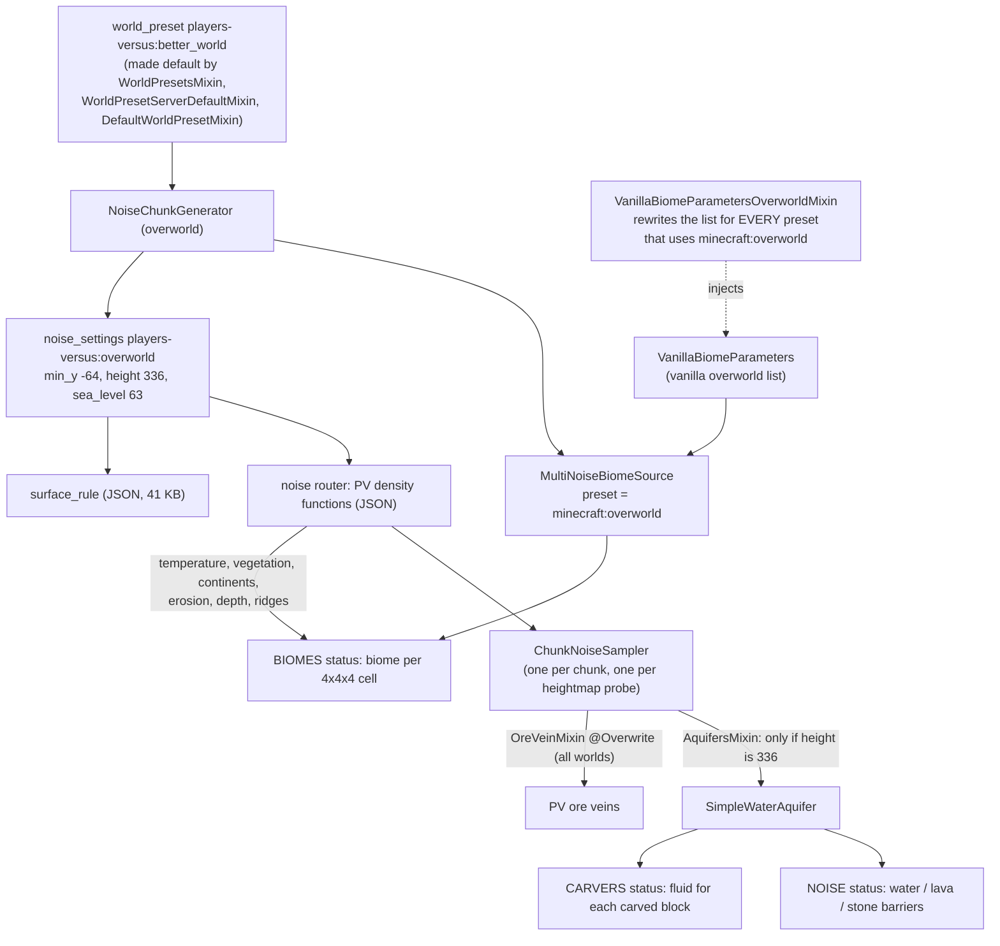
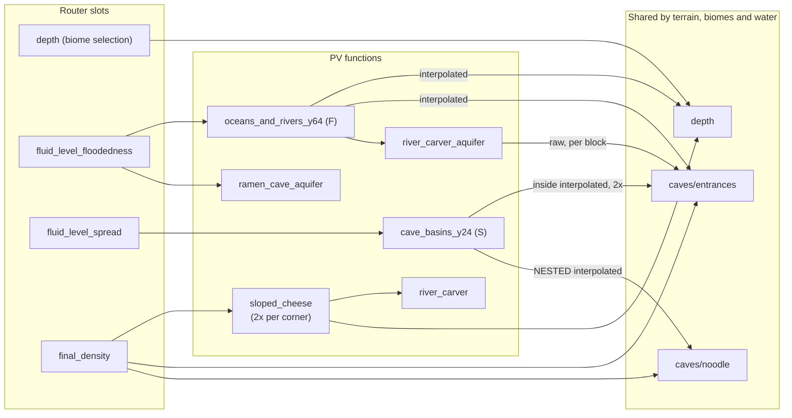

# Worldgen refactor plan: aquifers, density functions, biome placement

**Target:** Minecraft 1.21.10, Yarn `1.21.10+build.2`, Fabric Loader 0.17.3, Loom 1.11-SNAPSHOT, Java 21.
**Scope:** the three systems that make up terrain in the `players-versus:better_world` preset:

1. The custom aquifer (`AquifersMixin` + `SimpleWaterAquifer`).
2. The data-driven density functions (`data/players-versus/worldgen/density_function/**`, `noise_settings/overworld.json`).
3. The biome-placement injection (`VanillaBiomeParametersOverworldMixin` + `CustomOverworldBiomes`).

Ore veins (`OreVeinMixin`) and the default-preset mixins are included because they're part of the same setup: the ore-vein hook sits next to the aquifer hook, and the preset mixins select this worldgen. Structures, features and biome JSON content are out of scope.

**Status:** this is a plan only; no code has changed. It was written without being able to decompile Minecraft, because Fabric's maven and Mojang's servers were unreachable from the authoring environment. Statements about vanilla internals marked **[verify]** come from knowledge of the 1.21.x sources. Confirm them against `genSources` in Phase 0 before relying on them.

---

## 0. Summary

**What is slow.** The main cost is very likely the aquifer. Biome *lookup* is unlikely to matter. The feature cost of stacked cave biomes hasn't been measured yet (Phase 0 does that).

- `SimpleWaterAquifer.apply` evaluates the whole `fluid_level_floodedness` tree for **every non-solid block between y −31 and 63**. That tree samples 3D continentalness twice (18 octave samples each) and 3D `surface` noise twice (6 each), so each such block costs about **48 octave samples**. Vanilla's aquifer spends about 0–2 per block. An ocean chunk has 4–8k such blocks.
- Carvers call the same aquifer for **every carved block**. They pass a foreign position, so none of the chunk sampler's caches or interpolators apply, and `caves/entrances` is evaluated raw up to 4 times. One carved block costs roughly **100–250 samples**.
- The terrain density functions cost about the same as vanilla's, but they repeat work that can be removed without changing output. `sloped_cheese` is evaluated twice per cell corner, and y-invariant noises (`ridge`, `jagged`) are re-sampled at every corner instead of once per column.
- Most of this can be removed **without changing a single block**: evaluate each leaf once, evaluate lazily, and memoize with `cache_once`/`cache_2d`.

**What is fragile.**

- The biome mixin and the ore-vein `@Overwrite` are **global**. The vanilla Default, Large Biomes and Amplified presets all get the PV biome layout and PV ore veins, because every preset shares the `minecraft:overworld` parameter list.
- The aquifer is switched on by a magic number (`height == 336`).
- Thresholds are split between Java and JSON. For example, `0.34` and `0.0001` appear in both `SimpleWaterAquifer` and `aquifer_fluid_level_floodedness.json`. Sea level is 63 in the noise settings but 64 in the aquifer and density functions.
- The same density function is evaluated in 4 contexts with different semantics (interpolated, flat-cached, raw, stale). Section 1.6 covers this; it is the root of the "touchy" behavior.

**Today's output includes some quirks** (Section 2.3). The most important is a nested `interpolated` in the cave-basin function. It reads stale interpolator state and probably creates chunk-aligned seams in cave water. A refactor that is "correct" but not bug-for-bug will change terrain, so the plan preserves these quirks by default and fixes them only as explicit opt-ins.

**Recommended path.**

| Phase | Goal | Output change |
|---|---|---|
| 0 | Safety net: chunk fingerprints, biome-list hash, oracle/shadow mode, profiling baseline | none |
| 1 | Scope the mixins (the 3 terrain mixins for aquifer, ore veins and biome list become 1 gated hook + 1 accessor), delete dead code, move biome placement out of the mixin | none for PV worlds; vanilla presets become vanilla again |
| 2 | Exact performance work: lazy/deduplicated aquifer, carver path, DF memoization | none (bit/decision-exact) |
| 3 | In-code authoring (datagen) plus compiled DF kernels for the hot/complex subgraphs | none (bit-exact) |
| 4 | Optional fixes and cheaper models, each with before/after maps | opt-in only |

---

## 1. How it works today

### 1.1 Pipeline



### 1.2 The pieces

| Piece | File | What it does | Scope today |
|---|---|---|---|
| Default preset | `WorldPresetsMixin`, `WorldPresetServerDefaultMixin`, client `DefaultWorldPresetMixin` | Makes `players-versus:better_world` the default (server properties, demo world, Create World screen) | Intended |
| Noise settings | `noise_settings/overworld.json` | Height 336, PV router, surface rule | PV preset only |
| Aquifer | `AquifersMixin` → `SimpleWaterAquifer` | Replaces vanilla's aquifer when `height == 336` | Anything with height 336 |
| Ore veins | `OreVeinMixin` (`@Overwrite OreVeinSampler.create`) | Copper 32–96 over terracotta, iron −8–36 over tuff | **All** noise generators with ore veins, including vanilla presets |
| Biome placement | `VanillaBiomeParametersOverworldMixin`, `CustomOverworldBiomes` | Rewrites the vanilla overworld parameter list | **All** presets using `minecraft:overworld` (Default, Large Biomes, Amplified, PV) |
| Surface rules | JSON in `noise_settings/overworld.json` | Top blocks, beaches (2 custom 29-octave noises) | PV preset only. `SurfaceRulesMixin` is **not registered** and is stale. |

### 1.3 What each router slot means in PV

| Slot | PV value | Read by |
|---|---|---|
| `final_density` | `players-versus:overworld/final_density` (vanilla shape + river carving + ramen caves; `spaghetti_2d` replaced by the constant 1) | terrain (NOISE), heightmap probes |
| `depth` | `players-versus:overworld/depth` = vanilla depth + `river_carver_depth` | **biome selection** (the cave-biome depth bands) and the aquifer (interpolated) |
| `fluid_level_floodedness` | `aquifer_fluid_level_floodedness`: *not* vanilla's meaning; it is the PV sea-level/river "floodedness" F′ | `SimpleWaterAquifer` section 2 |
| `fluid_level_spread` | `aquifer_fluid_level_spread` → `cave_basins_y24` (S) | `SimpleWaterAquifer` section 3 |
| `barrier`, `lava` | vanilla-like | unused while the PV aquifer is active |
| `preliminary_surface_level` | vanilla formula (no rivers) | surface rule `above_preliminary_surface`, vanilla internals |
| `continents`, `erosion`, `ridges`, `temperature`, `vegetation`, `vein_*` | vanilla | biomes, ore veins |

### 1.4 The aquifer, as it behaves today

For a block whose final density is ≤ 0 (and for **every carved block**, since carvers call `apply(pos, 0.0)` **[verify]**). The first matching rule wins:

| # | Condition | Result |
|---|---|---|
| 1 | y < −54 | lava (from the chunk generator's fluid-level sampler) |
| 2 | y ≥ 64 or y ≤ −32 | air |
| 3a | −32 < y < 64 and F′ > 0.34 | water; schedule fluid tick if F′ < 0.54 |
| 3b | −32 < y < 64 and F′ > 0.0001 + max(0, y − 60)·0.015 | **stone** (barrier) |
| 4a | −4 < y < 32 and S > tW(y), where tW = 0.5 for y > 8, else 0.5 − (8 − y)·0.08 | water; tick if S < tW + 0.2 or density < 0.08 |
| 4b | −4 < y < 32, y < 23 and S > tB(y), where tB = 0.0001 for y < 12, else (y − 12)·0.06 | stone |
| 5 | otherwise | air |

F′ = `range_choice(y ∈ [−4, 32): F ∈ [0.0001, 0.34) ? F + ramen_cave_aquifer : F; else F)`, with F = `aquifer_floodedness_oceans_and_rivers_y64`.

`needsFluidTick` is instance state and is not reset on every path. It is only observable right after a fluid is returned, and every fluid-returning branch sets it, so the aquifer behaves as a pure function. The rewrite can rely on that.

### 1.5 Biome placement, as it behaves today

Vanilla's `writeBiomeParameters` emits two entries per surface slice (depth 0.0 and depth 1.0). The mixin cancels every call and emits, **in this order**:

1. **Mountain transition**, for the part of a slice with erosion < −0.475 and continentalness > 0.03. Slices whose weirdness lies entirely inside ±0.3 (river valleys) are skipped. Emitted at depth 0 and 0.1. Examples: forest → mountainside forest (warm variant above T 0.1998), jungle → mountainside jungle, plains → meadow.
2. **Frozen transition**, for temperature slices crossing −0.55 or −0.375. Examples: taiga → cold taiga, snowy plains → cold plains, frozen ocean → cold ocean.
3. **Peak temperature fixes**: grove/snowy slopes above T 0.145 become taiga/windswept hills; stony peaks below T 0.235 become windswept gravelly hills.
4. **Humid transition**, for humidity slices crossing 0.275 or 0.35. Examples: birch → dark birch forest, desert → desert oasis.
5. The **original biome** with the narrowed ranges, at depth 0 only. Vanilla's depth 1.0 copy is dropped, so the underground belongs to PV cave biomes.
6. A **surface-cave biome** at depth 0.1–0.25, offset +0.075: frozen peaks/snowy slopes → frosted caves, desert → desert creeper caves, badlands family → badlands cave.

It also replaces vanilla's lush-caves and dripstone-caves entries with PV variants (adding frosted caves) and appends 13 PV cave entries after deep dark: frosted, badlands, desert-creeper, creeper, lush, dripstone and deep-dark variants, plus regular cave (depth 0.25–0.65) and deep caves (depth 0.9).

Several emitted boxes **overlap**. Which one wins at a tie depends on list order, via R-tree construction **[verify]**. So parity means **same entries in the same order**, not just the same set.

### 1.6 The density-function graph and its four evaluation contexts



The same JSON node means different things depending on who evaluates it **[verify]**:

| Context | Who | `interpolated` | `flat_cache` | `cache_once` | `cache_2d` |
|---|---|---|---|---|---|
| Corner pass | `ChunkNoiseSampler` filling cell corners (5×5×43 = 1,075 per chunk) | evaluates the child at the corner. A *nested* interpolator reached through `sample()` returns its **stale** last result. | exact at corners (x, z multiples of 4) | per corner, shared across interpolators | per column |
| Block loop | aquifer, ore veins, noodle, per block | trilinear value from corners | value of the enclosing 4×4 column (**snapped**) | per block | last column only (misses in x/z loops) |
| Foreign position | carvers (`UnblendedNoisePos`), `NoiseConfig`, structure/biome lookups | **raw** child value | snapped inside the chunk, raw outside | **no caching** | per column |
| Heightmap probe | 1-column `ChunkNoiseSampler` for `getHeight`/`getColumnSample` | same as the corner pass and block loop, but for Q1 both of its x-planes see the initial stale state | as above | as above | as above |

`caves/entrances` is used in all four contexts (terrain, interpolated in F, raw in the river aquifer, inside the cave-basin interpolator). `depth` is used by terrain, biomes and the aquifer. That is why a small JSON edit ripples into biomes and water.

### 1.7 Constants that must agree but live in different places

| Constant | Places |
|---|---|
| Sea level | `noise_settings.sea_level = 63` (vanilla meaning: water up to y 62); `SimpleWaterAquifer.SEA_LEVEL = 64` (water up to y **63**); `range_choice` upper bound 64 in F; surface-rule `y_above` 60/63/64/66 |
| Water/barrier thresholds | `0.34` and `0.0001` in `SimpleWaterAquifer` **and** in `aquifer_fluid_level_floodedness.json` |
| Cave-basin band | Java `−4 < y < 32`, `y < 23`, `tW`/`tB` formulas **and** JSON bands `[-2, 48)`, `[24, 48)`, gradients 48→24 |
| Generator identity | `height: 336` in JSON **and** `AquifersMixin` |
| Mountain/frozen/humid cut points | Java constants that mirror vanilla's slice edges (0.03, −0.475, −0.55, −0.375, 0.275, 0.35) |
| Ore-vein bands | Java `VeinType` (copper 32–96, iron −8–36) **and** the router's `vein_toggle` range `[-60, 51)`, so copper veins actually fade out around y 50 |

---

## 2. Findings

### 2.1 Performance (static estimates, confirmed or refuted in Phase 0)

Unit: *octave samples*, meaning one single-octave Perlin sample. A vanilla "double Perlin" noise with n non-zero octaves costs 2n. See Appendix A.

| # | Hotspot | Where | Estimate | Why |
|---|---|---|---|---|
| P1 | Aquifer floodedness per block | NOISE, each non-solid block with −31 ≤ y ≤ 63 | ~48 per block. That is ~60–170k per land chunk and ~200–400k per ocean chunk; the whole terrain corner pass is ~130–180k. | F has `shifted_noise continentalness` (3D) twice and `noise surface` (3D) twice, evaluated per block. River blocks with 48 ≤ y < 64 add about 32 (ridge twice plus raw `entrances`). |
| P2 | Aquifer in carvers | CARVERS, each carved block | ~100–250 per block, versus ~0–2 in vanilla | Foreign position means no `cache_once`, and interpolators evaluate raw. F is evaluated twice for −4 ≤ y < 32, and `entrances` up to 4 times. |
| P3 | Redundant terrain work | NOISE corner pass | ~30–70k per chunk removable | `sloped_cheese` is evaluated twice per corner (range_choice input plus branch; `base_3d_noise` is 24–40 samples). `jagged` (32) and `ridge` (6) are 2D but re-sampled per corner. |
| P4 | Extra interpolators | NOISE corner pass | small | 3 extra interpolators, mostly sharing `entrances` through `cache_once` fill caches |
| P5 | Stacked biomes at FEATURES | FEATURES | unknown | A chunk typically holds 3–5 biomes stacked vertically, each with 27–56 placed features (the creeper-cave floor alone is count 96 × scan 12), and the union is attempted per chunk. |
| P6 | Biome lookup | BIOMES, structures | small | The list is bigger than vanilla's and has overlapping boxes, but R-tree lookups stay logarithmic. |
| P7 | 29-octave beach noises | SURFACE | small | Evaluated at most once per column per rule, only near sea level. Octaves past about 12 contribute less than 1e−4. |

C2ME (a suggested dependency) compiles JSON density functions, which reduces interpreter overhead. It cannot fix P1/P2, because those do the wrong *amount* of work **[verify with C2ME installed]**.

### 2.2 Scope and correctness issues

- **S1:** biome placement is global. See 1.2.
- **S2:** PV ore veins are global (`@Overwrite`). This also makes the mod incompatible with anything else touching `OreVeinSampler.create`.
- **S3:** the aquifer is switched on by `height == 336` and uses `@Redirect`, which doesn't compose with other mods (C2ME, Lithium-style optimizers) that target the same call **[verify]**.
- **S4:** dead code and clutter:
  - `SurfaceRulesMixin` (unregistered, and diverged from the JSON rule);
  - `caves/entrances_old.json` and the `overworld/gravel_beach` density function (unreferenced);
  - `SimpleWaterAquifer`'s `fluidLevelY`. It samples F at *chunk* coordinates treated as block coordinates and is never used, yet it costs one full raw F evaluation per `ChunkNoiseSampler`, including every heightmap probe;
  - unused fields and methods, and the empty "waterfalls" section;
  - `landBiomesToPlaceInOverorld` (empty), `PlacedBiomeType.SKY`, `freeUpMemory` (misses one map);
  - `rangeOf`'s cache, which only ever holds one entry;
  - the triple `cache_once` in `entrances.json`;
  - `createDemoOptions` listed twice in `WorldPresetsMixin`;
  - `remappedSrc/`, a stale copy of every worldgen class from the mapping migration, which pollutes searches.
- **S5:** there is no single source of truth for coupled constants (1.7).

### 2.3 Quirks that are part of today's output

These are preserved bug-for-bug through Phases 1–3. Fixing any of them is a Phase 4 opt-in.

| # | Quirk | Effect |
|---|---|---|
| Q1 | `cave_basins_y24` wraps a subtree containing `caves/noodle` (which has its own `interpolated` nodes) in another `interpolated`. In the corner pass the inner interpolators are reached through `sample()` and return stale state **[verify]**: 0.0 for the first two x-planes of a chunk, and then the value at the chunk's bottom row (−1/0). | The noodle term only acts on x-planes 0 and 4 of each chunk. Expect **vertical seams in cave-basin water/stone every 16 blocks along x**. Carvers see the un-stale raw value, so they disagree with the noise stage. |
| Q2 | The humid transition's first branch uses the *frozen* map (`VanillaBiomeParametersOverworldMixin.java:198`) | Humidity 0.275–0.3 slices become taiga/meadow/etc., not the humid variants. |
| Q3 | The dripstone replacement passes `continentalness` as the **depth** argument (`:90–91`) | Dripstone/frosted entries sit at depth 0.8–1.0. |
| Q4 | `newContinentalness` can never be set (`:136`), and the "replace entirely" test ignores continentalness < 0.03 | Parts of mountain slices are left uncovered, and the nearest box wins there. |
| Q5 | The aquifer fills water up to y 63, one block above what `sea_level: 63` means in vanilla (water up to y 62) | Ocean surfaces sit 1 block higher than the sea level that spawning and structure code assume. |
| Q6 | The aquifer returns STONE to carvers in barrier zones | Carvers overwrite dirt/ores with stone inside carved space. |

---

## 3. What "keep the original output" means

| Level | Definition | Applies to |
|---|---|---|
| **A: bit-exact chunks** | Same seed and mod set give identical block states, biomes (per 4×4×4 cell), WG heightmaps and fluid post-processing marks for every chunk at `BIOMES`, `NOISE`, `SURFACE`, `CARVERS`. Also an identical biome parameter list (same entries, same order). | Phases 1–3, mandatory |
| **B: stable decoration** | `FEATURES`/`FULL` identical except where vanilla is itself order-dependent across chunks (measured by running the baseline twice) | Phases 1–3 |
| **C: visual** | Before/after maps and the percentage of changed blocks, reviewed by you | Phase 4 only |

Two refinements make exact refactoring practical:

- **Density-function kernels must be bit-exact** against the reference graph in the raw context. IEEE addition is not associative, so they transliterate operation by operation.
- **The aquifer only needs to be decision-exact**: same block state and the same fluid-tick flag. That allows skipping a term whenever it is provably multiplied by exactly zero or dominated by a `min`/`max`. The result can differ only in the sign of zero, which no threshold can see.

---

## 4. Target architecture

```
mod/environment/worldgen/
  PvWorldgen.java                 registration entry point; isPvGenerator(settings)
  PvWorldgenConstants.java        sea level, vertical bands, aquifer thresholds (single source, documented)
  aquifer/PvAquiferSampler.java   replaces SimpleWaterAquifer
  ore/PvOreVeins.java             body of today's OreVeinMixin
  biome/PvBiomeKeys.java          keys (keep REGULAR_CAVE etc.; SuspiciousBlockEntityMixin uses it)
  biome/PvBiomeRules.java         transition tables as immutable maps/records
  biome/PvOverworldBiomeParameters.java   vanilla list -> PV list (no mixin)
  biome/PvBiomePresets.java       registers MultiNoiseBiomeSourceParameterList.Preset "players-versus:overworld"
  density/PvDensityFunctionTypes.java     registers compiled DF types
  density/kernel/...              RiverFunctions, AquiferNoises, RamenCaves, ...
  debug/WorldgenDebugCommands.java        /pvwg probe | fingerprint | map   (dev only)
mixin/environment/worldgen/
  ChunkNoiseSamplerMixin.java     2x @WrapOperation (aquifer, ore veins), both gated by isPvGenerator
  MultiNoisePresetAccessor.java   adds the PV preset to Preset.BY_IDENTIFIER
  WorldPresets*Mixin.java         unchanged behavior, MixinExtras instead of @Redirect
src/datagen/java/...              VersusDataGenerator + bootstraps (Phase 3)
```

**Rules for the new code:**

1. **Density functions are shared across worker threads.** Never store mutable state in a `DensityFunction`. Memoize with vanilla markers (`cache_once`, `cache_2d`), which `ChunkNoiseSampler` turns into per-chunk caches, or inside per-chunk objects such as the aquifer.
2. **Keep vanilla markers as real vanilla nodes** (`interpolated`, `flat_cache`, `cache_2d`, `cache_once`, `cache_all_in_cell`, `blend_*`). Their meaning depends on context (1.6). Kernels only replace the arithmetic between markers, and must map their children in `apply(visitor)`.
3. **Transliterate exactly**, including vanilla's short-circuits **[verify]**:
   - `mul` of two non-constant inputs returns `+0.0` when its first operand `== 0` (multiplying by a constant is a plain product);
   - `min`/`max` skip the second operand using its bounds;
   - kernel `minValue`/`maxValue` must be valid bounds, and ideally identical to the reference graph's.
4. **`flat_cache` is not a drop-in cache.** It snaps to 4×4 columns for per-block and carver evaluation. Use `cache_2d` for exact column caching.
5. **One predicate identifies the PV generator:** the router's `fluid_level_floodedness` resolves to the PV aquifer DF type. No magic numbers.
6. Every constant used by both Java and data lives in `PvWorldgenConstants`.

---

## 5. Phased plan

### Phase 0: Safety net and measurements (no behavior change). Size M.

- **0.1 Confirm the [verify] items** with `./gradlew genSources`:
  - `ChunkNoiseSampler.DensityInterpolator.sample/fill`
  - `DensityFunctionTypes.BinaryOperation`/`LinearOperation` short-circuits
  - `Carver.getState` (calls the aquifer with density 0)
  - `MultiNoiseBiomeSourceParameterList.Preset` (constructor, `BY_IDENTIFIER` mutability)
  - every `VanillaBiomeParameters.writeBiomeParameters` call using offset `0.0F`
  - R-tree tie-breaking

  Amend this plan if any differ.
- **0.2 Worldgen fingerprint.** A dev-only command plus a Loom run config that starts a headless server on a fresh world with a fixed seed and dumps:
  - per-chunk hashes (block states, biomes per cell, `OCEAN_FLOOR_WG`/`WORLD_SURFACE_WG`, post-processing marks) at `BIOMES`, `NOISE`, `SURFACE`, `CARVERS`, `FULL`, for about 3 seeds × a few chunk windows (ocean, river, mountain, badlands, snowy);
  - a canonical dump and SHA-256 of the overworld biome parameter list;
  - raw-context samples of every PV density function at about 10⁴ fixed points (hex bits).

  Commit the baseline produced from **the current commit**. Run it twice to learn which statuses are deterministic.
  ```groovy
  loom { runs { fingerprint { server(); configName = "Worldgen fingerprint"; runDir "run/fingerprint"; vmArg "-Dpv.fingerprint=true" } } }
  // runDir needs eula.txt (accepting the EULA is your call); the command stops the server when done.
  ```
- **0.3 CI.** Add a job to `.github/workflows/build.yml` that runs `runFingerprint` and diffs against the baseline on changes under `worldgen/`.
- **0.4 Profiling protocol.** Add Spark and Chunky as `modLocalRuntime` from `https://api.modrinth.com/maven`. Use the same seed and radius, and pregenerate the **Default** preset and **better_world** with the same mod jar. Record chunks/s, Spark flame graphs, and the time per status (`populateNoise`, `carve`, `buildSurface`, `generateFeatures` in the flame graph). This ranks P1–P7 with real numbers.
- **0.5 `/pvwg probe`** prints, at your position:
  - each PV density function (raw),
  - F, F′, S, final density,
  - biome and multinoise point,
  - the aquifer's decision and **which rule in 1.4 fired**.

  This is the single most useful debugging aid for tuning.

*Exit:* baseline committed, numbers recorded, [verify] items resolved.

### Phase 1: Scope and clean up (PV output identical). Size S–M.

- **1.1 Delete dead code** (S4). Behavior-neutral; the fingerprint must match.
- **1.2 One gated hook for aquifer and ore veins.** Introduce a DF type `players-versus:aquifer_noises` whose `sample()` delegates to today's JSON (bit-identical), and point the router slot at it. Then (sketch; confirm constructor arguments against `genSources`):
  ```java
  @Mixin(ChunkNoiseSampler.class)
  abstract class ChunkNoiseSamplerMixin {
      @WrapOperation(method = "<init>", at = @At(value = "INVOKE", target = "Lnet/minecraft/world/gen/chunk/AquiferSampler;aquifer(Lnet/minecraft/world/gen/chunk/ChunkNoiseSampler;Lnet/minecraft/util/math/ChunkPos;Lnet/minecraft/world/gen/noise/NoiseRouter;Lnet/minecraft/util/math/random/RandomSplitter;IILnet/minecraft/world/gen/chunk/AquiferSampler$FluidLevelSampler;)Lnet/minecraft/world/gen/chunk/AquiferSampler;"))
      private AquiferSampler pv$aquifer(ChunkNoiseSampler sampler, ChunkPos pos, NoiseRouter router, RandomSplitter random,
                                        int minY, int height, AquiferSampler.FluidLevelSampler fluids, Operation<AquiferSampler> original) {
          AquiferNoises noises = AquiferNoises.of(router);          // null unless this is the PV router
          return noises != null ? new PvAquiferSampler(noises, fluids) : original.call(sampler, pos, router, random, minY, height, fluids);
      }

      @WrapOperation(method = "<init>", at = @At(value = "INVOKE", target = "Lnet/minecraft/world/gen/OreVeinSampler;create(Lnet/minecraft/world/gen/densityfunction/DensityFunction;Lnet/minecraft/world/gen/densityfunction/DensityFunction;Lnet/minecraft/world/gen/densityfunction/DensityFunction;Lnet/minecraft/util/math/random/RandomSplitter;)Lnet/minecraft/world/gen/chunk/ChunkNoiseSampler$BlockStateSampler;"))
      private ChunkNoiseSampler.BlockStateSampler pv$oreVeins(DensityFunction toggle, DensityFunction ridged, DensityFunction gap, RandomSplitter random,
                                                              Operation<ChunkNoiseSampler.BlockStateSampler> original,
                                                              @Local(argsOnly = true) ChunkGeneratorSettings settings) {
          return PvWorldgen.isPvGenerator(settings) ? PvOreVeins.create(toggle, ridged, gap, random) : original.call(toggle, ridged, gap, random);
      }
  }
  ```
  `PvAquiferSampler` starts as a straight move of `SimpleWaterAquifer`, minus the dead constructor sample. Keep `SimpleWaterAquifer` in test/dev code as the **oracle**. With `-Dpv.aquifer.shadow=true`, every call runs both implementations and asserts the same block state (and the same `needsFluidTick` when the state is a fluid), logging the position and inputs on the first mismatch.
- **1.3 Biome placement without a mixin.** Transform vanilla's public output instead of intercepting its private methods (sketch):
  ```java
  public static void write(Consumer<Pair<NoiseHypercube, RegistryKey<Biome>>> out) {
      Transformer t = new Transformer(out);     // pairs each depth-0/depth-1 couple from writeBiomeParameters,
      new VanillaBiomeParameters().writeOverworldBiomeParameters(t);   // replaces lush/dripstone entries in place,
      t.appendCaveBiomes();                     // then appends the 13 PV cave entries (was @Inject TAIL writeCaveBiomes)
  }
  ```
  - `Transformer` reuses the vanilla `ParameterRange` objects unchanged and asserts the invariants: depth-1 twin follows its depth-0 entry, offset is 0, and lush/dripstone arrive where expected. It emits exactly the mixin's sequence (1.5), quirks Q2–Q4 included.
  - Register it as `MultiNoiseBiomeSourceParameterList.Preset("players-versus:overworld")`. This needs a one-line accessor for `Preset.BY_IDENTIFIER` **[verify mutability]**. Add `data/players-versus/worldgen/multi_noise_biome_source_parameter_list/overworld.json` = `{"preset": "players-versus:overworld"}` and point `better_world.json` at it.
  - Keeping the vanilla `MultiNoiseBiomeSource` class keeps F3's multinoise debug line, `/locate`, and mods that special-case it.
  - **Verification:** for one iteration, keep the old mixin in "record only" mode. Build both lists at startup and assert they are equal, including order. Then delete the mixin.
  - **Existing worlds:** their `level.dat` points at `minecraft:overworld`, so without help they would switch to vanilla placement for new chunks. If you need them, ship an optional built-in datapack `players-versus:legacy_biome_layout` (`ResourceManagerHelper.registerBuiltinResourcePack`, activation `NORMAL`, off by default). It overrides the `minecraft:overworld` parameter list to `{"preset": "players-versus:overworld"}`. Enabling it on an old world (`/datapack enable`, then restart) restores seamless generation *for that world only*, with no global mixin.
- **1.4 Default-preset mixins.** Switch `@Redirect` to `@ModifyExpressionValue`, remove the duplicated method name, and optionally add the preset to `tags/worldgen/world_preset/normal.json` so it shows up in the world-type button.

*Exit:* fingerprint identical for `better_world`. The Default preset's biome-list hash equals vanilla's list. Test with C2ME.

### Phase 2: Exact performance work. Size M–L.

- **2.1 Memoize terrain density functions (bit-exact).** Measure after each change.
  - `cache_once` around `sloped_cheese`: halves its evaluations per corner.
  - One shared `river_ridge = cache_2d(shifted_noise ridge, xz 0.25, y 0)`, referenced by `river_carver`, `river_carver_depth` and `river_carver_aquifer`. The 6 duplicate evaluations become 1, cached per column in the corner pass. **Not** `minecraft:overworld/ridges`: that one is `flat_cache`, which would snap per-block and carver values.
  - `cache_2d` around the `half_negative(noise jagged)` term: 32 samples per column instead of per corner, in mountains.
  - Collapse the triple `cache_once` in `entrances`.
- **2.2 `PvAquiferSampler` v2 (decision-exact).** F becomes a compiled evaluator that:
  - (a) evaluates each leaf **at most once per call**: interpolated `depth`, interpolated `entrances`, raw `entrances`, 3D `continentalness`, `surface`, `ridge`;
  - (b) evaluates **cheap leaves first and skips expensive ones when they cannot matter**;
  - (c) keeps per-chunk column caches (ridge) and per-y gradient tables *inside the aquifer object*, which is per chunk and therefore thread-safe.
  ```java
  // F = max(max(T1, rivers), T2) — sketch; real code is an exact transliteration of the JSON
  double iEntr = noises.entrancesInterpolated(pos);                 // table lookup inside the noise loop
  double t2 = Math.min(0.0, G2[y] + iEntr);                          // T2 = (G1 + C3) * (... * t2)
  double iDepth = noises.depthInterpolated(pos);
  double t1 = iDepth >= T1_SKIP_DEPTH ? -0.0 : term1(pos, iDepth);  // min(0, x>=0) => -8 * 0.0; surface noise not needed
  double f = Math.max(t1, rivers(pos));
  if (t2 == 0.0) return f;                                           // T2 is ±0: no threshold can tell the difference
  return Math.max(f, term2(pos, iDepth, t2));                        // continentalness sampled once, not twice
  ```
  Expected cost per block:

  | Region | Today | v2 |
  |---|---|---|
  | Cave air off tunnels | ~48 | **~0** |
  | Spaghetti tunnels | ~48 | ~24 |
  | Ocean/lake water | ~48 | ~6–24 |

  Guarded by shadow mode plus the fingerprint.
- **2.3 Carver path.** The same evaluator handles foreign positions. That collapses 4 raw `entrances` evaluations into 1, and F's double evaluation into 1: about 100–250 samples per carved block becomes about 20–50.
- **2.4 Only if profiling points there:** `cache_once` on `depth`, or trimming interpolators.

*Exit:* fingerprint identical. NOISE and CARVERS ms/chunk reported against the Phase 0 baseline. Target: pregenerating `better_world` takes at most about 1.2× as long as the Default preset.

### Phase 3: In-code authoring and compiled kernels. Size L.

- **3.1 Datagen as the single source of truth.**
  - Enable `fabricApi { configureDataGeneration() }` and add a `DataGeneratorEntrypoint` whose `buildRegistry` bootstraps `DENSITY_FUNCTION`, `NOISE_PARAMETERS` (beach noises), `CHUNK_GENERATOR_SETTINGS`, `WORLD_PRESET` and `MULTI_NOISE_BIOME_SOURCE_PARAMETER_LIST`.
  - Port each PV density function to Java using vanilla factories (`DensityFunctionTypes.add/mul/rangeChoice/yClampedGradient/interpolated/cacheOnce/cache2d/shiftedNoise2d/noise`). Names become typed constants, references are compile-checked, and every magic number gets a named constant with a comment.
  - Port the 41 KB surface rule to `MaterialRules` code. A one-off script converting JSON to builder calls makes a good first draft.
  - Acceptance: the generated JSON is **semantically identical** to the hand-written JSON, checked by parsed-tree comparison. Then delete the hand-written files.
- **3.2 Compiled kernels.** Add custom DF types (`Registries.DENSITY_FUNCTION_TYPE`) for the hot or complex subgraphs:
  - `RiverFunctions`: carver, depth and aquifer variants sharing one ridge column;
  - `AquiferNoises`: F, F′ and S, exposing the lazy evaluator from 2.2;
  - `RamenCaves`;
  - the glue inside `sloped_cheese` and `entrances`.

  Keep `final_density`'s outer structure as vanilla nodes (markers, `blend_density`, `squeeze`).
  ```java
  public record RiverCarver(DensityFunction ridge) implements DensityFunction {   // ridge = cache_2d(shifted ridge)
      public double sample(NoisePos pos) {
          int y = pos.blockY();
          if (y < 48 || y >= 256) return 1.0;
          double r = ridge.sample(pos);
          if (!(r >= -0.22 && r < 0.22)) return 1.0;
          double m = r * 7.0;
          return (GRAD_50_74[y] + (GRAD_68_90[y] + GRAD_68_128[y])) + m * m;    // same association as the JSON tree
      }
      public DensityFunction apply(DensityFunctionVisitor v) { return v.apply(new RiverCarver(ridge.apply(v))); }
      // fill(), minValue()/maxValue() identical to the reference graph, getCodecHolder()
  }
  ```
  Each kernel gets a unit test that builds the kernel and its **reference graph** (the old JSON, kept in test resources as the oracle) and compares `doubleToRawLongBits` at about 10⁵ random points, plus the fingerprint.

  Expect kernels to add roughly 10–30% on top of Phase 2. Most of the speed comes from not doing redundant work (Phase 2). Kernels mainly make the terrain readable, debuggable and safe to change.
- **3.3** Consolidate `PvWorldgenConstants`, and write Javadoc on every vertical band and threshold explaining *why* it has that value.

*Exit:* no hand-written router, DF, settings or preset JSON remains. Kernel tests and fingerprint are green.

### Phase 4: Optional output changes (opt-in, each shown as before/after maps). Size S each.

1. Fix Q1: move the noodle term out of the interpolator, or use raw noodle. This removes the chunk-aligned cave-basin seams.
2. Fix Q2–Q4 if they were not intended.
3. Trim the beach noises to about 12 octaves (P7).
4. Align sea level (Q5). Probably leave it.
5. A cheaper aquifer model (sample F and S at cell corners and interpolate, like vanilla), only if Phase 2 is not enough.
6. If FEATURES is hot: deduplicate or merge cave-biome feature lists.

To keep existing worlds seamless across output-changing fixes, **version the settings**: new worlds get `players-versus:overworld_v2`, and old worlds keep v1 (level.dat stores the key).

---

## 6. Verification matrix

| Check | How | Gate |
|---|---|---|
| Biome list | canonical dump + SHA-256, old vs new, including order | 1.3, CI |
| Density-function values | raw-context samples, bitwise, for every PV density function | 2.1, 3.1, 3.2 |
| Aquifer decisions | shadow mode: oracle vs new implementation on every call (noise, carvers, heightmap probes) | 1.2, 2.2, 2.3 |
| Chunks | fingerprint: strict at BIOMES–CARVERS, measured tolerance at FEATURES/FULL | every phase, CI |
| Performance | Chunky pregen chunks/s + Spark, same seed, Default vs better_world | 0 (baseline), after 2 and 3 |
| Compatibility | run with C2ME (and any other worldgen mods you care about) | end of 1 and 2 |
| Visual | `/pvwg map` PNGs (biome, height, water), before/after | Phase 4 only |

---

## 7. Decisions needed from you

1. **Parity bar.** Bit-exact chunks at BIOMES–CARVERS (recommended), or are visually-equivalent changes acceptable for more speed?
2. **Existing worlds** created with `better_world`: must they keep generating seamlessly? If yes, add the opt-in legacy datapack (1.3).
3. **Vanilla presets:** restore vanilla biome placement and ore veins there (recommended), or keep the PV layout in them?
4. **Quirks Q1–Q6:** preserve (default) or fix in Phase 4? Q1 is the one I would fix.
5. **Authoring style:** datagen-generated JSON plus compiled kernels (recommended), or a thin JSON shell whose DF types build their graphs in code through registry-lookup codecs?
6. **Order:** performance (Phase 2) before in-code authoring (Phase 3) is recommended, since Phase 2 delivers most of the speed with the smallest diff.

---

## Appendix A: Noise costs used in the estimates

| Noise | Non-zero octaves | Octave samples per evaluation |
|---|---|---|
| `minecraft:surface` | 3 | 6 |
| `minecraft:continentalness` | 9 | 18 |
| `minecraft:ridge` | 3 | 6 |
| `minecraft:jagged` | 16 | 32 |
| `minecraft:cave_cheese` | 7 | 14 |
| `minecraft:noodle`, `noodle_thickness`, `noodle_ridge_a/b`, `spaghetti_3d_*` | 1 | 2 |
| `base_3d_noise` (old blended noise) | 8 main + 16–32 limit | 24–40 |
| `players-versus:sand_beach`, `gravel_beach` | 29 | 58 |

Counts come from vanilla's noise-parameter definitions **[verify]** and the mod's JSON. One octave sample takes roughly 10–20 ns, so 400k samples is about 4–8 ms of one core per chunk.

## Appendix B: Name map for a 26.x port (Yarn → Mojang)

This list is from memory; confirm it against the 26.x sources when porting.

| Yarn (1.21.10) | Mojang (26.x) |
|---|---|
| `ChunkNoiseSampler` | `NoiseChunk` |
| `AquiferSampler` (`aquifer`, `apply`, `needsFluidTick`) | `Aquifer` (`create`, `computeSubstance`, `shouldScheduleFluidUpdate`) |
| `AquiferSampler.FluidLevelSampler` / `FluidLevel` | `Aquifer.FluidPicker` / `Aquifer.FluidStatus` |
| `OreVeinSampler` | `OreVeinifier` |
| `ChunkGeneratorSettings`, `NoiseChunkGenerator`, `NoiseConfig` | `NoiseGeneratorSettings`, `NoiseBasedChunkGenerator`, `RandomState` |
| `DensityFunction.NoisePos` / `EachApplier` / `DensityFunctionVisitor` | `DensityFunction.FunctionContext` / `ContextProvider` / `Visitor` |
| `DensityFunctionTypes` | `DensityFunctions` |
| `MultiNoiseUtil` (`NoiseHypercube`, `ParameterRange`, `Entries`) | `Climate` (`ParameterPoint`, `Parameter`, `ParameterList`) |
| `VanillaBiomeParameters` (`writeOverworldBiomeParameters`, `writeBiomeParameters`, `writeCaveBiomeParameters`) | `OverworldBiomeBuilder` (`addBiomes`, `addSurfaceBiome`, `addUndergroundBiome`) |
| `MaterialRules` / `VanillaSurfaceRules` | `SurfaceRules` / `SurfaceRuleData` |
| `Carver` | `WorldCarver` |
| `DoublePerlinNoiseSampler` / `OctavePerlinNoiseSampler` / `PerlinNoiseSampler` | `NormalNoise` / `PerlinNoise` / `ImprovedNoise` |

Fewer mixins also means fewer things to re-target when porting. After Phase 1 only two worldgen hooks remain (`ChunkNoiseSampler.<init>` and the preset accessor), plus the three default-preset tweaks.

## Appendix C: What happens to each current file

| File | Fate |
|---|---|
| `mixin/.../AquifersMixin.java` | replaced by `ChunkNoiseSamplerMixin` (1.2) |
| `mixin/.../OreVeinMixin.java` | body moves to `ore/PvOreVeins`; hook moves to `ChunkNoiseSamplerMixin` (1.2) |
| `mixin/.../VanillaBiomeParametersOverworldMixin.java` | logic moves to `biome/PvOverworldBiomeParameters` + `PvBiomeRules`; mixin deleted (1.3) |
| `mixin/.../SurfaceRulesMixin.java` | deleted (1.1) |
| `WorldPresetsMixin`, `WorldPresetServerDefaultMixin`, client `DefaultWorldPresetMixin` | kept; switched to MixinExtras (1.4) |
| `mod/.../SimpleWaterAquifer.java` | moves to `aquifer/PvAquiferSampler` (1.2), rewritten (2.2); original kept in tests as the oracle |
| `mod/.../CustomOverworldBiomes.java` | keys move to `biome/PvBiomeKeys`; tables move to `biome/PvBiomeRules` (1.3) |
| `mod/.../CustomWorldgen.java` | becomes `PvWorldgen` (feature registration stays) |
| `density_function/**` | memoized (2.1), then generated (3.1); `entrances_old` and `gravel_beach` deleted (1.1) |
| `noise_settings/overworld.json` | floodedness slot points at the PV type (1.2); generated (3.1) |
| `world_preset/better_world.json` | biome preset changes to `players-versus:overworld` (1.3); generated (3.1) |
| `remappedSrc/` | deleted (1.1) |
